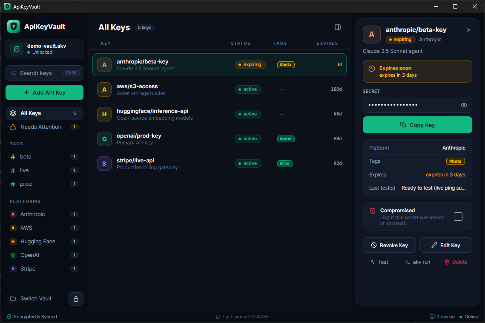
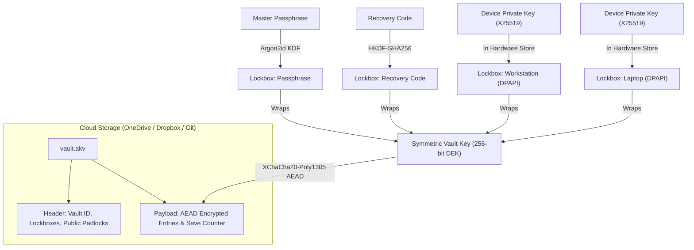

<div align="center">

# 🔐 ApiKeyVault

**Zero-knowledge, hardware-bound API key management for developers and AI workflows.**

<br/>

<p align="center">
  <a href="#quickstart">Quickstart</a> •
  <a href="#key-features">Key Features</a> •
  <a href="#cli-usage">CLI Usage</a> •
  <a href="#desktop-ui">Desktop UI</a> •
  <a href="#security--cryptography">Cryptography & Security</a>
</p>

---

</div>

<br/>

<div align="center">
  
  <p><em>ApiKeyVault Desktop UI — Real-time key inventory, category filtering, secret masking, and status monitoring.</em></p>
</div>

<br/>

## 💡 Why ApiKeyVault?

I originally built this app for myself to solve my own key management workflow, but I'm making it available for anyone else who might find it useful.

Modern development requires juggling dozens of API keys across OpenAI, Anthropic, Gemini, AWS, Stripe, and Azure. Most developers resort to:
- ❌ **Unencrypted `.env` files** scattered in directories, at constant risk of accidental `git commit` and leak.
- ❌ **Shell history leaks** when keys are passed via command-line arguments.
- ❌ **Forgotten expired tokens** that cause silent breaks in production or staging pipelines.
- ❌ **Manual password typing** dozens of times a day on personal workstations.

**ApiKeyVault eliminates this entirely.** It stores your API secrets in a single, zero-knowledge encrypted vault file (`vault.akv`) designed to live in **OneDrive, Dropbox, or Git**. 

On trusted devices, ApiKeyVault binds your hardware using the **OS Credential Store (Windows DPAPI / Credential Manager)**—giving you **instant, passwordless access** on your daily machines while maintaining total cryptographic isolation.

---

## ✨ Key Features

- 🛡️ **Zero-Knowledge Encryption**: All payloads sealed using **XChaCha20-Poly1305 AEAD** with fresh 192-bit nonces. Master passphrases protected by memory-hard **Argon2id**.
- 💻 **Hardware-Bound Passwordless Unlock**: Enroll trusted workstations and laptops. Devices open the vault instantly without typing a master password, using OS-protected private keys.
- 📅 **Token Expiration & Review Lifecycle**: Optional calendar date picker (`CalendarDatePicker`) with one-click presets (`+30 days`, `+90 days`, `+180 days`, `+1 year`, `No expiry`) to proactively prevent expired keys from disrupting workflows.
- 🚀 **Direct Process Injection (`akv run`)**: Run any developer tool or script with secrets injected strictly into memory via environment variables—secrets never touch the disk, terminal history, or process arguments.
- 📋 **Auto-Shredding Clipboard**: Copy a key with one keystroke; ApiKeyVault automatically scrubs the clipboard memory after 45 seconds.
- 🩺 **Live Provider Health Checks**: Validate key liveness and connectivity with one click (`akv test`) against OpenAI, Anthropic, OpenRouter, Azure OpenAI, Google Gemini, and custom endpoints.
- 🔄 **Safe Multi-Device Cloud Sync**: Synchronize seamlessly over OneDrive or cloud drives. Lockbox architecture allows retiring or wiping a lost laptop remotely without resetting other devices.
- 🖥️ **Obsidian Vault v2 Desktop UI**: Built with Avalonia 11 for cross-platform performance. Features an obsidian dark aesthetic with crisp vector icons, keyboard-first navigation (Enter/Esc dialog bindings, Ctrl+K search), and quick tag/platform filtering.
- ⚡ **Cross-Platform CLI**: Full-featured Spectre.Console CLI (`akv`) optimized for interactive developer workflows, CI agents, and shell automation.

```bash
$ akv list
╭────────┬───────────┬─────────────┬──────────────────┬───────────┬───────────────────────╮
│ Status │ Provider  │ Name        │ Expires / Review │ Last Test │ Comment               │
├────────┼───────────┼─────────────┼──────────────────┼───────────┼───────────────────────┤
│ ● OK   │ openai    │ prod        │ expires in 88d   │ ✓ Passed  │ Production model key  │
│ ● OK   │ anthropic │ claude-code │ expires in 28d   │ ✓ Passed  │ Developer tool token  │
│ ▲ Due  │ stripe    │ live        │ review due       │ Not run   │ Quarterly rotation    │
╰────────┴───────────┴─────────────┴──────────────────┴───────────┴───────────────────────╯

$ akv run -e OPENAI_API_KEY=openai/prod -- npm run start
[akv] Injected 1 secret into environment. Spawning process...
> Ready on http://localhost:3000
```

---

## 🚀 Quickstart

### Prerequisites

- [.NET 10.0 SDK](https://dotnet.microsoft.com/download/dotnet/10.0) or later
- Supported OS: Windows 10/11, macOS, Linux

### 1. Build and Install

```bash
# Clone the repository
git clone https://github.com/dandrejvv/ApiKeyVault.git
cd ApiKeyVault

# Build the entire solution
dotnet build -c Release

# (Optional) Pack and install the CLI globally
dotnet pack src/ApiKeyVault.Cli -c Release -o ./nupkg
dotnet tool install --global --add-source ./nupkg ApiKeyVault.Cli
```

### 2. Initialize Your First Vault

Create an encrypted vault in your OneDrive or home directory. ApiKeyVault automatically enrolls your current machine in the hardware store:

```bash
akv init
```

*You'll be prompted for a master passphrase and given a secure emergency recovery code. Store both in your password manager!*

### 3. Add Keys

Store API secrets under clean addresses (`provider/name`):

```bash
# Add an OpenAI key with 90-day review reminder
akv add openai/prod --secret "your-openai-api-key" --comment "Production model access" --days 90

# Add an Anthropic token with a specific expiration date
akv add anthropic/claude --secret "your-anthropic-api-key" --expires 2026-12-31

# Add Stripe secret
akv add stripe/live --secret "your-stripe-api-key" --comment "Billing gateway"
```

### 4. Use Keys Without Leaking Them

#### Direct Process Injection (Recommended)
Inject secrets directly into your development server, test suite, or container:

```bash
akv run -e OPENAI_API_KEY=openai/prod -e STRIPE_SECRET_KEY=stripe/live -- npm run dev
```

#### Safe Copy to Clipboard
Copies the key to your clipboard and automatically cleanses it after 45 seconds:

```bash
akv get openai/prod
```

#### Pipe Secret to Tool (Scripts)
```bash
akv get openai/prod --stdout | curl https://api.openai.com/v1/models -H "Authorization: Bearer $(cat)"
```

### 5. Launch the Desktop UI

```bash
dotnet run --project src/ApiKeyVault.UI
```

---

## 📖 CLI Usage

| Command | Description | Example |
|---|---|---|
| `akv init` | Create a new encrypted vault and enroll device | `akv init --path ~/OneDrive/vault.akv` |
| `akv join` | Enroll a new machine into an existing vault | `akv join --path ~/OneDrive/vault.akv` |
| `akv list` | List all keys with status, provider, and expiry | `akv list` or `akv list --filter due` |
| `akv get <key>` | Copy secret to clipboard (cleared in 45s) | `akv get openai/prod` |
| `akv get <key> --reveal` | Temporarily display secret in terminal | `akv get openai/prod --reveal` |
| `akv run -e VAR=<key> -- <cmd>` | Execute command with secrets injected into environment | `akv run -e OPENAI_API_KEY=openai/prod -- python main.py` |
| `akv add <key>` | Add a new API key entry | `akv add stripe/live` |
| `akv edit <key>` | Edit comments, metadata, or expiration | `akv edit openai/prod --days 180` |
| `akv rotate <key>` | Rotate a secret (preserves 7-day grace period) | `akv rotate openai/prod` |
| `akv test [key]` | Perform live API connectivity checks | `akv test` or `akv test openai/prod` |
| `akv import <file>` | Import secrets from `.env`, JSON, or text files | `akv import .env.production` |
| `akv devices` | List and manage enrolled hardware devices | `akv devices list` |
| `akv devices remove <id>`| Sever a retired/lost device & rotate vault key | `akv devices remove LAPTOP-02` |

---

## 🖥️ Desktop UI

The desktop application is built on **Avalonia 11** with an **Obsidian Dark v2** visual design system.

### Key Capabilities
- **Status Dashboard**: Sidebar counts for all keys and keys needing attention, plus one-click filters per tag and platform (the active filter is highlighted and titles the key list).
- **Scannable Key List**: Colour-coded provider tiles, status pills (`active`, `expiring`, `expired`, `failing`, `compromised`, `revoked`) and expiry countdowns that turn amber/red as a deadline approaches. Columns adapt to narrow windows (tags hide first, then status collapses to a dot).
- **Interactive Calendar Date Picker**:
  - Exact calendar date selection (`CalendarDatePicker`) for API tokens with hard expiry dates.
  - One-click duration presets: `+30 days`, `+90 days`, `+180 days`, `+1 year`, and `No expiry`.
  - Timezone-safe local date resolution with UTC serialization.
- **Fast Search (`Ctrl + K`)**: Find any key by provider, name, tag, or comment in real time.
- **Ephemeral Secret Reveal**: Click the eye icon to view a masked secret; an automated 10-second timer masks it again to protect against shoulder surfing.
- **One-Click Command Generator**: Copy a ready-to-run `akv run -e ... -- <cmd>` snippet directly to your clipboard.
- **Lock Screen & Recent Vaults Switcher**: Seamlessly toggle between multiple project vaults with keyboard shortcuts (`Enter` to unlock, `Esc` to cancel).
- **Guided Empty States**: An empty vault offers *Add API Key*, *Import .env / JSON* and *Sample keys*; a search with no results offers *Clear filters*.

### Visual Design
- **Design tokens** (surfaces, borders, emerald accent, status colours) and all control styles live in `src/ApiKeyVault.UI/App.axaml`. The Fluent accent is set to emerald so built-in controls (checkboxes, date picker, focus rings) match.
- **Icons** are stroke-drawn vector paths (`Icon.*` geometries, 24×24 grid) rendered by `Controls/Icon.cs`, which inherits the surrounding text colour — no emoji, so they look identical on every OS.
- **Brand mark** is a vector `Controls/LogoMark.axaml`; `Assets/app.ico` (16–256 px) is rendered from it and used for the window and executable.

---

## 🔒 Security & Cryptography

ApiKeyVault implements a multi-tier cryptographic design that prioritizes both defense-in-depth and developer ergonomics.

### Key Hierarchy



### Cryptographic Primitives

| Purpose | Primitive | Security Rationale |
|---|---|---|
| **Payload Encryption & Integrity** | **XChaCha20-Poly1305** | Extended 192-bit random nonce eliminates collision risk across frequent saves. Authenticated encryption (AEAD) ensures file tampering is instantly rejected. |
| **Passphrase KDF** | **Argon2id** | Memory-hard key derivation provides state-of-the-art resistance against GPU/ASIC brute-force attacks. |
| **Asymmetric Key Exchange** | **X25519** | Industry-standard elliptic curve Diffie-Hellman used for device padlocks and lockbox wrapping. |
| **Key Derivation** | **HKDF-SHA256** | RFC 5869 extract-and-expand key derivation for recovery codes and session secrets. |
| **Vault Identity Proof** | **HMAC-SHA256** | Authenticates genuine vault files against rogue look-alikes. |
| **Hardware Secret Storage** | **Windows Credential Manager / DPAPI** | Device private keys never enter the vault file and cannot leave the host machine. |

### Threat Defense Matrix

| Threat Vector | Mitigation Strategy |
|---|---|
| **Cloud Storage Compromise** | Vault payload is unreadable without the vault key. Passphrase brute-forcing slowed by Argon2id. |
| **Lost or Stolen Device** | Remove the device from any other enrolled machine via `akv devices remove`. The vault key is automatically rotated, cutting off the lost machine permanently. |
| **File Tampering or Bit-Rot** | AEAD authentication tag covers both header and payload. Any modified byte fails validation before decryption. |
| **Rollback / Downgrade Attack** | Monotonically increasing save counter and identity verification detect stale vault copies. |
| **Shoulder Surfing & Screen Recording** | Secrets masked by default; 10s auto-remask in UI; 45s clipboard shredding; terminal secrets entered via hidden buffers. |

---

## 🏗️ Repository Architecture

```
ApiKeyVault/
├── src/
│   ├── ApiKeyVault.Core/       # Cryptographic engine, storage, sync, & provider testers
│   │   ├── Cryptography/       # XChaCha20, Argon2id, X25519, HKDF implementations
│   │   ├── Model/              # VaultEntry, VaultPayload, KeyStatus calculations
│   │   ├── Presets/            # Provider presets (OpenAI, Anthropic, Stripe, AWS, etc.)
│   │   ├── Storage/            # Device key store (DPAPI) and local state management
│   │   └── Vault/              # VaultManager & VaultSession session controller
│   ├── ApiKeyVault.Cli/        # Spectre.Console CLI application (akv)
│   └── ApiKeyVault.UI/         # Avalonia 11 Desktop Application (Obsidian Vault theme)
│       ├── ViewModels/         # MVVM ViewModels with CommunityToolkit
│       └── Views/              # MainWindow, CalendarDatePicker, and custom controls
├── tests/
│   ├── ApiKeyVault.Core.Tests/ # Cryptographic, storage, and synchronization unit tests
│   ├── ApiKeyVault.Cli.Tests/  # CLI command execution & argument parsing tests
│   └── ApiKeyVault.UI.Tests/   # UI ViewModel, date picker, and flow tests
├── docs/
│   ├── design/                 # Deep architectural and cryptographic specifications
│   └── images/                 # UI screenshots and visual assets
└── ApiKeyVault.slnx            # Solution file (.NET 10)
```

---

## 🧪 Testing

ApiKeyVault includes an automated test suite verifying cryptographic correctness, tamper detection, CLI execution, and UI ViewModels:

```bash
# Run all unit and integration tests
dotnet test ApiKeyVault.slnx -nr:false -p:UseSharedCompilation=false
```

The headless UI tests (`HeadlessVisualTests`) render every screen — first run, lock screen, main window at normal/narrow widths, dialogs, filtered, no-match and empty-vault states — to PNG files for visual review. They are written to `%TEMP%/AkvScreenshots` by default; set `AKV_SCREENSHOT_DIR` to choose another folder.

---

## ⚖️ Disclaimer

I built this application for myself and make it available as-is in case others find it helpful.

This software is released into the public domain under [The Unlicense](UNLICENSE). Anyone is free to use, copy, modify, or distribute it for any purpose. It is provided "as is", without warranty of any kind. The author assumes no responsibility or liability for its use.
