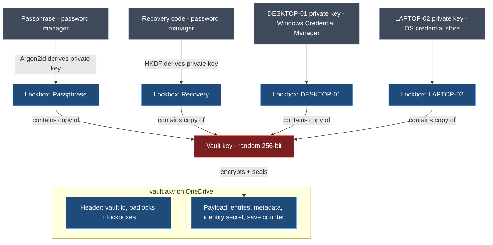
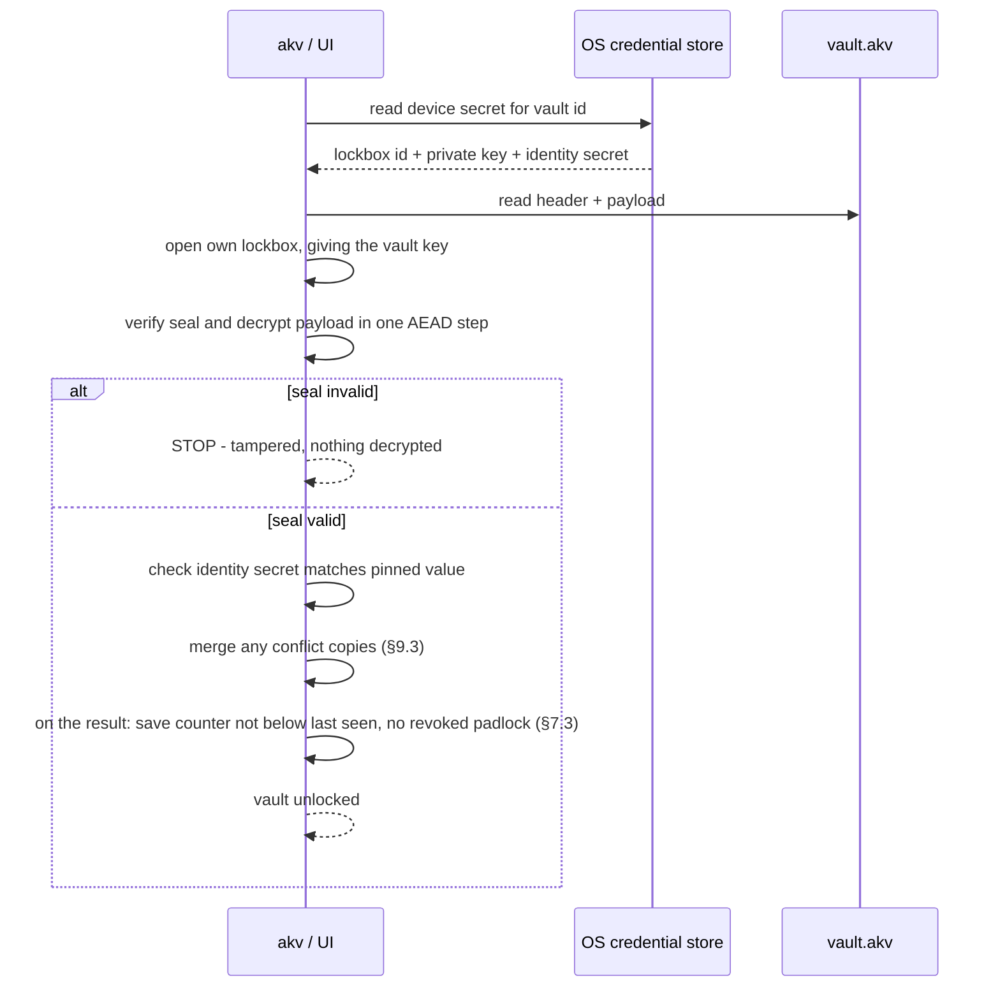
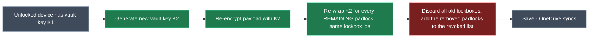
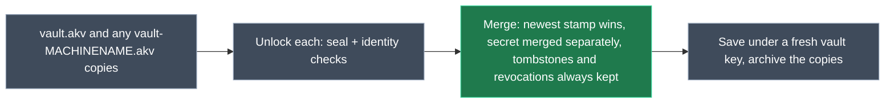

# ApiKeyVault — Cryptography & Persistence Design

> **Status:** Agreed in design discussion, 2026-10-05; revised 2026-10-06 after review. Scope: how the vault is encrypted, unlocked, shared between devices via OneDrive, and stored on each device.

## 1. Context

API secret keys (OpenAI, Anthropic, OpenRouter, Azure OpenAI, Gemini, Google Stitch, Serper, Clockify, …) currently live in a plain-text file. ApiKeyVault replaces that with a single **encrypted vault file** that:

- lives in a OneDrive folder so every personal machine sees the same vault;
- opens **without a password prompt** on a trusted device, using the OS credential store;
- can always be recovered with a **master passphrase** or a **recovery code**, both kept in my password manager;
- lets a lost or retired device be **cut off** without touching any other device;
- refuses to open if anyone has **tampered** with the file.

Both the CLI (`akv`) and the desktop UI use the same core library, and therefore the same design.

**Scope and principle.**
- This is a vault for **one person and their own devices**. It is not a team or enterprise vault.
- Real holes are plugged with simple mechanisms.
- Threats that need an attacker who **already had access** (a former device, or an old passphrase) **and** can write to my OneDrive are accepted, not engineered around (§3, §12). The remedy for those is to rotate the API keys with each provider.

## 2. Glossary

| Term | Plain meaning | Technical meaning |
|---|---|---|
| **Vault key** | The one key that locks the safe | Random 256-bit symmetric key (DEK) encrypting the payload |
| **Lockbox** | A small locked box holding a copy of the vault key | The vault key encrypted to one recipient (key slot) |
| **Padlock** | Anyone can snap it shut; only its key opens it | A recipient's X25519 **public** key, stored in the vault file |
| **Private key** | The key that opens one padlock | A recipient's X25519 **private** key, never stored in the vault file |
| **Seal** | Tamper-evident seal over the whole file | AEAD authentication tag over header + payload |
| **Vault identity secret** | Proof that this is *my* vault, not a look-alike | Random 256-bit value inside the payload, pinned on each device |
| **Identity tag** | The same proof, for unlocks with the passphrase or recovery code | HMAC over the identity secret, keyed from the passphrase or recovery code (§7.2) |

## 3. Threat model

| Threat | Defended? | How |
|---|---|---|
| Someone gets the vault file (OneDrive compromise, leaked backup) | ✅ | Everything is encrypted. The only offline attack is guessing the passphrase, which is slowed by Argon2id. |
| Stolen laptop, powered off | ✅ (with BitLocker/FileVault) | The device private key is protected by the OS store (DPAPI) and full-disk encryption. |
| A device is lost or retired | ✅ | Remove its lockbox and rotate the vault key (§6.6). |
| Someone edits or corrupts the vault file | ✅ detected | The seal (§7.1). Restore from OneDrive version history. |
| Someone adds their own padlock to the file | ✅ detected | The seal covers the header (§7.1). |
| Someone builds a look-alike vault from my public padlocks | ✅ detected | Enrolled devices check the pinned identity secret. Passphrase and recovery unlocks check the identity tag (§7.2). |
| Someone serves an older genuine copy of the file (rollback) | ⚠️ warned | Save counter and the list of removed devices (§7.3). |
| An old passphrase or recovery code leaks after it was changed | ⚠️ partly | Every change of owner rotates the vault key (§6.5), so the old secret doesn't open the current vault. Copies saved **before** the change (version history, backups) still open with it and show the data as it was then. |
| Someone learns my passphrase or recovery code and adds their own device | ⚠️ visible | The device shows up in the device list. Remove it (§6.6) and change the passphrase or recovery code (§6.5). |
| Another OS user on the same machine | ✅ | The OS store is per user. |
| Malware running as **me** | ❌ (accepted) | With Tier 1 storage, it can read the device key, just as it can read Git or Azure CLI credentials. Tier 2 (§8.2) narrows this. |
| **Anyone who once held an owner secret** (a removed device, or an old passphrase plus an old copy) **and** can write to my OneDrive | ❌ (accepted) | They know the identity secret, so they can plant a vault my devices would open, and read keys added to it afterwards. Rotate the actual API keys with each provider, and treat an unexpectedly changed vault as a compromise. Defending this needs a key history (§13), which is overkill for a single-user vault. |
| Forgot the passphrase **and** lost every device **and** the recovery code | ❌ by design | Nobody can open the vault. That is the point. |

## 4. Key hierarchy



*Key: red = never written in the clear; blue = stored in the vault file; grey = held outside the file by its owner.*

Rules:

1. The **vault key is random** and never derived from the passphrase, so owners can be added without touching the others. It is **rotated whenever an owner is removed or replaced** (§6.5, §6.6), because an old copy of the file plus an old owner secret would otherwise still open the current vault.
2. Every lockbox holds the **same** vault key, locked to a different owner's padlock.
3. Padlocks are **public**: any unlocked device can create a new lockbox for any owner without that owner's secret. This is what makes rotation possible (§6.6).
4. Private keys **never enter the vault file**, and device private keys never leave their device.

## 5. Cryptographic constructions

### 5.1 Primitives

| Purpose | Primitive | Notes |
|---|---|---|
| Payload encryption + seal | **XChaCha20-Poly1305** (AEAD) | 192-bit random nonce, generated fresh on **every** save |
| Owner key pairs (padlocks) | **X25519** | Device, passphrase and recovery owners all use X25519 |
| Lockbox key derivation | **HKDF-SHA256** | Derives the wrap key from the X25519 shared secret |
| Passphrase → private key | **Argon2id** | Parameters stored in the passphrase lockbox |
| Identity tag | **HMAC-SHA256** | §7.2 |
| Randomness | OS CSPRNG | `RandomNumberGenerator` / libsodium `randombytes` |

### 5.2 Creating a lockbox (locking a copy of the vault key to a padlock)

This follows the same pattern as `age`'s X25519 recipients:

```
eph_priv, eph_pub  = X25519 keygen()                     # throwaway, per lockbox
shared             = X25519(eph_priv, recipient_pub)
wrap_key           = HKDF-SHA256(ikm  = shared,
                                 salt = eph_pub || recipient_pub,
                                 info = "akv/lockbox/v1")
nonce              = random 24 bytes
wrapped_vault_key  = XChaCha20-Poly1305.Encrypt(wrap_key, nonce,
                                 plaintext = vault_key,
                                 aad = vault_id || lockbox_id)
lockbox            = { lockbox_id, kind, recipient_pub, eph_pub, nonce, wrapped_vault_key,
                       kdf     (passphrase lockbox only, §5.4),
                       id_tag  (passphrase and recovery lockboxes only, §7.2) }
```

Opening a lockbox is the mirror image, using the owner's `recipient_priv` with `eph_pub`. The lockbox has its own authentication tag, so a tampered lockbox fails outright.

A `lockbox_id` belongs to one owner for life. Rotation (§6.6) re-wraps the new vault key under the **same** id. A replaced owner (new passphrase, new recovery code, re-enrolled device) gets a **new** id, and the old one is revoked.

### 5.3 The three kinds of owner

| Lockbox kind | Where the private key comes from |
|---|---|
| **Passphrase** | `Argon2id(passphrase, salt, m, t, p = 1)` produces 64 bytes: the first 32 are the X25519 private key, the last 32 are the identity-tag key (§7.2). Salt and parameters are stored in the passphrase lockbox. |
| **Recovery** | A 128-bit random code generated at vault creation, shown **once** as 26 Crockford Base32 characters plus a 2-character checksum, in groups of 4, and never stored by ApiKeyVault (it goes in the password manager). `HKDF-SHA256(code, info = "akv/recovery/v1")` expands it to 64 bytes, split the same way as the passphrase's. |
| **Device** | 32 random bytes generated when the device enrols, stored only in that device's OS credential store (§8). Devices have no identity tag; they pin the identity secret instead (§7.2). |

**Who can be removed:**

| Owner | Change it | Remove it |
|---|---|---|
| Passphrase | ✅ Replace (§6.5) | ❌ Never |
| Recovery code | ✅ Replace (§6.5) | ❌ Never |
| Other devices | ✅ Rename, replace on re-enrolment (§6.4) | ✅ Yes (§6.6) |
| **This device** | ✅ Rename | ❌ Never from itself. Remove it from another device |

- There is exactly **one** passphrase lockbox and **one** recovery lockbox at any time. They are your way back in when devices are lost, so they can only ever be replaced, never removed.
- **This device** is the one whose lockbox id is in this machine's OS credential store for this vault (§8.1). That's the key it "logged in" with. It is recognised the same way even if this session was opened with the passphrase. A machine that isn't enrolled has no "this device".
- The core enforces these rules on **every** save, whatever asked for it: the UI, the CLI, *Accept as current* or a merge (§9.3).
  - It refuses any operation that would leave the vault without a passphrase lockbox or without a recovery lockbox.
  - It refuses any request **made on this device** to remove this device's lockbox. A removal made on another device still applies when this device next opens or merges the vault (§6.6). That's how a lost laptop gets cut off.
- There are no per-device permissions: every owner has full access.

### 5.4 Argon2id parameters

- **Parallelism is 1**, because libsodium (and therefore NSec, §11) only supports `p = 1`.
- The starting point is `m = 64 MiB, t = 3, p = 1`.
- At vault creation, only the **iterations** are tuned upward, until a derivation takes about **0.5–1 s** on the creating machine. Memory stays at 64 MiB, so a vault created on a powerful desktop still opens on a small headless machine.
- The parameters can be raised later with the same passphrase. This gives the passphrase lockbox a new id (the old one is revoked). It is the one replacement that needs **no** key rotation, because nobody new can open anything.
- **Bounds are enforced on read:** `m` outside 19–256 MiB, `t` outside 2–64, or `p ≠ 1` are rejected before Argon2 runs. This stops a tampered header from causing a memory-exhaustion hang, since the seal can't be checked until after a lockbox is opened.

## 6. Operations

### 6.1 Create a vault

1. Generate the vault key, vault id, vault identity secret, recovery code and this device's private key.
2. Ask for the passphrase (entered twice) and derive the passphrase private key (§5.3).
3. Create three lockboxes: passphrase and recovery (each with its identity tag, §7.2), and this device.
4. Encrypt and seal the payload (§7.1), then write the file atomically (§9.2).
5. Store the device secrets in the OS store (§8). Show the recovery code once, and confirm it has been saved.

### 6.2 Unlock on a trusted device



### 6.3 Unlock with the passphrase or recovery code

This is the same flow as §6.2, except the private key comes from Argon2id(passphrase) or from the typed-in recovery code. It is used on a device that hasn't been enrolled, or as a fallback where no OS store is available.

There is no pinned identity secret to compare with, so after the seal check the lockbox's **identity tag** is checked instead (§7.2). A mismatch is treated as tampering (UC-24).
### 6.4 Enrol a new device

1. Unlock once with the passphrase (§6.3).
2. Generate a device private key and add a new lockbox for it, with the device's name and the date in the device list (§9.1).
3. Device names are unique. If a device lockbox with the **same machine name** already exists (for example after an OS reinstall), offer to replace it, showing when it was last used. Replacing removes the old lockbox, so it rotates the vault key (§6.6).
4. If this device already has a **different** identity secret pinned for this vault id, stop and report tampering. A pin is never silently replaced.
5. Save the file, then store the device secrets in the OS store.

### 6.5 Change the passphrase or recover

- **Proof required:** any **one** of the current passphrase, the recovery code, or an OS re-authentication (Windows Hello, or the Windows sign-in prompt where Hello isn't set up). Being unlocked by the device key alone isn't enough.
- **Change passphrase:** derive a new passphrase key with a new salt. Replace the passphrase lockbox: it gets a new id and a new identity tag, and the old id is revoked. Then **rotate the vault key** (§6.6).
- **Forgot the passphrase:**
  - on a trusted device, prove yourself with an OS re-authentication, then change the passphrase;
  - with no trusted device, unlock with the recovery code, then change the passphrase.
- **Regenerate the recovery code:** replace the recovery lockbox in the same way, rotate the vault key, then show the new code once.
- **Limitation:** copies of the file saved *before* the change (OneDrive version history, backups) still open with the old passphrase or code, and show the data as it was at that time.

### 6.6 Remove devices (always rotates the vault key)



- **Several devices can be removed in one go**, with one rotation.
- Only **other** devices' lockboxes can be removed (§5.3). To retire the machine you're on, remove it from another device, or with the passphrase on another machine.
- Removing a device doesn't need anything from it: it can be offline, lost or broken.
- Old lockboxes are **discarded unopened**. New ones are created using the public padlocks, so no other device's secret, passphrase or recovery code is needed. Identity tags are carried over unchanged, because the identity secret doesn't change.
- Other devices notice nothing: they open their (new) lockbox with their unchanged private key and find K2 inside.
- The removed padlock goes on the payload's append-only **revoked** list, which each device mirrors locally (§7.3).
- **Every** operation that removes or replaces an owner uses this flow, with one exception (re-tuning the passphrase's Argon2id parameters, §5.4). The operations are:
  - removing devices;
  - replacing a device on re-enrolment;
  - changing the passphrase;
  - regenerating the recovery code;
  - *Accept as current* (§7.3);
  - merging conflict copies (§9.3).
- **Open sessions:**
  - A session unlocked with a device key re-reads that key from the OS store and opens its re-wrapped lockbox.
  - A session unlocked with the passphrase or recovery code (`akv shell`, or a UI opened with the passphrase) asks for it again.
  - A session that can't open the current file **never saves**.
- **Limitation:** rotation protects the vault from this point on. It can't take back what the removed device could already read, including its OneDrive copy and older versions in version history. The removed device also still knows the identity secret (§3, accepted). There is no remote wipe. If that device was compromised, rotate the affected API keys with each provider.
- **What the removed device sees:** its lockbox id is no longer in the header. It reports "This device no longer has access to this vault", and offers to delete its OS store item and local state, or to re-enrol with the passphrase.
- **Edge case:** if two devices remove each other at the same moment, the merge keeps both removals (§9.3) and both are locked out. The passphrase still works, so either can re-enrol.

### 6.7 Stale-device pruning

- Each device's lockbox metadata lives in the **encrypted payload** (§9.1). The header holds only the lockbox id, kind and padlock.
- "Last used" is updated **at most once a day**, so OneDrive isn't constantly syncing tiny changes. Merges take the latest value, and it never counts as an edit.
- Devices unused for more than **90 days** are flagged in the UI and in `akv status`. Removing them is a manual action (several at once if you like), and always rotates the vault key (§6.6).
- There is no automatic pruning, because it would silently cut off a rarely used machine.
- The passphrase and recovery lockboxes are never pruned (§5.3).

## 7. Integrity

### 7.1 The seal

- The payload is encrypted with XChaCha20-Poly1305 under the vault key, with **AAD = every byte of the file before the payload nonce, exactly as stored**: magic, format version, header length and header, with no re-serialisation.
- Opening is a two-stage process: first get the vault key from your own lockbox, then **verify and decrypt in one AEAD step**. No plaintext is released unless the seal matches, so editing the header (adding a padlock, removing a lockbox, changing parameters, changing the format version) or the payload is always detected.
- The seal only proves that the header and payload belong together under *some* vault key. Anyone can build a well-sealed file from the public padlocks, which is why §7.2 exists.

### 7.2 Vault identity secret (stops look-alike vaults)

- **Enrolled devices pin it.**
  - When a device enrols, it copies the identity secret from the payload into its OS store, next to its private key.
  - On every device unlock, the payload's identity secret must match the pinned value. Someone who builds a fake vault from my public padlocks can't know it.
  - Enrolment never replaces a different pinned value (§6.4).
- **Passphrase and recovery unlocks check a tag.** These unlocks have nothing pinned, so the passphrase and recovery lockboxes each carry

  ```
  id_tag = HMAC-SHA256(tag_key, "akv/id/v1" || vault_id || identity_secret)
  ```

  where `tag_key` is the second half of that owner's derived secret (§5.3). After the seal check, the tag is recomputed and must match.
  - Without my passphrase or recovery code, nobody can produce a valid tag for a look-alike vault.
  - Copying the genuine tag doesn't help, because it only matches the genuine identity secret, which is encrypted.
- Tags are recomputed only when their lockbox is replaced, which is when the passphrase or new recovery code is at hand anyway. Rotation (§6.6) keeps them valid, because the identity secret never changes.
- **Limitation:** someone who once held an owner secret already knows the identity secret (§3, accepted).

### 7.3 Rollback detection

- The payload carries a **save counter** that goes up on every save, and the append-only **revoked** list of removed padlocks (§6.6).
- Each device mirrors, in its local state file (§8.1), the highest counter it has seen and every revoked padlock it has seen.
- It's a rollback, with a "this vault is older than one you've already seen" warning, if:
  - the counter is lower than the highest seen; or
  - the file holds a lockbox for a padlock this device knows was revoked. This catches a restored copy from before a device removal, which would otherwise quietly let that device back in.
- Conflict copies are merged **before** these checks, which then run on the merged result (§9.3).
- The choices are *Continue read-only* (writes nothing) or *Accept as current* (UC-25). Accepting:
  1. asks for the same proof as a passphrase change (§6.5);
  2. rotates the vault key, dropping every revoked padlock this device knows about;
  3. if the copy's passphrase or recovery lockbox is older than the one this device last saw (the copy predates a passphrase change or a new recovery code), requires a new passphrase or a new recovery code **in the same step**, so an old secret isn't quietly let back in. `--accept-rollback` refuses in that case (exit 7);
  4. sets the save counter to one more than the larger of the file's counter and the highest this device has seen, and saves.
- **Limitation:** a device that never opened a copy saved after a removal doesn't know the padlock was revoked, so it can't detect that rollback.

## 8. Device-side persistence

### 8.1 What each device stores

| Item | Where | Secret? |
|---|---|---|
| Device private key (32 B) + lockbox id + vault identity secret (32 B) | OS credential store, one item per vault, target `ApiKeyVault/<vaultId>` | **Yes** |
| Known vaults (path, vault id), highest save counter seen, revoked padlocks seen, current passphrase and recovery lockbox ids, last-used throttle | Local state file, e.g. `%LOCALAPPDATA%\ApiKeyVault\state.json` | No |

All OS store access goes through a single interface (`IDeviceKeyStore`: get / set / remove), so Tier 2 and other OSes can be added without touching the vault code.

### 8.2 Per-OS storage

| OS | Tier 1: silent (v1) | Tier 2: Windows Hello / Touch ID prompt (later) |
|---|---|---|
| **Windows** | Credential Manager, `CRED_TYPE_GENERIC`, **`CRED_PERSIST_LOCAL_MACHINE`** (never `ENTERPRISE`, which roams). Library: **Meziantou.Framework.Win32.CredentialManager**. | Non-exportable TPM key via `ncrypt.dll` (Platform Crypto Provider or the Passport/NGC key storage provider) used to wrap the device secret. **Needs a proof-of-concept** to confirm it actually shows a Windows Hello prompt rather than a key PIN. |
| **macOS** | **Login keychain**, generic password, non-synchronising. The Data Protection Keychain is ruled out because it needs a paid Apple Developer entitlement. Sign the CLI and UI with a stable self-signed certificate to avoid "Allow access?" prompts after rebuilds. Native calls (P/Invoke) into Security.framework. | Secure Enclave P-256 key wrapping the device secret. Deferred. |
| **Linux** | Secret Service (GNOME Keyring / KWallet / KeePassXC) via **Tmds.DBus.Protocol**, or the `secret-tool` command. | `systemd-creds --user` with TPM2 (needs systemd v256+ and `/dev/tpmrm0` access). Deferred. |
| **No store available** (SSH, WSL, headless) | Not enrolled as a device. The passphrase is asked for each session, and nothing secret is written to disk. | — |

### 8.3 Losing the device store is harmless

An admin password reset (which breaks DPAPI), an OS reinstall or a new machine all just mean the device is no longer enrolled. Unlock with the passphrase, re-enrol (which replaces the old lockbox, §6.4), and carry on.

## 9. Vault file persistence and sync

### 9.1 File layout

```
vault.akv
├── magic "AKV1" + format version          ┐
├── header (length-prefixed, UTF-8 JSON)     ┘ stored bytes = seal AAD (§7.1)
│   ├── vault_id
│   └── lockboxes: [ { lockbox_id, kind, recipient_pub, eph_pub, nonce, wrapped_vault_key,
│                      kdf?: { alg: argon2id, salt, m, t, p }, id_tag? } ]
└── payload: nonce (24 B) + XChaCha20-Poly1305 ciphertext of
    {
      identity_secret, save_counter,
      lockbox_registry: [ { lockbox_id, kind, name, created, last_used } ],
      revoked: [ { lockbox_id, recipient_pub, removed_at } ],   # append-only (§6.6, §7.3)
      entries: [ { id, provider, name, comment, source, expires, review_by, extra_fields,
                   stamp,                                        # details
                   secret, secret_stamp, previous_secret?, previous_until?,
                   created, last_used, last_test } ],            # last_* are usage fields
      profiles: [ { id, name, mappings: [ { var, entry_id, field? } ], stamp } ],
      settings: { <name>: { value, stamp }, … },                 # vault-wide settings (UI §5.7)
      tombstones: [ { id, stamp } ]                              # deleted entries and profiles
    }
    # stamp = { time, writer lockbox_id }  (§9.3)
```

All metadata (provider, name, comment, expiry) is encrypted, because it reveals too much to leave readable.

A reader checks the magic and format version **before** anything else. A version newer than it understands is reported as "saved by a newer ApiKeyVault", never as tampering.

### 9.2 Writing safely

1. **One writer per machine:** take an exclusive per-vault lock on this machine around steps 2–4. Use a named mutex keyed by vault id, **never** a lock file in the OneDrive folder. OneDrive only makes conflict copies between machines, so without this the UI and the CLI could silently overwrite each other.
2. **Re-read before write:** if the file on disk has changed since it was loaded (a different save counter or hash), reload and merge (§9.3) before saving.
3. **Atomic replace:**
   - Write a temp file in the same folder and flush it.
   - Re-check the file's hash just before replacing, because OneDrive can write a downloaded version at any moment. If it changed, go back to step 2.
   - Then replace `vault.akv`, retrying briefly on sharing violations, since OneDrive holds file handles.
   - OneDrive never sees a half-written file.
4. A fresh payload nonce on every save.
5. **Reads don't write**, except the throttled usage fields (§6.7). Those are skipped entirely in read-only mode (UC-25).

### 9.3 OneDrive conflict copies



- **When:** conflict copies are merged as soon as the vault is opened, **before** the rollback checks (§7.3), which then run on the merged result.
- **All files are treated alike.** OneDrive may keep either the older or the newer file as `vault.akv`, so a file's name carries no weight.
- **Checks on every file:**
  - The seal, the same `vault_id`, and the same identity secret (pinned value or identity tag).
  - A file that has a lockbox for this owner but fails a check is **not merged**. It is reported as tampering (UC-24) and left where it is.
  - A file this owner has no lockbox in (for example, one saved before this device enrolled) isn't tampering. It is left for another device, or for the passphrase, to merge.
- **Stamps:** every changed record is stamped with the writer's lockbox id and a time. The time is the later of the device clock and the newest stamp already in the vault plus 1 ms, so an edit always beats everything its device had already seen, even if its clock is slow. The newest stamp wins, and ties go to the higher lockbox id.
- **Entries:**
  - *Details* (name, comment, expiry, extra fields and so on): the newest `stamp` wins.
  - *The secret* is decided by `secret_stamp` alone, so a rotation on one device is never lost to a comment edit on another.
    - If the losing secret is neither the winner's secret nor its *previous*, both devices rotated the key. The losing secret is kept as *previous*, and an Attention item is raised (UI UC-16).
  - *Usage fields* (`last_used`, `last_test`) take the latest value and never count as edits.
  - *Tombstones* win over older stamps, so a deleted entry isn't brought back by a merge with an older copy.
- **Profiles and vault settings:** the newest stamp wins.
- **Lockboxes:**
  - The result is the union of all files' lockboxes, minus every revoked one. The revoked lists are merged too.
  - If both copies changed the passphrase, or both regenerated the recovery code, the newest lockbox of that kind wins and the other is revoked. The merge result says which passphrase or code now works.
  - The result always has exactly one passphrase lockbox and one recovery lockbox (§5.3). A passphrase or recovery lockbox is only ever revoked when a newer one replaces it. A file with no passphrase lockbox or no recovery lockbox is treated as tampering, and isn't merged.
- **The vault key:**
  - A merge always saves under a **fresh** vault key (§6.6). Conflicts are rare, and this guarantees that no key known to a dropped owner survives.
  - If two devices merge at the same moment, the result is just one more conflict copy, which the next open merges in the same way.
- **Save counter:** one more than the largest. The merged copies are archived to `conflicts/`.

## 10. Runtime hygiene

- **No plaintext on disk:** no temp files and no swap-friendly caches. Secret buffers are zeroed (`CryptographicOperations.ZeroMemory`) as soon as they've been used.
- **Secrets stay sealed in memory:**
  - the decrypted payload is parsed with `Utf8JsonReader` straight into `byte[]` buffers, never `string`;
  - each secret is immediately re-encrypted under a random per-session key, and the decrypted payload buffer is wiped;
  - a secret is decrypted only when it's used (copy, reveal, test, inject), then wiped;
  - the per-session key and the vault key are held with `CryptProtectMemory` on Windows (equivalents elsewhere where they exist).

  This gives the UI design's "decrypt only when used" rule (UI §8) without changing the file format.
- **Auto-lock:** the vault locks after a configurable idle time, and the vault key and per-session key are wiped from memory.
- **Clipboard:**
  - copied secrets are cleared after about 20 s;
  - on Windows they're marked `ExcludeClipboardContentFromMonitorProcessing` and `CanIncludeInClipboardHistory = 0`, so they skip clipboard history and cloud clipboard;
  - equivalent hints are used on macOS and Linux where they exist.
- **CLI:** secrets are never accepted as command-line arguments. `akv add` reads them with hidden input, or takes them from the clipboard and then clears it.

## 11. Libraries (.NET 10)

| Need | Library | Status |
|---|---|---|
| X25519, XChaCha20-Poly1305, HKDF, Argon2id | **NSec** (libsodium) | Preferred. Argon2id supports only `p = 1` (§5.4). A small proof-of-concept must confirm that Native AOT works and that a raw X25519 private key can be imported and exported (`RawPrivateKey`, `AllowPlaintextExport`). |
| Windows credential store | **Meziantou.Framework.Win32.CredentialManager** | v1 |
| Windows re-authentication (§6.5) | `UserConsentVerifier` (Windows Hello), falling back to `CredUIPromptForWindowsCredentials` | v1. A proof-of-concept must confirm it works from the CLI, which has to supply a console window handle |
| Linux Secret Service | **Tmds.DBus.Protocol** | Later |
| macOS Keychain | P/Invoke to Security.framework (`[LibraryImport]`) | Later |
| Rejected | Devlooped.CredentialManager (maintenance-fee checks, heavy dependencies), Microsoft.Identity.Client.Extensions.Msal (tied to MSAL's token cache) | — |

## 12. Accepted trade-offs

- **A single-user vault, not an enterprise one.** The passphrase and recovery code live in my password manager, and the OS credential store provides the convenience. Nothing beyond that is built.
- **Tier 1 is readable by any process running as me.** This matches Git, Azure CLI and most developer tooling. Tier 2 is the upgrade path, and it slots in behind `IDeviceKeyStore`.
- **A custom file format** rather than KDBX or age. The constructions above are standard (they follow the `age` pattern). Only the container is ours, which keeps it small and lets the header be sealed.
- **No 1Password-style Secret Key.** A strong passphrase plus Argon2id is the only defence against offline guessing. This was chosen for simpler recovery, and the OneDrive account has its own MFA.
- **Whole-file encryption.** Simple and atomic. The vault is small, so re-encrypting it on every save costs nothing. The same goes for rotating the vault key on every owner change and every merge.
- **The vault identity secret never rotates.** A former owner who can write to my OneDrive could therefore plant a vault my devices would open (§3). This is accepted. The remedy is to rotate the provider keys.
- **Conflict merging is automatic.** Copies that pass the seal and identity checks are merged without asking.

## 13. Deferred

- Tier 2 storage (Windows Hello / TPM, Secure Enclave, `systemd-creds`).
- **Key history.** An append-only list of key commitments, pinned per device, would let up-to-date devices reject a vault planted by a former owner (§3). It also needs merge rules for copies that are behind or have diverged. This was considered and deferred as overkill for a single-user vault.
- Per-secret encryption inside the file itself. In v1 this is done in memory only (§10).
- FIDO2 / YubiKey `hmac-secret` as an extra lockbox kind.
- Raising Argon2id parameters automatically as hardware gets faster.

## 14. Verification (when implemented)

- Round-trip tests: create, unlock (device / passphrase / recovery), enrol, remove and rotate, change passphrase.
- Known-answer test vectors for the lockbox, the identity tag and the payload format.
- Tamper tests: flip a byte in the magic/version, the header, a lockbox and the payload; add a padlock. Each must be detected, and no plaintext must be returned.
- Look-alike tests: a vault built from the genuine public padlocks, with its own vault key and identity secret, is rejected on:
  - device unlock;
  - passphrase and recovery unlock on a device with nothing pinned, including when the genuine `id_tag` is copied into it;
  - re-enrolment of a device whose lockbox is missing.
- Owner-change tests:
  - after a passphrase change or recovery regeneration, the old passphrase or code plus an **older copy** of the file can't open the current file;
  - replacing a device on re-enrolment rotates the key;
  - a passphrase change is refused when the only proof is the device key;
  - re-tuning Argon2id gives a new lockbox id without a rotation.
- Access tests:
  - removing the passphrase or recovery lockbox is refused by the core, whether it's asked for by the UI, the CLI, *Accept as current* or a merge;
  - removing this device's own lockbox is refused, whether the session was opened with the device key or with the passphrase;
  - removing three other devices at once does one rotation, and none of the three can open the result;
  - a removed device reports "no longer has access", not tampering.
- Rollback tests:
  - restoring a copy from before a device removal is flagged by a device that saw the removal;
  - *Accept as current* drops the revoked padlock and moves the save counter past every value seen;
  - *Accept as current* on a copy from before a passphrase change requires a new passphrase, and `--accept-rollback` refuses.
- Conflict tests, each verified on both merge orders **and** with OneDrive keeping either file as `vault.akv`:
  - concurrent edits to different entries are both kept;
  - deletes and device removals aren't brought back;
  - a rotation on one device and a comment edit on another keep the new secret and the new comment;
  - an edit from a device whose clock is a day slow still beats what that device had seen;
  - the merged vault is saved under a fresh key that no dropped owner's key opens;
  - a file with a different identity secret is refused, not merged;
  - two devices that remove each other at the same moment both end up removed, and the passphrase and recovery lockboxes survive;
  - a file with no passphrase or no recovery lockbox is refused as tampering;
  - a file this device has no lockbox in is left alone, not reported as tampering.
- Concurrency tests: two processes on one machine saving at once lose nothing; a crash between writing the temp file and the replace leaves the old vault intact.
- Version test: a file with a newer format version is reported as such, not as tampering.
- Argon2id bounds: out-of-range parameters (including `p ≠ 1`) are rejected before derivation.
- Manual check on Windows: the Credential Manager item exists as a local-machine generic credential, and copied secrets don't appear in clipboard history (Win+V).
