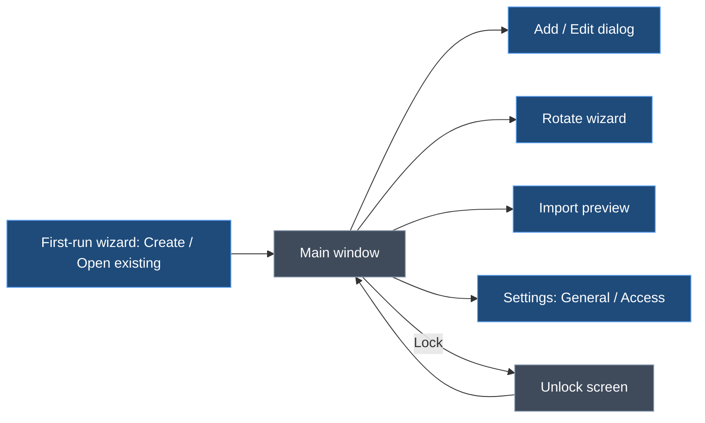

# ApiKeyVault — UI & CLI Design

> **Status:** Draft from design discussion, 2026-10-05; revised 2026-10-06 after review; §7.4 as-built UI notes added 2026-10-08. Scope: what the user can do with ApiKeyVault (use cases), and how each use case works in the CLI (`akv`, Spectre.Console) and the desktop UI (Avalonia). Cryptography and storage are covered in `crypto-and-persistence.md`, referred to below as *Crypto §n*.

## 1. Context

- ApiKeyVault replaces a plain-text file of API keys, for a **single user** across their own devices.
- There are two ways in:
  - a **CLI** for the terminal, scripts and AI agents;
  - a **desktop UI** for browsing and day-to-day copying.
- Both are thin layers over one **Core** library, so every use case behaves the same way in both.
- Daily use should be fast:
  - on an enrolled device there's no password prompt;
  - getting a key into a tool should take seconds;
  - keys should never be shown on screen, put in shell history or written to plain files.

## 2. Principles

1. **Same behaviour in the CLI and UI.** Every use case below has a CLI command and a UI location. Where they differ, the difference is noted.
2. **Use secrets without seeing them.** The main ways to use a key are copy (clipboard auto-clear) and inject (`akv run`). Showing a key on screen is an explicit, short-lived action.
3. **Secrets never travel as command-line arguments.** They're entered as hidden input or taken from the clipboard (in the UI or the CLI), or passed through stdin (scripts only).
4. **Keyboard first.** Everything common can be done without the mouse.
5. **Scriptable and testable.** The CLI has a non-interactive mode with JSON output. Every UI control has an automation ID (§9).
6. **No surprises.** Destructive or security-relevant actions say exactly what will happen before they do it: delete, remove a device (which rotates the vault key), change the passphrase.

## 3. Entry model

| Field | Required | Notes |
|---|---|---|
| Provider | ✅ | A preset (§4) or `Other` |
| Name | ✅ | Unique per provider. Lowercase, `a-z 0-9 - _`. Together these give the address `provider/name`, for example `anthropic/claude-code` |
| Secret | ✅ | Kept sealed in memory and decrypted only when used (§8) |
| Comment | — | What the key is for, and where it's used |
| Source | — | Where the key came from. Pre-filled by the preset with the provider's key-management URL, and can be edited (for example a different Azure resource) |
| Expires | — | Optional date. Most AI provider keys don't expire, so this can be left blank |
| Review by | — | Optional reminder date, for keys that don't expire but should be rotated regularly |
| Extra fields | Per preset | For example Azure OpenAI: endpoint, deployment, API version |
| Last test | Automatic | Time and result of the last live check (✓ / ✗ with the reason) |
| Created / Updated | Automatic | Timestamps |

**Status of an entry** (shown as an icon and colour everywhere):

| Status | Rule | CLI | UI |
|---|---|---|---|
| OK | Not expiring within 30 days, and the last test passed or the key hasn't been tested | `●` green | green dot |
| Due | Expires or review-by date within 30 days | `▲` yellow | yellow triangle |
| Expired | Expiry date has passed | `▲` red | red triangle |
| Failing | Last live test failed (401, 403 and so on) | `✕` red | red cross |

## 4. Provider presets

A preset provides:
- a display name and icon;
- the source URL;
- a key format hint (used only to warn, never to block);
- any extra fields;
- a live test.

Live tests are read-only calls that cost nothing where possible. **Every endpoint and format below must be confirmed during implementation.**

| Provider | Key looks like | Source (key page) | Extra fields | Live test |
|---|---|---|---|---|
| OpenAI | `sk-proj-…` / `sk-…` | platform.openai.com/api-keys | Organisation (optional) | `GET api.openai.com/v1/models` (Bearer) |
| Anthropic | `sk-ant-api03-…` | platform.claude.com/settings/keys (console.anthropic.com redirects there) | — | `GET api.anthropic.com/v1/models` (`x-api-key`, `anthropic-version`) |
| OpenRouter | `sk-or-v1-…` | openrouter.ai/settings/keys | — | `GET openrouter.ai/api/v1/key` (also shows usage and limit) |
| Azure OpenAI | 32 or 84 characters | Azure portal → resource → *Keys and Endpoint* | Endpoint, deployment, API version | `GET {endpoint}/openai/models?api-version=…` (`api-key` header) |
| Gemini | `AIza…` (39 characters) | aistudio.google.com/apikey | — | `GET generativelanguage.googleapis.com/v1beta/models` (`x-goog-api-key`) |
| Google Stitch | To confirm. It may share Gemini's `AIza` prefix, in which case import must ask, not guess | stitch.withgoogle.com/settings | — | To confirm. Otherwise stored without a live test |
| Serper | 40 hex characters | serper.dev/api-key | — | To confirm. If there's no free endpoint, use a minimal search (1 credit) that only runs when you ask for a test |
| Clockify | Alphanumeric | Clockify → Profile settings → API | Workspace (optional) | `GET api.clockify.me/api/v1/user` (`X-Api-Key`) |
| Other | Anything | Free text | Any custom name/value pairs | Optional: an `https` URL + header name (+ prefix such as `Bearer `), test passes on any 2xx response |

- Presets are data (an embedded JSON file), so a new provider is a small change and not new screens.
- **Import** (UC-04) uses each preset's key format to guess the provider, matching the **longest prefix first** (`sk-ant-` and `sk-or-` before `sk-`). Where two presets share a format, it asks rather than guesses.
- **Live tests only send a key where it's meant to go:**
  - `https` only;
  - redirects are not followed (a 3xx counts as "couldn't test"), because .NET's `HttpClient` forwards custom key headers such as `x-api-key` to the redirected host;
  - an Azure endpoint outside `*.openai.azure.com`, `*.cognitiveservices.azure.com` and `*.services.ai.azure.com` gets a warning;
  - for *Other*, the first test, and the first test after the URL's host changes, asks "Send this key to `<host>`?".

## 5. Use cases

### 5.1 Overview

| ID | Use case | CLI | UI |
|---|---|---|---|
| **Setting up** | | | |
| UC-01 | Create a new vault | `akv init` | First-run wizard → *Create a new vault* |
| UC-02 | Use the vault on another device | `akv join` | First-run wizard → *Open an existing vault* |
| UC-03 | Unlock when the device isn't enrolled | Asked for the passphrase automatically; `akv shell` for a session | Unlock screen |
| UC-04 | Import keys from the old plain-text file | `akv import <file>` | *File → Import…* |
| **Daily use** | | | |
| UC-05 | Find a key | `akv list`, `akv find <text>` | Search (Ctrl+K), sidebar filters |
| UC-06 | Copy a key | `akv get <key>` | Enter / 📋 / double-click |
| UC-07 | Use a key in a command without copying it | `akv run -e VAR=<key> -- <cmd>` | *Copy as command…* (copies the `akv run` line, not the key) |
| UC-08 | Pipe a key into a tool | `akv get <key> --stdout \| tool` | — (CLI only) |
| UC-09 | Show a key on screen | `akv get <key> --reveal` | 👁 (re-masks after 10 s) |
| UC-10 | Lock | Not needed (each command is short-lived); `exit` in `akv shell` | Ctrl+L, auto-lock |
| **Managing keys** | | | |
| UC-11 | Add a key | `akv add` | Ctrl+N |
| UC-12 | Edit a key's details | `akv edit <key>` | *Edit* |
| UC-13 | Replace a key's secret (rotate) | `akv rotate <key>` | *Rotate* wizard |
| UC-14 | Delete a key | `akv rm <key>` | 🗑 / Delete key |
| UC-15 | Test a key, or all keys | `akv test <key>` / `akv test --all` | *Test* / *Test all* |
| UC-16 | See what needs attention | `akv status` | *Attention* view and badge |
| **Access (devices, passphrase, recovery code)** | | | |
| UC-17 | See who has access | `akv access list` | *Settings → Access* |
| UC-18 | Remove one or more other devices (rotates the vault key) | `akv access remove <name>...` | *Settings → Access → Remove* (multi-select) |
| UC-19 | Rename this device | `akv access rename <new>` | *Settings → Access → Rename* |
| UC-20 | Change the passphrase | `akv passphrase change` | *Settings → Access → Passphrase → Replace* |
| UC-21 | Create a new recovery code | `akv recovery new` | *Settings → Access → Recovery code → Replace* |
| UC-22 | Recover (forgotten passphrase, no enrolled device) | `akv recover` | Unlock screen → *Use recovery code* || **When things go wrong** | | | |
| UC-23 | OneDrive conflict copy found | Merged automatically on next open; reported in the output | Banner: "Merged N changes from a conflicting copy" |
| UC-24 | Tampering detected | Stops; exit code 6 | Blocking error screen |
| UC-25 | Older copy detected (rollback) | Warning; asks before continuing | Warning dialog |
| **Settings** | | | |
| UC-26 | Change settings | `akv config get/set` | *Settings → General* |

### 5.2 Setting up

**UC-01 Create a new vault**

1. Choose the folder; the default suggestion is the OneDrive folder, if one is found. The vault file is set to OneDrive's *Always keep on this device*, so it can still be opened offline after Storage Sense frees up space.
2. Enter the passphrase twice. A strength meter shows; weak passphrases trigger a warning, and very weak ones are refused.
3. Argon2id is tuned automatically, with a "Securing…" spinner of about 1 s.
4. The **recovery code** is shown once in a panel, with a reminder to save it in your password manager. To continue, type a **randomly chosen group** of the code to confirm you've saved it. The code can also be copied to the clipboard once (with auto-clear).
5. This device is enrolled automatically, using the machine name as the device name (editable).
6. Offer to import (UC-04).

```
$ akv init
? Vault location › C:\Users\me\OneDrive\ApiKeyVault\vault.akv
? Passphrase     › ************************   strength: strong
? Confirm        › ************************
⠋ Securing (tuning key derivation)…
╭─ Recovery code ─ shown once ──────────────────────────────╮
│  7KQ2-M9XD-4RTA-PB3W-ZE8N-H1FC-60VJ                       │
│  Save it in your password manager.                        │
│  It opens the vault if you forget the passphrase.         │
╰───────────────────────────────────────────────────────────╯
? Type group 3 to confirm you saved it › 4RTA
✓ Vault created. This device (DESKTOP-01) is enrolled.
? Import keys from an existing file now? (y/N)
```

**UC-02 Use the vault on another device**

1. Point to the existing `vault.akv`. The default finds it in OneDrive and sets it to *Always keep on this device*.
2. Enter the passphrase once. The passphrase lockbox's identity tag is checked (Crypto §7.2), so a look-alike vault planted in OneDrive is refused here.
3. Confirm the device name. Names are unique. If a device with the same name already exists (for example after an OS reinstall), its last-used time is shown and you're offered to **replace** it. Replacing removes the old device, so the vault key is rotated (Crypto §6.4).
4. The device is enrolled. From now on, it opens without a prompt.

**UC-03 Unlock when the device isn't enrolled**

- Used where there's no OS credential store (SSH, WSL, headless) or the user chose not to enrol.
- CLI: each command asks for the passphrase. `akv shell` opens an interactive session (`akv> list`, `akv> get …`) that keeps the vault unlocked until `exit` or the idle timeout. If another device rotates the vault key meanwhile, the session asks for the passphrase again before its next save (Crypto §6.6).
- Prompts always read from the console itself (`CONIN$` / `/dev/tty`), never from stdin, so piping data into a command doesn't collide with the passphrase prompt. Scripts on a device that isn't enrolled pass `--passphrase-stdin`: the first line of stdin is the passphrase, and the rest is left for `--secret-stdin`.
- UI: the unlock screen has a passphrase box, a *Use recovery code* link and an *Enrol this device* checkbox (on by default where an OS store exists).

**UC-04 Import keys from the old plain-text file**

1. Read a `.env`-style file (`NAME=value`), JSON, or loose lines.
2. Each value's provider is guessed from its key format (§4). A name is suggested from the variable name, for example `OPENAI_API_KEY_WORK` → `openai/work`.
3. **Preview table:** provider, name, masked secret, duplicate warnings. Every row can be edited or skipped.
4. *Test after import* is an optional checkbox.
5. Once the import is saved, offer to delete the original file, with a warning:
   - deleting doesn't remove copies in the Recycle Bin, OneDrive version history or backups;
   - if the plain-text file was ever synced, **rotate those keys** (UC-13).
   - The *Attention* view can list them as "was stored in plain text".

```
$ akv import C:\Users\me\keys.txt
 #  Provider      Name           Secret        Note
 1  OpenAI        personal-dev   sk-proj-…Xa9  
 2  Anthropic     claude-code    sk-ant-…3fQ   
 3  Unknown       clockify-key   N3k…q1        ? pick provider
 4  OpenAI        personal-dev   sk-proj-…Xa9  duplicate of #1 – skipped
? Provider for #3 › Clockify
? Import 3 keys? (Y/n)
✓ Imported 3 keys.
⚠ keys.txt still exists and may be in OneDrive version history.
? Delete keys.txt now? (y/N)
```

### 5.3 Daily use

**UC-05 Find a key**

- CLI:
  - `akv list` shows a table: status, provider, name, expires/review, last test, comment.
  - Filters: `--provider`, `--due [30d]`, `--failing`, `--search <text>`.
  - `akv find <text>` does a fuzzy search across provider, name and comment.
- UI:
  - Ctrl+K focuses search, with fuzzy matching on every keystroke.
  - The sidebar filters by provider or *Attention*.
  - ↑/↓ moves through the results.

**Addressing keys in the CLI:**
- **Exact:** the full `provider/name`, or an entry id. This always works.
- **Short:** just the `name`, if it's unique, or a fuzzy fragment.
  - Allowed only when running interactively at a console, for `get` (clipboard and `--reveal`), `find`, `list` and `test`.
  - If more than one key matches, a picker is shown.
  - The chosen `provider/name` is always echoed back before anything happens.
- Everything else accepts **exact addresses only**: `run`, `get --stdout`, `rm`, `rotate`, `edit`, every `--no-input` run, and every run without a console. Anything else is an error (exit 4), so a script never silently gets a different key after a rename or delete.

**UC-06 Copy a key**

1. The secret is decrypted on its own (§8) and put on the clipboard, flagged so Windows keeps it out of clipboard history and cloud clipboard.
2. A countdown clears the clipboard after 20 s (configurable).
   - It's only cleared if the clipboard still holds our value, so anything you copied since isn't wiped.
   - Our value is recognised by the clipboard's change counter (Windows `GetClipboardSequenceNumber`) or by a SHA-256 of the value.
   - The secret itself is wiped from our memory as soon as it's on the clipboard.
3. CLI: the command stays open and shows a progress bar until the clipboard is cleared.
   - Ctrl+C clears it straight away.
   - `--no-wait` hands the clear-down to a small background helper and returns at once. The helper is given only the change counter and the hash, over a pipe: never the secret, and nothing in its command line or environment.
4. UI: the status bar shows "📋 Copied claude-code · clears in 14s" with a ring countdown, and a *Clear now* button.
5. The entry's "last used" time is recorded, at most once a day per entry.

**UC-07 Use a key in a command without copying it**

```
$ akv run -e OPENAI_API_KEY=openai/personal-dev -e SERPER_API_KEY=serper/research -- python agent.py
```

- The secrets are put only into the child process's environment. No clipboard, screen, history or file is involved.
- **Exit code:** the child's exit code. If akv fails before the child starts, it follows the `env` / `docker run` convention, so a script can tell the two apart:
  - 125 for akv's own failure, with akv's reason on stderr (as JSON under `--json`);
  - 126 if the command can't be run;
  - 127 if it isn't found.
- An extra field is injected with `#`, for example `-e AZURE_OPENAI_ENDPOINT=azure-openai/intent-eastus#endpoint`.
- On Windows the command is resolved with `PATH` and `PATHEXT`, so `npx`, `npm` and other `.cmd` tools work. `.cmd` and `.bat` files run through `cmd.exe` with escaping that is safe against the "BatBadBut" class of argument-injection bugs.
- **Profiles** (optional): `akv run --profile agent -- python agent.py`, where `agent` is a saved set of `VAR=key` mappings stored in the vault. Profiles refer to entries **by id**, so renaming an entry doesn't break them, and deleting one makes the profile fail loudly.
- UI: *Copy as command…* puts the `akv run …` line on the clipboard. That's safe, because the line doesn't contain the key.
- **This is the way for AI agents to use keys.** The agent sees the command and its output, never the key, unless the child prints it.

**UC-08 Pipe a key into a tool**

- `akv get <key> --stdout` writes the secret to stdout with no trailing newline (`--newline` adds one).
- It's **refused when stdout is the terminal**, so the key never appears on screen or in the scrollback. Use `--reveal` (UC-09) to see it on purpose.
- It's also **off until enabled on this device**, with the *Allow secret output to pipes* setting (§5.7).
  - AI agent tools run commands with stdout piped and keep that output in their transcript, so the terminal check alone doesn't stop an agent printing a key by accident.
  - The setting can be changed in the UI, or in the CLI only with a confirmation typed at the console. It's refused under `--no-input`.
  - The refusal message points to `akv run` (UC-07), not to the setting.

**UC-09 Show a key on screen**

- An explicit action:
  - UI: 👁, which re-masks after 10 s or when focus moves;
  - CLI: `--reveal`, which prints the secret in a panel and warns that it stays in the scrollback. It's refused when stdout isn't a terminal.
- The secret can be shown partly: first 6 and last 4 characters (*Show ends*), for checking which key it is without showing it all.

**UC-10 Lock**

- UI:
  - Ctrl+L, or the 🔒 button;
  - automatically after the idle timeout (5 minutes by default);
  - automatically when Windows is locked, the PC sleeps or the user session changes.
- Locking wipes the vault key and returns to a lock screen, or straight back to unlocked on an enrolled device with one click (*Open*).
- Locking or closing the app also clears the clipboard at once, if it still holds a value we put there.

### 5.4 Managing keys

**UC-11 Add a key**

- The fields from §3. Choosing a provider pre-fills the source and shows the format hint and any extra fields.
- Secret input:
  - UI: a masked box with paste support. Pasting from the clipboard clears the clipboard afterwards.
  - CLI: hidden prompt, `--from-clipboard`, or `--secret-stdin` for scripts.
- A live test runs on save by default (`--no-test` skips it).
  - If it fails, you can *Save anyway* or *Go back*.
  - Under `--no-input`, a failed test means **not saved**, with exit 5, unless `--save-anyway` is given.
  - "Couldn't test" saves with a warning.
- Duplicate check: the same provider/name is refused. The same secret already stored under another name gives a warning.

```
$ akv add --provider anthropic --name claude-code --comment "Claude Code on DESKTOP-01" --from-clipboard
⠋ Testing against api.anthropic.com…
✓ Valid. Saved anthropic/claude-code. Clipboard cleared.
```

**UC-12 Edit a key's details**

- Change the name, comment, source, expiry, review-by date or extra fields.
- Changing the **secret** goes through UC-13, so the change is recorded on purpose.
- Renaming doesn't break `akv run` profiles, which refer to entries by id. Scripts that use `-e VAR=provider/name` with the old name fail with exit 4 rather than picking up another key.

**UC-13 Replace a key's secret (rotate)** — a guided flow:

1. **Open source:** opens the provider's key page in the browser.
2. **New key:** paste the new secret; it's tested at once.
3. **Save:** the new secret replaces the old one.
   - The old secret is kept for 7 days as *previous*, so an accidental rotation can be undone (`akv rotate <key> --undo`, or *Undo rotation* in the UI). It's then removed during the next save.
   - The *rotated on* date is recorded, and the review-by date can be pushed forward.
4. **Revoke old:** a reminder to delete the old key on the provider's page, with a checkbox to confirm.

**UC-14 Delete a key**

- Asks for confirmation:
  - CLI: type the name, or use `--yes` in scripts;
  - UI: a dialog naming the key.
- Leaves a tombstone so a sync merge doesn't bring the key back (Crypto §9.3).
- Reminds you to revoke the key on the provider's page.

**UC-15 Test a key, or all keys**

- One key: a spinner, then ✓ or ✕ with the reason (401 invalid / revoked, 403 no permission, 429 rate limited, network error).
- All keys: tested in parallel (up to 4 at a time), with a live table in the CLI and progress in the UI.
- Results are saved as *last test*.
- Network errors and redirects don't mark a key as failing; they're shown as "couldn't test".
- Keys are only ever sent to the host their preset or entry names, over `https` (§4).
- `akv test` exits 5 if any key failed. Keys that merely couldn't be tested don't change the exit code.
- Tests never run automatically in the background, because they make network calls.

```
$ akv test --all
 Provider      Name           Result
 OpenAI        personal-dev   ✓ 210 ms
 Anthropic     claude-code    ✓ 180 ms
 Serper        research       ✕ 401 invalid or revoked
 Google Stitch prototype      – no live test for this provider
```

**UC-16 See what needs attention**

- Collects:
  - keys that are due, expired or failing;
  - keys flagged "was stored in plain text";
  - keys where two devices both rotated the secret (Crypto §9.3);
  - devices not used for over 90 days.
- CLI: `akv status` shows a summary panel with the vault path, number of devices, save counter and the items above.
- UI: the *Attention* entry in the sidebar shows a count badge. The app opens to this view when there's something new.

### 5.5 Access

**The rule** (Crypto §5.3):

| Owner | Allowed | Not allowed |
|---|---|---|
| Passphrase | Replace (UC-20) | Remove |
| Recovery code | Replace (UC-21) | Remove |
| Other devices | Remove (UC-18) | — |
| This device | Rename (UC-19) | Remove |

- There's no *Remove* button or command for the passphrase, the recovery code or the device you're on.
- The core refuses these removals too, so no script, merge or rollback can do them either.
- "This device" is the one whose key is in this machine's Credential Manager. It's recognised even if you opened the vault with the passphrase.

**UC-17 See who has access**

```
Access                                                     [Remove selected]
┌───┬───────────────┬──────────────┬──────────────┬──────────────┐
│   │ Owner         │ Added        │ Last used    │              │
├───┼───────────────┼──────────────┼──────────────┼──────────────┤
│   │ Passphrase    │ 2026-10-05   │ today        │ [Replace]    │
│   │ Recovery code │ 2026-10-05   │ never        │ [Replace]    │
│   │ DESKTOP-01 ★  │ 2026-10-05   │ now          │              │
│ ☐ │ LAPTOP-02     │ 2026-10-06   │ 2 days ago   │ [Remove]     │
│ ☑ │ OLD-SURFACE   │ 2025-11-02   │ 142 days ⚠   │ [Remove]     │
└───┴───────────────┴──────────────┴──────────────┴──────────────┘
★ this device   ⚠ unused for over 90 days
```

- The passphrase and recovery code are listed first, then the devices.
- Only other devices have a checkbox and a *Remove* button.
- CLI: `akv access list` (`--json` for scripts), with this device marked.

**UC-18 Remove one or more other devices**

1. Tick one or more devices (CLI: `akv access remove OLD-SURFACE LAPTOP-02`).
   - The passphrase, the recovery code and this device can't be selected.
   - The CLI refuses them with exit 2: for this device, "You can't remove the device you're using. Remove it from another device."
2. A confirmation explains what will happen: "OLD-SURFACE and LAPTOP-02 will lose access. The vault key will be changed; your other devices aren't affected. Anything they have already read can't be taken back. If one of them may be compromised, rotate your API keys."
3. The vault key is rotated **once** for all of them (Crypto §6.6), with a spinner. The result is shown.

**UC-19 Rename this device** — changes only the display name in the encrypted payload. Names stay unique.

**UC-20 Change the passphrase**

- First asks you to prove it's you, with any **one** of: the current passphrase, the recovery code, or Windows Hello (or the Windows sign-in prompt) (Crypto §6.5).
  - Being unlocked by the device key isn't enough, so a passerby can't change it.
  - If you've forgotten the passphrase but are on an enrolled device, Windows Hello is the way through.
- Then enter the new one twice. A strength meter shows.
- The vault key is rotated, with a spinner. Other devices aren't affected.
- The confirmation says: "Remember to update your password manager. Copies of the vault saved before now, such as in OneDrive version history, still open with the old passphrase."

**UC-21 Create a new recovery code**

- Proof as in UC-20.
- A new code is shown once, then confirmed by typing a randomly chosen group.
- The vault key is rotated, so the old code no longer opens the vault from now on. Copies saved before now still open with it, which the confirmation says, along with a reminder to update your password manager.

**UC-22 Recover**

1. Enter the recovery code. It's checked with its checksum, so typos are caught before trying it.
2. Set a new passphrase.
3. This device is enrolled.
4. Offer to create a new recovery code.

### 5.6 When things go wrong

| Case | What the user sees | What they can do |
|---|---|---|
| **UC-23 Conflict copy** | "OneDrive created a conflicting copy (vault-LAPTOP-02.akv). Merged 2 changes." | *View changes* (list of merged entries). The copy is archived to `conflicts/` |
| **UC-24 Tampering** | "This vault file has been changed by something other than ApiKeyVault, is damaged, or isn't the vault this device knows. Nothing was decrypted." Also used for a conflict copy that fails its checks, which is then not merged | *Open OneDrive version history*; *Choose another file*. The vault can't be opened until it's fixed. A restored older version then shows as UC-25 |
| **UC-25 Rollback** | "This vault is older than one this device has already seen (save 41 vs 57). Changes may be missing." If the copy still lets in a removed device, it says so | *Continue read-only* (writes nothing); *Open OneDrive version history*; *Accept as current*. Accepting needs the same proof as UC-20, rotates the vault key (which shuts out removed devices again), and asks for a new passphrase or recovery code if the copy predates a change to either (Crypto §7.3). CLI: `--accept-rollback`, which refuses in that last case |
| Newer format | "This vault was saved by a newer version of ApiKeyVault." Exit code 8 | Update ApiKeyVault |
| Vault file missing | "Vault not found at …" | *Locate…* / `akv config set vault <path>` |
| Device removed from another device | "This device no longer has access to this vault." | *Clean up* (deletes the local credential and state); *Re-enrol with passphrase* |
| Device no longer enrolled (OS store cleared) | Unlock screen with "This device needs to be enrolled again" | Enter the passphrase → re-enrol (replaces the old entry) |
| Wrong passphrase | "Passphrase didn't open this vault." A short delay is added after each wrong attempt | Retry / *Use recovery code* |

### 5.7 Settings (UC-26)

| Setting | Default |
|---|---|
| Vault path | Chosen at init or join |
| Auto-lock after idle | 5 min |
| Lock when the OS locks or sleeps | On |
| Clipboard clear after | 20 s |
| Reveal re-mask after | 10 s |
| "Due" warning window | 30 days |
| Stale device after | 90 days |
| Theme | Follow OS (light / dark) |
| Hide window from screen capture (Windows `WDA_EXCLUDEFROMCAPTURE`) | On. Keeps the window out of screen sharing and screenshots; can be turned off |
| Test keys when saving | On |
| Allow secret output to pipes (`get --stdout`) | Off. Turn on for scripts on this device (UC-08) |

Settings that belong to the vault (warning window, stale-device age) are stored in the encrypted payload. Settings that belong to this device (path, timers, theme, secret output) are stored in the local state file.

## 6. CLI reference (`akv`)

### 6.1 Command tree

```
akv
├── init                         UC-01
├── join [path]                  UC-02
├── shell                        UC-03
├── import <file>                UC-04
├── list | ls  [filters]         UC-05
├── find <text>                  UC-05
├── get <key> [--stdout|--reveal|--no-wait]     UC-06/08/09
├── run [-e VAR=<key>[#field]]... [--profile p] -- <cmd>  UC-07
├── add [--no-test|--save-anyway] UC-11
├── edit <key>                   UC-12
├── rotate <key> [--undo]        UC-13
├── rm <key>                     UC-14
├── test [<key>|--all]           UC-15
├── status                       UC-16
├── profile list|set|rm          UC-07 (run profiles)
├── access list                  UC-17
├── access remove <name>...      UC-18  (other devices only)
├── access rename <new>          UC-19
├── passphrase change            UC-20
├── recovery new                 UC-21
├── recover                      UC-22
└── config get|set|list          UC-26
```

### 6.2 Global options

| Option | Meaning |
|---|---|
| `--vault <path>` | Use a different vault for this command |
| `--json` | Machine-readable output. **Never includes secrets.** The only ways akv itself shows a secret are `get --stdout` and `get --reveal`; `run` passes them only to the child |
| `--no-input` | Never prompt; fail instead (exit 2, 3 or 4). For scripts and CI. Implied when there's no console. AI agents should use `akv run` (UC-07) |
| `--yes` | Confirm destructive actions without asking |
| `--passphrase-stdin` | On a device that isn't enrolled, read the passphrase from the first line of stdin (UC-03) |
| `--accept-rollback` | Accept an older vault as current, without asking (UC-25) |
| `--no-color`, `--quiet` | Plain or minimal output. Colour is also turned off automatically when output is redirected |

### 6.3 Exit codes

| Code | Meaning |
|---|---|
| 0 | Success |
| 1 | General error |
| 2 | Bad usage or invalid arguments |
| 3 | Couldn't unlock (wrong passphrase, not enrolled under `--no-input`) |
| 4 | Key not found, or more than one match |
| 5 | Live test failed |
| 6 | Tampering detected |
| 7 | Rollback detected and not accepted |
| 8 | Vault saved by a newer version of ApiKeyVault |
| *n* | `akv run`: the child process's exit code. akv's own failures before the child starts are 125 (reason on stderr), 126 (can't run the command) and 127 (command not found) instead of 1–8 |

### 6.4 Spectre.Console pieces used

| Need | Spectre feature |
|---|---|
| Choosing from lists (provider, ambiguous key) | `SelectionPrompt` with search |
| Hidden secret / passphrase entry | `TextPrompt<string>.Secret()` |
| Lists and results | `Table`, with colours from the status in §3 |
| Recovery code, warnings, `status` | `Panel` |
| Live tests, Argon2 tuning, key rotation | `Status` spinner / `Live` table |
| Clipboard countdown | `Progress` bar |
| Command parsing and help | `Spectre.Console.Cli` (`CommandApp`) |

## 7. Desktop UI (Avalonia)

### 7.1 Window map



### 7.2 Main window

```
┌──────────────────────────────────────────────────────────────────────────────┐
│ 🔒 ApiKeyVault          [ Search keys…              Ctrl+K ]     ⚙  🔒 Lock  │
├───────────────┬──────────────────────────────────┬───────────────────────────┤
│ All keys   12 │ ● Anthropic · claude-code        │ Anthropic · claude-code   │
│ ⚠ Attention 2 │ ● OpenAI · personal-dev          │                           │
│───────────────│ ▲ Azure OpenAI · intent-eastus   │ Secret  ••••••••••  👁 📋  │
│ Anthropic   2 │   expires in 27 days             │ Comment Claude Code on…   │
│ OpenAI      3 │ ✕ Serper · research   401        │ Source  platform.clau… ↗  │
│ OpenRouter  1 │ ● Gemini · stitch-proto          │ Expires —                 │
│ Azure OpenAI 2│                                  │ Tested  ✓ today 09:14     │
│ Gemini      2 │                                  │ Created 2026-03-02        │
│ Serper      1 │                                  │                           │
│ Clockify    1 │                                  │ [Test] [Rotate] [Edit] 🗑  │
├───────────────┴──────────────────────────────────┴───────────────────────────┤
│ 📋 Copied claude-code · clears in 14s ◔  [Clear now]        Synced · 3 devices │
└──────────────────────────────────────────────────────────────────────────────┘
```

- **Sidebar:** All keys, Attention (with a badge), then one item per provider with a count.
- **List:** status icon, provider, name, and a second line with the expiry or failure reason.
- **Details:** the masked secret with 👁 / 📋, the entry fields, the test result and actions.
- **Status bar:**
  - clipboard countdown;
  - sync state ("Synced", "Merged 2 changes", "Vault file changed on disk — reloaded");
  - device count.
- The window follows the OS light/dark theme using Avalonia's Fluent theme.

### 7.3 Keyboard shortcuts

| Keys | Action |
|---|---|
| Ctrl+K | Search |
| ↑ / ↓ | Move through the list |
| Enter | Copy the selected key |
| Ctrl+Shift+C | *Copy as command…* (`akv run` line) |
| Ctrl+N | Add a key |
| Ctrl+E | Edit |
| Ctrl+R | Show / hide the selected secret |
| Ctrl+T | Test the selected key |
| Delete | Delete (with confirmation), when the list has focus |
| Ctrl+L | Lock |
| Ctrl+, | Settings |

### 7.4 As built (Obsidian Vault v2)

The mock-up in §7.2 is the target. The current build differs in these ways:

- **Theme:** dark only (`RequestedThemeVariant="Dark"`). The Fluent accent is set to emerald, and Fluent's hover/focus resources are overridden so built-in controls stay on-palette. All tokens and styles are in `App.axaml`.
- **Sidebar:** logo, active vault (with unlocked state), search (`Ctrl+K`), *Add API Key*, then *All Keys* and *Needs Attention* with counts, a **Tags** section and a **Platforms** section. The active filter is highlighted. *Switch Vault* and a lock button sit at the bottom.
- **List:** a title showing the current filter and key count, then columns *Key* (provider tile + `provider/name` + comment), *Status* (coloured pill), *Tags* and *Expires* (amber when due, red when expired). Below ~540 px the Tags column hides; below ~420 px the status pill collapses to a dot.
- **Details:** provider tile, address and status pill; expiring / compromised / revoked banners; secret field with an inline reveal toggle and a *Copy Key* button (clipboard countdown shown underneath); a details card; a *Compromised* flag; *Revoke* / *Edit*; then *Test*, *akv run* and *Delete*.
- **Empty states:** an empty vault shows an illustration with *Add API Key*, *Import .env / JSON* and *Sample keys*. A search or filter with no results shows *Clear filters*.
- **Icons and branding:** emoji aren't used. Icons are stroke paths on a 24×24 grid (`Icon.*` resources) drawn by `Controls/Icon.cs`. The brand mark is `Controls/LogoMark.axaml`, and `Assets/app.ico` is rendered from it.
- **Recovery code:** shown once after the first-run wizard creates a vault, and from *Recovery Code* in the sidebar (master passphrase required; the old code is revoked). Like `akv init` / `akv recovery new`, the dialog only closes once a randomly chosen group is typed back.
- **Test:** disabled for providers without a live test. Results that never reached the provider ("could not test") aren't recorded, so they never mark a key as failing.
- **Shortcuts implemented so far:** `Ctrl+K`, and `Enter` / `Esc` in the unlock screen, first-run wizard and add/edit dialog. The rest of §7.3 is still to do.

## 8. Secret handling in the interfaces

**Requirement on the core:** whole-file encryption would put every secret in memory as plain text while the vault is open. Instead, the core keeps secrets **sealed in memory** (Crypto §10), and the file format doesn't change:
- unlocking makes only the entry details readable;
- each secret is decrypted only when it's used, then wiped.

| Situation | Vault key in memory | Plain-text secret in memory |
|---|---|---|
| CLI `get` / `test` / `add` | Only while the command runs | Only while copying, testing or saving it, then wiped |
| CLI `run` | Only at startup | In the child process's environment, for as long as the child runs |
| CLI clipboard countdown | Wiped before the countdown starts | Only on the clipboard, not in our memory |
| UI, unlocked | Kept, protected in memory, because it's needed to save | Only while you copy, reveal, test or edit it, then wiped |
| UI, locked | Wiped | None |

**Rules:**

- Secrets are kept as pinned `byte[]` buffers and wiped with `CryptographicOperations.ZeroMemory`.
- **.NET strings can't be wiped.** A secret becomes a `string` only where a framework API demands it:
  - Avalonia text input, and the CLI's hidden prompt;
  - the reveal label;
  - the clipboard API;
  - HTTP headers for live tests;
  - the child's environment for `akv run` (`ProcessStartInfo.Environment`).

  These strings are short-lived, never stored in view models, and input boxes are cleared straight after saving. A copy may remain in memory until the memory manager reuses it; this is an accepted limitation. `SecureString` isn't used, because Microsoft no longer recommends it.
- Secrets are **never** logged, written to exception messages, included in `--json`, or shown in window titles or notifications.
- Masked inputs don't reveal their value through the accessibility interface. This must be confirmed for Avalonia's `TextBox` with `PasswordChar` (§9).
- Paging and crash dumps can capture memory, so full-disk encryption is assumed.

## 9. Testing and AI automation

| Layer | Tool | What it covers |
|---|---|---|
| Core | xUnit | Crypto, storage, merge and presets (Crypto §14) |
| View models | xUnit + CommunityToolkit.Mvvm | Every UI use case's logic, without the UI: add, copy and countdown, lock on idle, rotate wizard steps, attention rules |
| UI (headless) | **Avalonia.Headless.XUnit** | Real windows rendered in memory: clicks, typing, focus, keyboard shortcuts. Screenshot output for visual checks, including by an AI agent reading the images. `HeadlessVisualTests` writes PNGs to `AKV_SCREENSHOT_DIR` (default `%TEMP%/AkvScreenshots`) |
| CLI | **Spectre.Console.Testing** (`CommandAppTester`, `TestConsole`) | Commands, prompts, tables, exit codes, `--json` output |
| End-to-end smoke (Windows) | FlaUI (UI Automation) | Start the real app, unlock, find a key, copy it, check the clipboard is cleared |

**Rules that make this possible:**

- Every interactive control has an `AutomationProperties.AutomationId` (for example `Search.Box`, `Entry.Copy`, `Settings.Access.Remove`).
- The CLI's `--no-input` + `--json` + `--secret-stdin` (+ `--passphrase-stdin` on a device that isn't enrolled) let scripts run every use case without prompts. The exceptions are `init`, `join`, `recover`, `passphrase change` and `recovery new`, which are interactive on purpose and are covered by `TestConsole` tests instead.
- The device key store, clock, clipboard and HTTP layer are interfaces (`IDeviceKeyStore`, `TimeProvider`, `IClipboard`, `IProviderTester`). Tests use fakes, so automated tests never touch the real Credential Manager, the real clipboard or real provider APIs.
- **Automation only ever uses a throwaway test vault with fake keys.** It never points at the real `vault.akv`. The test fixtures create the vault in a temporary folder.

## 10. Out of scope (v1)

- Tray icon with a global quick-copy hotkey (a likely next step).
- Exporting to plain text or `.env` files (`akv run` covers this need without writing secrets to disk).
- Creating or revoking keys automatically through provider admin APIs.
- Sharing a vault with other people.
- Browser extension, mobile apps.
- macOS and Linux packaging (the design is cross-platform; Windows ships first).

## 11. Verification (when implemented)

- Each use case UC-01 to UC-26 has at least one view-model or CLI test. The key flows (UC-01, 02, 04, 06, 07, 11, 13, 18, 22, 24) also have a headless UI test.
- Access (UC-17 to UC-21):
  - the Access screen has no *Remove* for the passphrase, the recovery code or this device, and `akv access remove` refuses them (exit 2);
  - this device is recognised whether the vault was opened with the device key or the passphrase;
  - removing several devices does one rotation.
- Clipboard:
  - the value is cleared after the timeout;
  - it isn't cleared if the user copied something else since;
  - it doesn't appear in Win+V history;
  - lock and exit clear it at once;
  - the `--no-wait` helper's command line and environment contain no secret.
- `akv get --stdout` is refused on a terminal, refused while *Allow secret output* is off, and works when piped with it on. `--reveal` is refused when piped. Turning the setting on is refused under `--no-input`.
- Conflict copy (UC-23): merged automatically and archived; a copy that fails its checks isn't merged.
- No secret in output: a test scans stdout, stderr, `--json` output and exception text for every secret in the test vault.
- Key addressing: a fuzzy or bare-name address is refused (exit 4) by `run`, `--stdout`, `rm`, `rotate`, `edit` and every `--no-input` or console-less run, even when exactly one key matches. Where short addresses are allowed, the chosen key is echoed before acting.
- `akv run`:
  - passes only the requested variables;
  - returns the child's exit code;
  - returns 125 / 126 / 127 for its own failures;
  - runs a `.cmd` tool on Windows.
- Prompts read from the console while stdin is piped; `--passphrase-stdin` + `--secret-stdin` work together.
- Live tests: never follow a redirect, refuse `http`, and ask before sending an *Other* key to a new host.
- *Continue read-only* (UC-25) and read commands leave the vault file unchanged, apart from the daily usage fields when not read-only.
- Masked inputs expose nothing through UI Automation (§8).
- Locking wipes the vault key. Copy, reveal and test don't leave the decrypted secret in any view-model field afterwards.
- Manual: screen sharing in Teams shows a blank window while *Hide from screen capture* is on.
