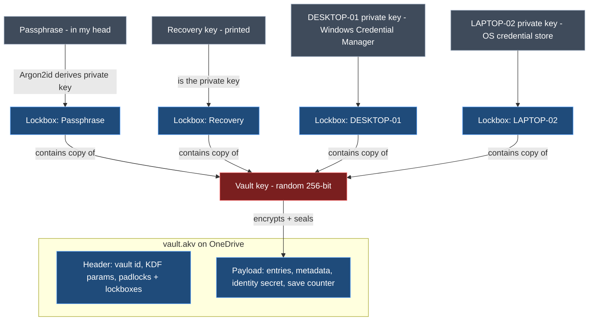
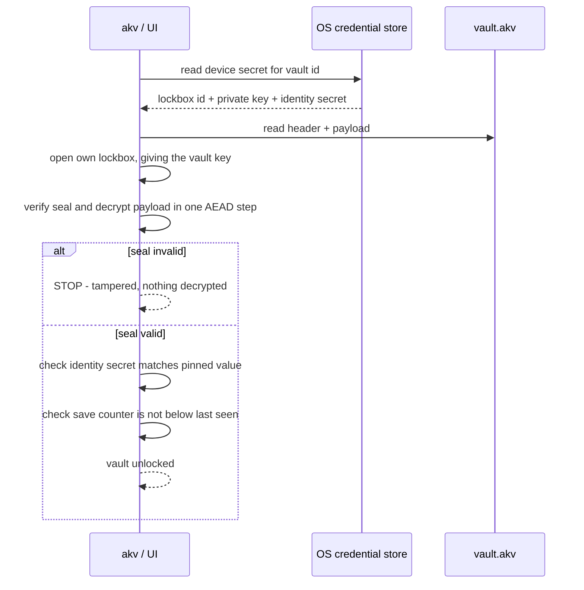
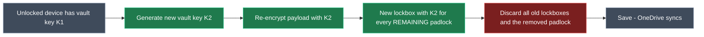
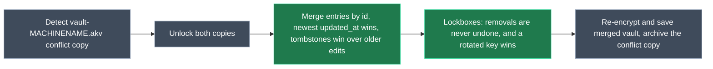
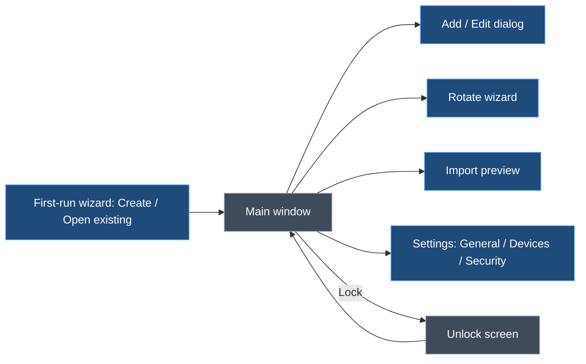

> **Plan file holds two design documents.** On approval they are saved to the repository (not committed unless asked):
> - Part 1 → `docs/design/crypto-and-persistence.md`
> - Part 2 → `docs/design/ui-and-cli.md`

# ApiKeyVault — Cryptography & Persistence Design

> **Status:** Agreed in design discussion, 2026-10-05. Scope: how the vault is encrypted, unlocked, shared between devices via OneDrive, and stored on each device.

## 1. Context

API secret keys (OpenAI, Anthropic, OpenRouter, Azure OpenAI, Gemini, Google Stitch, Serper, Clockify, …) currently live in a plain-text file. ApiKeyVault replaces that with a single **encrypted vault file** that:

- lives in a OneDrive folder so every personal machine sees the same vault;
- opens **without a password prompt** on a trusted device, using the OS credential store;
- can always be recovered with a **master passphrase** or a **printed recovery key**;
- lets a lost or retired device be **cut off** without touching any other device;
- refuses to open if anyone has **tampered** with the file.

Both the CLI (`akv`) and the desktop UI use the same core library, and therefore the same design.

## 2. Glossary

| Term | Plain meaning | Technical meaning |
|---|---|---|
| **Vault key** | The one key that locks the safe | Random 256-bit symmetric key (DEK) encrypting the payload |
| **Lockbox** | A small locked box holding a copy of the vault key | The vault key encrypted to one recipient (key slot) |
| **Padlock** | Anyone can snap it shut; only its key opens it | A recipient's X25519 **public** key, stored in the vault file |
| **Private key** | The key that opens one padlock | A recipient's X25519 **private** key, never stored in the vault file |
| **Seal** | Tamper-evident seal over the whole file | AEAD authentication tag over header + payload |
| **Vault identity secret** | Proof that this is *my* vault, not a look-alike | Random 256-bit value inside the payload, pinned on each device |

## 3. Threat model

| Threat | Defended? | How |
|---|---|---|
| Someone gets the vault file (OneDrive compromise, leaked backup) | ✅ | Everything is encrypted. The only offline attack is guessing the passphrase, which is slowed by Argon2id. |
| Stolen laptop, powered off | ✅ (with BitLocker/FileVault) | The device private key is protected by the OS store (DPAPI) and full-disk encryption. |
| A device is lost or retired | ✅ | Remove its lockbox and rotate the vault key (§6.6). |
| Someone edits or corrupts the vault file | ✅ detected | The seal (§7.1). Restore from OneDrive version history. |
| Someone adds their own padlock to the file | ✅ detected | The seal covers the header (§7.1). |
| Someone swaps in a complete look-alike vault | ✅ detected | Vault identity secret pinning (§7.2). |
| Someone serves an older genuine copy of the file (rollback) | ⚠️ warned | Save counter (§7.3). |
| Another OS user on the same machine | ✅ | The OS store is per user. |
| Malware running as **me** | ❌ (accepted) | With Tier 1 storage, it can read the device key, just as it can read Git or Azure CLI credentials. Tier 2 (§8.2) narrows this. |
| A removed device **and** control of my OneDrive, together | ❌ (accepted) | Rotate the actual API keys with each provider. |
| Forgot the passphrase **and** lost every device **and** the recovery key | ❌ by design | Nobody can open the vault. That is the point. |

## 4. Key hierarchy



*Key: red = never written in the clear; blue = stored in the vault file; grey = held outside the file by its owner.*

Rules:

1. The **vault key is random**. It is never derived from the passphrase, so changing the passphrase never re-encrypts the vault.
2. Every lockbox holds the **same** vault key, locked to a different owner's padlock.
3. Padlocks are **public**: any unlocked device can create a new lockbox for any owner without that owner's secret. This is what makes rotation possible (§6.6).
4. Private keys **never enter the vault file**, and device private keys never leave their device.

## 5. Cryptographic constructions

### 5.1 Primitives

| Purpose | Primitive | Notes |
|---|---|---|
| Payload encryption + seal | **XChaCha20-Poly1305** (AEAD) | 192-bit random nonce, generated fresh on **every** save |
| Owner key pairs (padlocks) | **X25519** | Device, passphrase and recovery owners all use X25519 |
| Lockbox key derivation | **HKDF-SHA256** | Derives the wrap key from the X25519 shared secret |
| Passphrase → private key | **Argon2id** | Parameters stored in the header, tunable over time |
| Randomness | OS CSPRNG | `RandomNumberGenerator` / libsodium `randombytes` |

### 5.2 Creating a lockbox (locking a copy of the vault key to a padlock)

This follows the same pattern as `age`'s X25519 recipients:

```
eph_priv, eph_pub  = X25519 keygen()                     # throwaway, per lockbox
shared             = X25519(eph_priv, recipient_pub)
wrap_key           = HKDF-SHA256(ikm  = shared,
                                 salt = eph_pub || recipient_pub,
                                 info = "akv/lockbox/v1")
nonce              = random 24 bytes
wrapped_vault_key  = XChaCha20-Poly1305.Encrypt(wrap_key, nonce,
                                 plaintext = vault_key,
                                 aad = vault_id || lockbox_id)
lockbox            = { lockbox_id, kind, recipient_pub, eph_pub, nonce, wrapped_vault_key }
```

Opening a lockbox is the mirror image, using the owner's `recipient_priv` with `eph_pub`. The lockbox has its own authentication tag, so a tampered lockbox fails outright.

### 5.3 The three kinds of owner

| Lockbox kind | Where the private key comes from |
|---|---|
| **Passphrase** | `Argon2id(passphrase, salt, m, t, p)` produces 32 bytes, used as an X25519 private key. Salt and parameters are in the header. |
| **Recovery** | 32 random bytes generated at vault creation, shown **once** as a printable code (Crockford Base32 in groups, with a checksum), and never stored. |
| **Device** | 32 random bytes generated when the device enrols, stored only in that device's OS credential store (§8). |

### 5.4 Argon2id parameters

- The starting point is RFC 9106's memory-constrained recommendation (`m = 64 MiB, t = 3, p = 4`). At vault creation, the parameters are tuned upward until a derivation takes about **0.5–1 s** on the creating machine.
- The parameters are stored in the header. They can be raised later, which only re-creates the passphrase lockbox.
- **Bounds are enforced on read:** values below a minimum floor, or above a maximum ceiling (for example 1 GiB of memory), are rejected before Argon2 runs. This stops a tampered header from causing a memory-exhaustion hang, since the seal can't be checked until after a lockbox is opened.

## 6. Operations

### 6.1 Create a vault

1. Generate the vault key, vault id, vault identity secret, recovery private key and this device's private key.
2. Ask for the passphrase (entered twice) and derive the passphrase private key (§5.3).
3. Create three lockboxes: passphrase, recovery and this device.
4. Encrypt and seal the payload (§7.1), then write the file atomically (§9.2).
5. Store the device secrets in the OS store (§8). Show the recovery code once, and confirm it has been saved.

### 6.2 Unlock on a trusted device



### 6.3 Unlock with the passphrase or recovery key

This is the same flow as §6.2, except the private key comes from Argon2id(passphrase) or from the typed-in recovery code. It is used on a device that hasn't been enrolled, or as a fallback where no OS store is available.

### 6.4 Enrol a new device

1. Unlock once with the passphrase (§6.3).
2. Generate a device private key and add a new lockbox for it.
3. If a device lockbox with the **same machine name** already exists (for example after an OS reinstall), offer to replace it, so duplicates don't build up.
4. Save the file, then store the device secrets in the OS store.

### 6.5 Change the passphrase or recover

- **Change passphrase:** on an unlocked device, after an OS re-authentication check, derive a new passphrase private key with a new salt, then replace only the passphrase lockbox.
- **Forgot the passphrase:**
  - on a trusted device, unlock with the device key, then change the passphrase;
  - with no trusted device, unlock with the recovery code, then change the passphrase.
- **Regenerate the recovery code:** replace only the recovery lockbox, then show the new code once.

### 6.6 Remove a device (always rotates the vault key)



- Old lockboxes are **discarded unopened**. New ones are created using the public padlocks, so no other device's secret, passphrase or recovery code is needed.
- Other devices notice nothing: they open their (new) lockbox with their unchanged private key and find K2 inside.
- **Limitation:** rotation protects the vault from this point on. It can't take back what the removed device could already read. If that device was compromised, rotate the affected API keys with each provider.

### 6.7 Stale-device pruning

- Each device's lockbox metadata (name, created, last used) lives in the **encrypted payload**. The header holds only the lockbox id, kind and padlock.
- "Last used" is updated **at most once a day**, so OneDrive isn't constantly syncing tiny changes.
- Devices unused for more than **90 days** are flagged in the UI and in `akv status`. Removing one is a manual action, and always rotates the vault key (§6.6).
- The passphrase and recovery lockboxes are never pruned.

## 7. Integrity

### 7.1 The seal

- The payload is encrypted with XChaCha20-Poly1305 under the vault key, with **AAD = the header bytes exactly as stored in the file** (no re-serialisation).
- Opening is a two-stage process: first get the vault key from your own lockbox, then **verify and decrypt in one AEAD step**. No plaintext is released unless the seal matches, so editing the header (adding a padlock, removing a lockbox, changing parameters) or the payload is always detected.

### 7.2 Vault identity secret (stops look-alike vaults)

- When a device enrols, it copies the identity secret from the payload into its OS store, next to its private key.
- On every unlock, the payload's identity secret must match the pinned value. An attacker who builds a fake vault using my public padlocks can't know it.

### 7.3 Rollback detection

- The payload carries a **save counter** that goes up on every save.
- Each device remembers the highest counter it has seen, in its local state file (§8.1). A lower counter triggers a "this vault is older than one you've already seen" warning.

## 8. Device-side persistence

### 8.1 What each device stores

| Item | Where | Secret? |
|---|---|---|
| Device private key (32 B) + lockbox id + vault identity secret (32 B) | OS credential store, one item per vault, target `ApiKeyVault/<vaultId>` | **Yes** |
| Known vaults (path, vault id), highest save counter seen, last-used throttle | Local state file, e.g. `%LOCALAPPDATA%\ApiKeyVault\state.json` | No |

All OS store access goes through a single interface (`IDeviceKeyStore`: get / set / remove), so Tier 2 and other OSes can be added without touching the vault code.

### 8.2 Per-OS storage

| OS | Tier 1: silent (v1) | Tier 2: Windows Hello / Touch ID prompt (later) |
|---|---|---|
| **Windows** | Credential Manager, `CRED_TYPE_GENERIC`, **`CRED_PERSIST_LOCAL_MACHINE`** (never `ENTERPRISE`, which roams). Library: **Meziantou.Framework.Win32.CredentialManager**. | Non-exportable TPM key via `ncrypt.dll` (Platform Crypto Provider or the Passport/NGC key storage provider) used to wrap the device secret. **Needs a proof-of-concept** to confirm it actually shows a Windows Hello prompt rather than a key PIN. |
| **macOS** | **Login keychain**, generic password, non-synchronising. The Data Protection Keychain is ruled out because it needs a paid Apple Developer entitlement. Sign the CLI and UI with a stable self-signed certificate to avoid "Allow access?" prompts after rebuilds. Native calls (P/Invoke) into Security.framework. | Secure Enclave P-256 key wrapping the device secret. Deferred. |
| **Linux** | Secret Service (GNOME Keyring / KWallet / KeePassXC) via **Tmds.DBus.Protocol**, or the `secret-tool` command. | `systemd-creds --user` with TPM2 (needs systemd v256+ and `/dev/tpmrm0` access). Deferred. |
| **No store available** (SSH, WSL, headless) | Not enrolled as a device. The passphrase is asked for each session, and nothing secret is written to disk. | — |

### 8.3 Losing the device store is harmless

An admin password reset (which breaks DPAPI), an OS reinstall or a new machine all just mean the device is no longer enrolled. Unlock with the passphrase, re-enrol (which replaces the old lockbox, §6.4), and carry on.

## 9. Vault file persistence and sync

### 9.1 File layout

```
vault.akv
├── magic "AKV1" + format version
├── header (length-prefixed, UTF-8 JSON, stored bytes = seal AAD)
│   ├── vault_id
│   ├── kdf: { alg: argon2id, salt, m, t, p }
│   └── lockboxes: [ { lockbox_id, kind, recipient_pub, eph_pub, nonce, wrapped_vault_key } ]
└── payload: nonce (24 B) + XChaCha20-Poly1305 ciphertext of
    {
      identity_secret, save_counter,
      lockbox_registry: [ { lockbox_id, name, kind, created, last_used } ],
      entries: [ { id, provider, name, comment, source, secret, created, expires, updated_at } ],
      tombstones: [ { id, deleted_at } ]   # deleted entries and removed lockboxes
    }
```

All metadata (provider, name, comment, expiry) is encrypted, because it reveals too much to leave readable.

### 9.2 Writing safely

1. **Re-read before write:** if the file on disk has changed since it was loaded (a different save counter or hash), reload and merge (§9.3) before saving.
2. **Atomic replace:** write a temp file in the same folder, flush it, then replace `vault.akv` with it. OneDrive never sees a half-written file.
3. A fresh payload nonce on every save.

### 9.3 OneDrive conflict copies



- **Tombstones** make sure a deleted entry, or a removed device, isn't brought back by a merge with an older copy.
- If one copy has had its vault key rotated, the merged vault uses the **newer** key and lockbox set.

## 10. Runtime hygiene

- **No plaintext on disk:** no temp files and no swap-friendly caches. Secret buffers are zeroed (`CryptographicOperations.ZeroMemory`) as soon as they've been used.
- **Auto-lock:** the vault locks after a configurable idle time, and the vault key is wiped from memory.
- **Clipboard:**
  - copied secrets are cleared after about 20 s;
  - on Windows they're marked `ExcludeClipboardContentFromMonitorProcessing` and `CanIncludeInClipboardHistory = 0`, so they skip clipboard history and cloud clipboard;
  - equivalent hints are used on macOS and Linux where they exist.
- **CLI:** secrets are never accepted as command-line arguments. `akv add` reads them with hidden input, or takes them from the clipboard and then clears it.

## 11. Libraries (.NET 10)

| Need | Library | Status |
|---|---|---|
| X25519, XChaCha20-Poly1305, HKDF, Argon2id | **NSec** (libsodium) | Preferred. A small proof-of-concept must confirm Native AOT works and that the X25519 private key can be exported (`AllowPlaintextExport`). |
| Windows credential store | **Meziantou.Framework.Win32.CredentialManager** | v1 |
| Linux Secret Service | **Tmds.DBus.Protocol** | Later |
| macOS Keychain | P/Invoke to Security.framework (`[LibraryImport]`) | Later |
| Rejected | Devlooped.CredentialManager (maintenance-fee checks, heavy dependencies), Microsoft.Identity.Client.Extensions.Msal (tied to MSAL's token cache) | — |

## 12. Accepted trade-offs

- **Tier 1 is readable by any process running as me.** This matches Git, Azure CLI and most developer tooling. Tier 2 is the upgrade path, and it slots in behind `IDeviceKeyStore`.
- **A custom file format** rather than KDBX or age. The constructions above are standard (they follow the `age` pattern). Only the container is ours, which keeps it small and lets the header be sealed.
- **No 1Password-style Secret Key.** A strong passphrase plus Argon2id is the only defence against offline guessing. This was chosen for simpler recovery, and the OneDrive account has its own MFA.
- **Whole-file encryption.** Simple and atomic. The vault is small, so re-encrypting it on every save costs nothing.

## 13. Deferred

- Tier 2 storage (Windows Hello / TPM, Secure Enclave, `systemd-creds`).
- A second encryption layer per secret, so browsing the list doesn't decrypt every value.
- FIDO2 / YubiKey `hmac-secret` as an extra lockbox kind.
- Raising Argon2id parameters automatically as hardware gets faster.

## 14. Verification (when implemented)

- Round-trip tests: create, unlock (device / passphrase / recovery), enrol, remove and rotate, change passphrase.
- Tamper tests: flip a byte in the header, in a lockbox and in the payload, add a padlock, swap in a look-alike vault, roll back to an older copy. Each must be detected, and no plaintext must be returned.
- Conflict tests: concurrent edits merged correctly, deletes and device removals not resurrected, rotated key wins.
- Argon2id bounds: out-of-range parameters are rejected before derivation.
- Manual check on Windows: the Credential Manager item exists as a local-machine generic credential, and copied secrets don't appear in clipboard history (Win+V).

---

# ApiKeyVault — UI & CLI Design

> **Status:** Draft from design discussion, 2026-10-05. Scope: what the user can do with ApiKeyVault (use cases), and how each use case works in the CLI (`akv`, Spectre.Console) and the desktop UI (Avalonia). Cryptography and storage are covered in `crypto-and-persistence.md`, referred to below as *Crypto §n*.

## 1. Context

- ApiKeyVault replaces a plain-text file of API keys.
- There are two ways in:
  - a **CLI** for the terminal and for scripts;
  - a **desktop UI** for browsing and day-to-day copying.
- Both are thin layers over one **Core** library, so every use case behaves the same way in both.
- Daily use should be fast:
  - on an enrolled device there's no password prompt;
  - getting a key into a tool should take seconds;
  - keys should never be shown on screen, put in shell history or written to plain files.

## 2. Principles

1. **Same behaviour in the CLI and UI.** Every use case below has a CLI command and a UI location. Where they differ, the difference is noted.
2. **Use secrets without seeing them.** The main ways to use a key are copy (clipboard auto-clear) and inject (`akv run`). Showing a key on screen is an explicit, short-lived action.
3. **Secrets never travel as command-line arguments.** They're entered as hidden input or taken from the clipboard (in the UI or the CLI), or passed through stdin (scripts only).
4. **Keyboard first.** Everything common can be done without the mouse.
5. **Scriptable and testable.** The CLI has a non-interactive mode with JSON output. Every UI control has an automation ID (§9).
6. **No surprises.** Destructive or security-relevant actions say exactly what will happen before they do it: delete, remove a device (which rotates the vault key), change the passphrase.

## 3. Entry model

| Field | Required | Notes |
|---|---|---|
| Provider | ✅ | A preset (§4) or `Other` |
| Name | ✅ | Unique per provider. Lowercase, `a-z 0-9 - _`. Together these give the address `provider/name`, for example `anthropic/claude-code` |
| Secret | ✅ | Encrypted separately from the rest of the entry (§8) |
| Comment | — | What the key is for, and where it's used |
| Source | — | Where the key came from. Pre-filled by the preset with the provider's key-management URL, and can be edited (for example a different Azure resource) |
| Expires | — | Optional date. Most AI provider keys don't expire, so this can be left blank |
| Review by | — | Optional reminder date, for keys that don't expire but should be rotated regularly |
| Extra fields | Per preset | For example Azure OpenAI: endpoint, deployment, API version |
| Last test | Automatic | Time and result of the last live check (✓ / ✗ with the reason) |
| Created / Updated | Automatic | Timestamps |

**Status of an entry** (shown as an icon and colour everywhere):

| Status | Rule | CLI | UI |
|---|---|---|---|
| OK | Not expiring within 30 days, and the last test passed or the key hasn't been tested | `●` green | green dot |
| Due | Expires or review-by date within 30 days | `▲` yellow | yellow triangle |
| Expired | Expiry date has passed | `▲` red | red triangle |
| Failing | Last live test failed (401, 403 and so on) | `✕` red | red cross |

## 4. Provider presets

A preset provides:
- a display name and icon;
- the source URL;
- a key format hint (used only to warn, never to block);
- any extra fields;
- a live test.

Live tests are read-only calls that cost nothing where possible. **Every endpoint and format below must be confirmed during implementation.**

| Provider | Key looks like | Source (key page) | Extra fields | Live test |
|---|---|---|---|---|
| OpenAI | `sk-proj-…` / `sk-…` | platform.openai.com/api-keys | Organisation (optional) | `GET api.openai.com/v1/models` (Bearer) |
| Anthropic | `sk-ant-api03-…` | console.anthropic.com/settings/keys | — | `GET api.anthropic.com/v1/models` (`x-api-key`, `anthropic-version`) |
| OpenRouter | `sk-or-v1-…` | openrouter.ai/settings/keys | — | `GET openrouter.ai/api/v1/key` (also shows usage and limit) |
| Azure OpenAI | 32 or 84 characters | Azure portal → resource → *Keys and Endpoint* | Endpoint, deployment, API version | List models or deployments on the endpoint (`api-key` header) |
| Gemini | `AIza…` (39 characters) | aistudio.google.com/apikey | — | `GET generativelanguage.googleapis.com/v1beta/models` (`x-goog-api-key`) |
| Google Stitch | To confirm | Stitch settings | — | None known yet. Stored without a live test |
| Serper | 40 hex characters | serper.dev/api-key | — | To confirm. If there's no free endpoint, use a minimal search (1 credit) that only runs when you ask for a test |
| Clockify | Alphanumeric | Clockify → Profile settings → API | Workspace (optional) | `GET api.clockify.me/api/v1/user` (`X-Api-Key`) |
| Other | Anything | Free text | Any custom name/value pairs | Optional: URL + header name (+ prefix such as `Bearer `), test passes on any 2xx response |

- Presets are data (an embedded JSON file), so a new provider is a small change and not new screens.
- **Import** (UC-04) uses each preset's key format to guess the provider.

## 5. Use cases

### 5.1 Overview

| ID | Use case | CLI | UI |
|---|---|---|---|
| **Setting up** | | | |
| UC-01 | Create a new vault | `akv init` | First-run wizard → *Create a new vault* |
| UC-02 | Use the vault on another device | `akv join` | First-run wizard → *Open an existing vault* |
| UC-03 | Unlock when the device isn't enrolled | Asked for the passphrase automatically; `akv shell` for a session | Unlock screen |
| UC-04 | Import keys from the old plain-text file | `akv import <file>` | *File → Import…* |
| **Daily use** | | | |
| UC-05 | Find a key | `akv list`, `akv find <text>` | Search (Ctrl+K), sidebar filters |
| UC-06 | Copy a key | `akv get <key>` | Enter / 📋 / double-click |
| UC-07 | Use a key in a command without copying it | `akv run -e VAR=<key> -- <cmd>` | *Copy as command…* (copies the `akv run` line, not the key) |
| UC-08 | Pipe a key into a tool | `akv get <key> --stdout \| tool` | — (CLI only) |
| UC-09 | Show a key on screen | `akv get <key> --reveal` | 👁 (re-masks after 10 s) |
| UC-10 | Lock | Not needed (each command is short-lived); `exit` in `akv shell` | Ctrl+L, auto-lock |
| **Managing keys** | | | |
| UC-11 | Add a key | `akv add` | Ctrl+N |
| UC-12 | Edit a key's details | `akv edit <key>` | *Edit* |
| UC-13 | Replace a key's secret (rotate) | `akv rotate <key>` | *Rotate* wizard |
| UC-14 | Delete a key | `akv rm <key>` | 🗑 / Delete key |
| UC-15 | Test a key, or all keys | `akv test <key>` / `akv test --all` | *Test* / *Test all* |
| UC-16 | See what needs attention | `akv status` | *Attention* view and badge |
| **Devices and security** | | | |
| UC-17 | See devices | `akv device list` | *Settings → Devices* |
| UC-18 | Remove a device (rotates the vault key) | `akv device remove <name>` | *Settings → Devices → Remove* |
| UC-19 | Rename this device | `akv device rename <new>` | *Settings → Devices → Rename* |
| UC-20 | Change the passphrase | `akv passphrase change` | *Settings → Security* |
| UC-21 | Create a new recovery code | `akv recovery new` | *Settings → Security* |
| UC-22 | Recover (forgotten passphrase, no enrolled device) | `akv recover` | Unlock screen → *Use recovery code* |
| **When things go wrong** | | | |
| UC-23 | OneDrive conflict copy found | Merged automatically on next open; reported in the output | Banner: "Merged N changes from a conflicting copy" |
| UC-24 | Tampering detected | Stops; exit code 6 | Blocking error screen |
| UC-25 | Older copy detected (rollback) | Warning; asks before continuing | Warning dialog |
| **Settings** | | | |
| UC-26 | Change settings | `akv config get/set` | *Settings → General* |

### 5.2 Setting up

**UC-01 Create a new vault**

1. Choose the folder; the default suggestion is the OneDrive folder, if one is found.
2. Enter the passphrase twice. A strength meter shows; weak passphrases trigger a warning, and very weak ones are refused.
3. Argon2id is tuned automatically, with a "Securing…" spinner of about 1 s.
4. The **recovery code** is shown once in a panel. To continue, type the last group of the code to confirm you've saved it. There's also an option to print it (UI) or copy it to the clipboard once (with auto-clear).
5. This device is enrolled automatically, using the machine name as the device name (editable).
6. Offer to import (UC-04).

```
$ akv init
? Vault location › C:\Users\me\OneDrive\ApiKeyVault\vault.akv
? Passphrase     › ************************   strength: strong
? Confirm        › ************************
⠋ Securing (tuning key derivation)…
╭─ Recovery code ─ shown once ──────────────────────────────╮
│  7KQ2-M9XD-4RTA-PB3W-ZE8N-H1FC-60VJ-Y5GS-KQ                │
│  Store it offline (paper, password manager).              │
│  It opens the vault if you forget the passphrase.         │
╰───────────────────────────────────────────────────────────╯
? Type the last group to confirm you saved it › KQ
✓ Vault created. This device (DESKTOP-01) is enrolled.
? Import keys from an existing file now? (y/N)
```

**UC-02 Use the vault on another device**

1. Point to the existing `vault.akv`. The default finds it in OneDrive.
2. Enter the passphrase once.
3. Confirm the device name. If a device with the same name already exists (for example after an OS reinstall), offer to **replace** it instead of adding a duplicate.
4. The device is enrolled. From now on, it opens without a prompt.

**UC-03 Unlock when the device isn't enrolled**

- Used where there's no OS credential store (SSH, WSL, headless) or the user chose not to enrol.
- CLI: each command asks for the passphrase. `akv shell` opens an interactive session (`akv> list`, `akv> get …`) that keeps the vault unlocked until `exit` or the idle timeout.
- UI: the unlock screen has a passphrase box, a *Use recovery code* link and an *Enrol this device* checkbox (on by default where an OS store exists).

**UC-04 Import keys from the old plain-text file**

1. Read a `.env`-style file (`NAME=value`), JSON, or loose lines.
2. Each value's provider is guessed from its key format (§4). A name is suggested from the variable name, for example `OPENAI_API_KEY_WORK` → `openai/work`.
3. **Preview table:** provider, name, masked secret, duplicate warnings. Every row can be edited or skipped.
4. *Test after import* is an optional checkbox.
5. Once the import is saved, offer to delete the original file, with a warning:
   - deleting doesn't remove copies in the Recycle Bin, OneDrive version history or backups;
   - if the plain-text file was ever synced, **rotate those keys** (UC-13).
   - The *Attention* view can list them as "was stored in plain text".

```
$ akv import C:\Users\me\keys.txt
 #  Provider      Name           Secret        Note
 1  OpenAI        personal-dev   sk-proj-…Xa9  
 2  Anthropic     claude-code    sk-ant-…3fQ   
 3  Unknown       clockify-key   N3k…q1        ? pick provider
 4  OpenAI        personal-dev   sk-proj-…Xa9  duplicate of #1 – skipped
? Provider for #3 › Clockify
? Import 3 keys? (Y/n)
✓ Imported 3 keys.
⚠ keys.txt still exists and may be in OneDrive version history.
? Delete keys.txt now? (y/N)
```

### 5.3 Daily use

**UC-05 Find a key**

- CLI:
  - `akv list` shows a table: status, provider, name, expires/review, last test, comment.
  - Filters: `--provider`, `--due [30d]`, `--failing`, `--search <text>`.
  - `akv find <text>` does a fuzzy search across provider, name and comment.
- UI:
  - Ctrl+K focuses search, with fuzzy matching on every keystroke.
  - The sidebar filters by provider or *Attention*.
  - ↑/↓ moves through the results.

**Addressing keys in the CLI:**
- `<key>` can be the full `provider/name`, just the `name` if that's unique, or a fuzzy fragment.
- If more than one key matches, an interactive picker is shown.
- In `--no-input` mode, more than one match is an error (exit 4).

**UC-06 Copy a key**

1. The secret is decrypted on its own (§8) and put on the clipboard, flagged so Windows keeps it out of clipboard history and cloud clipboard.
2. A countdown clears the clipboard after 20 s (configurable). It's only cleared if the clipboard still holds our value, so anything you copied since isn't wiped.
3. CLI: the command stays open and shows a progress bar until the clipboard is cleared. Ctrl+C clears it straight away. `--no-wait` hands the clear-down to a small background helper and returns at once.
4. UI: the status bar shows "📋 Copied claude-code · clears in 14s" with a ring countdown, and a *Clear now* button.
5. The entry's "last used" time is recorded, at most once a day per entry.

**UC-07 Use a key in a command without copying it**

```
$ akv run -e OPENAI_API_KEY=openai/personal-dev -e SERPER_API_KEY=serper/research -- python agent.py
```

- The secrets are put only into the child process's environment. The exit code is the child's exit code.
- No clipboard, screen, history or file is involved.
- **Profiles** (optional): `akv run --profile agent -- python agent.py`, where `agent` is a saved set of `VAR=key` mappings stored in the vault.
- UI: *Copy as command…* puts the `akv run …` line on the clipboard. That's safe, because the line doesn't contain the key.

**UC-08 Pipe a key into a tool**

- `akv get <key> --stdout` writes the secret to stdout with no trailing newline (`--newline` adds one).
- It's **refused when stdout is the terminal**, so the key never appears on screen or in the scrollback. Use `--reveal` (UC-09) to see it on purpose.

**UC-09 Show a key on screen**

- An explicit action:
  - UI: 👁, which re-masks after 10 s or when focus moves;
  - CLI: `--reveal`, which prints the secret in a panel and warns that it stays in the scrollback.
- The secret can be shown partly: first 6 and last 4 characters (*Show ends*), for checking which key it is without showing it all.

**UC-10 Lock**

- UI:
  - Ctrl+L, or the 🔒 button;
  - automatically after the idle timeout (5 minutes by default);
  - automatically when Windows is locked, the PC sleeps or the user session changes.
- Locking wipes the vault key and returns to a lock screen, or straight back to unlocked on an enrolled device with one click (*Open*).

### 5.4 Managing keys

**UC-11 Add a key**

- The fields from §3. Choosing a provider pre-fills the source and shows the format hint and any extra fields.
- Secret input:
  - UI: a masked box with paste support. Pasting from the clipboard clears the clipboard afterwards.
  - CLI: hidden prompt, `--from-clipboard`, or `--secret-stdin` for scripts.
- A live test runs on save by default (can be skipped). If it fails, you can *Save anyway* or *Go back*.
- Duplicate check: the same provider/name is refused. The same secret already stored under another name gives a warning.

```
$ akv add --provider anthropic --name claude-code --comment "Claude Code on DESKTOP-01" --from-clipboard
⠋ Testing against api.anthropic.com…
✓ Valid. Saved anthropic/claude-code. Clipboard cleared.
```

**UC-12 Edit a key's details**

- Change the name, comment, source, expiry, review-by date or extra fields.
- Changing the **secret** goes through UC-13, so the change is recorded on purpose.
- Renaming warns if `akv run` profiles refer to the old name, and offers to update them.

**UC-13 Replace a key's secret (rotate)** — a guided flow:

1. **Open source:** opens the provider's key page in the browser.
2. **New key:** paste the new secret; it's tested at once.
3. **Save:** the new secret replaces the old one.
   - The old secret is kept for 7 days as *previous*, so an accidental rotation can be undone, and then removed.
   - The *rotated on* date is recorded, and the review-by date can be pushed forward.
4. **Revoke old:** a reminder to delete the old key on the provider's page, with a checkbox to confirm.

**UC-14 Delete a key**

- Asks for confirmation:
  - CLI: type the name, or use `--yes` in scripts;
  - UI: a dialog naming the key.
- Leaves a tombstone so a sync merge doesn't bring the key back (Crypto §9.3).
- Reminds you to revoke the key on the provider's page.

**UC-15 Test a key, or all keys**

- One key: a spinner, then ✓ or ✕ with the reason (401 invalid / revoked, 403 no permission, 429 rate limited, network error).
- All keys: tested in parallel (up to 4 at a time), with a live table in the CLI and progress in the UI.
- Results are saved as *last test*.
- Network errors don't mark a key as failing; they're shown as "couldn't test".
- Tests never run automatically in the background, because they make network calls.

```
$ akv test --all
 Provider      Name           Result
 OpenAI        personal-dev   ✓ 210 ms
 Anthropic     claude-code    ✓ 180 ms
 Serper        research       ✕ 401 invalid or revoked
 Google Stitch prototype      – no live test for this provider
```

**UC-16 See what needs attention**

- Collects:
  - keys that are due, expired or failing;
  - keys flagged "was stored in plain text";
  - devices not used for over 90 days;
  - a pending conflict copy.
- CLI: `akv status` shows a summary panel with the vault path, number of devices, save counter and the items above.
- UI: the *Attention* entry in the sidebar shows a count badge. The app opens to this view when there's something new.

### 5.5 Devices and security

**UC-17 See devices** — a table of name, kind (device / passphrase / recovery), created, last used and stale flag. *This device* is marked.

**UC-18 Remove a device**

1. Choose the device; it can't be this device.
2. A confirmation explains what will happen:
   - "DESKTOP-OLD will lose access. The vault key will be changed; your other devices aren't affected. Anything DESKTOP-OLD has already read can't be taken back. If that device may be compromised, rotate your API keys."
3. The vault key is rotated (Crypto §6.6), with a spinner. The result is shown.
4. If the device may be compromised, the follow-up *Rotate all keys…* flag marks every key as due for rotation.

**UC-19 Rename this device** — changes only the display name in the encrypted payload.

**UC-20 Change the passphrase**

- Asks for the current passphrase first. Being unlocked by the device key isn't enough, so a passerby can't change it.
- Then enter the new one twice. A strength meter shows.
- Only the passphrase lockbox changes. Other devices aren't affected.

**UC-21 Create a new recovery code**

- Asks for the current passphrase.
- A new code is shown once, then confirmed by typing its last group.
- The old code stops working at once.

**UC-22 Recover**

1. Enter the recovery code. It's checked with its checksum, so typos are caught before trying it.
2. Set a new passphrase.
3. This device is enrolled.
4. Offer to create a new recovery code. This is recommended, since the old one has now been typed in.

### 5.6 When things go wrong

| Case | What the user sees | What they can do |
|---|---|---|
| **UC-23 Conflict copy** | "OneDrive created a conflicting copy (vault-LAPTOP-02.akv). Merged 2 changes." | *View changes* (list of merged entries), then the copy is archived to `conflicts/` |
| **UC-24 Tampering** | "This vault file has been changed by something other than ApiKeyVault, or is damaged. Nothing was decrypted." | *Open OneDrive version history*; *Choose another file*. The vault can't be opened until it's fixed |
| **UC-25 Rollback** | "This vault is older than one this device has already seen (save 41 vs 57). Changes may be missing." | *Continue read-only*; *Open OneDrive version history*; *Accept as current* (needs confirmation) |
| Vault file missing | "Vault not found at …" | *Locate…* / `akv config set vault <path>` |
| Device no longer enrolled (OS store cleared, removed elsewhere) | Unlock screen with "This device needs to be enrolled again" | Enter the passphrase → re-enrol (replaces the old entry) |
| Wrong passphrase | "Passphrase didn't open this vault." A short delay is added after each wrong attempt | Retry / *Use recovery code* |

### 5.7 Settings (UC-26)

| Setting | Default |
|---|---|
| Vault path | Chosen at init or join |
| Auto-lock after idle | 5 min |
| Lock when the OS locks or sleeps | On |
| Clipboard clear after | 20 s |
| Reveal re-mask after | 10 s |
| "Due" warning window | 30 days |
| Stale device after | 90 days |
| Theme | Follow OS (light / dark) |
| Hide window from screen capture (Windows `WDA_EXCLUDEFROMCAPTURE`) | On. Keeps the window out of screen sharing and screenshots; can be turned off |
| Test keys when saving | On |

Settings that belong to the vault (warning window, stale-device age) are stored in the encrypted payload. Settings that belong to this device (path, timers, theme) are stored in the local state file.

## 6. CLI reference (`akv`)

### 6.1 Command tree

```
akv
├── init                         UC-01
├── join [path]                  UC-02
├── shell                        UC-03
├── import <file>                UC-04
├── list | ls  [filters]         UC-05
├── find <text>                  UC-05
├── get <key> [--stdout|--reveal|--no-wait]     UC-06/08/09
├── run [-e VAR=<key>]... [--profile p] -- <cmd>  UC-07
├── add                          UC-11
├── edit <key>                   UC-12
├── rotate <key>                 UC-13
├── rm <key>                     UC-14
├── test [<key>|--all]           UC-15
├── status                       UC-16
├── profile list|set|rm          UC-07 (run profiles)
├── device list|remove|rename    UC-17–19
├── passphrase change            UC-20
├── recovery new                 UC-21
├── recover                      UC-22
└── config get|set|list          UC-26
```

### 6.2 Global options

| Option | Meaning |
|---|---|
| `--vault <path>` | Use a different vault for this command |
| `--json` | Machine-readable output. **Never includes secrets.** `get --stdout` is the only command that outputs a secret |
| `--no-input` | Never prompt; fail instead (exit 2 or 4). For scripts, CI and AI agents |
| `--yes` | Confirm destructive actions without asking (needs `--no-input` or an interactive terminal) |
| `--no-color`, `--quiet` | Plain or minimal output. Colour is also turned off automatically when output is redirected |

### 6.3 Exit codes

| Code | Meaning |
|---|---|
| 0 | Success |
| 1 | General error |
| 2 | Bad usage or invalid arguments |
| 3 | Couldn't unlock (wrong passphrase, not enrolled under `--no-input`) |
| 4 | Key not found, or more than one match |
| 5 | Live test failed |
| 6 | Tampering detected |
| 7 | Rollback detected and not accepted |
| *n* | `akv run`: the child process's exit code |

### 6.4 Spectre.Console pieces used

| Need | Spectre feature |
|---|---|
| Choosing from lists (provider, ambiguous key) | `SelectionPrompt` with search |
| Hidden secret / passphrase entry | `TextPrompt<string>.Secret()` |
| Lists and results | `Table`, with colours from the status in §3 |
| Recovery code, warnings, `status` | `Panel` |
| Live tests, Argon2 tuning, key rotation | `Status` spinner / `Live` table |
| Clipboard countdown | `Progress` bar |
| Command parsing and help | `Spectre.Console.Cli` (`CommandApp`) |

## 7. Desktop UI (Avalonia)

### 7.1 Window map



### 7.2 Main window

```
┌──────────────────────────────────────────────────────────────────────────────┐
│ 🔒 ApiKeyVault          [ Search keys…              Ctrl+K ]     ⚙  🔒 Lock  │
├───────────────┬──────────────────────────────────┬───────────────────────────┤
│ All keys   12 │ ● Anthropic · claude-code        │ Anthropic · claude-code   │
│ ⚠ Attention 2 │ ● OpenAI · personal-dev          │                           │
│───────────────│ ▲ Azure OpenAI · intent-eastus   │ Secret  ••••••••••  👁 📋  │
│ Anthropic   2 │   expires in 27 days             │ Comment Claude Code on…   │
│ OpenAI      3 │ ✕ Serper · research   401        │ Source  console.anthr… ↗  │
│ OpenRouter  1 │ ● Gemini · stitch-proto          │ Expires —                 │
│ Azure OpenAI 2│                                  │ Tested  ✓ today 09:14     │
│ Gemini      2 │                                  │ Created 2026-03-02        │
│ Serper      1 │                                  │                           │
│ Clockify    1 │                                  │ [Test] [Rotate] [Edit] 🗑  │
├───────────────┴──────────────────────────────────┴───────────────────────────┤
│ 📋 Copied claude-code · clears in 14s ◔  [Clear now]        Synced · 3 devices │
└──────────────────────────────────────────────────────────────────────────────┘
```

- **Sidebar:** All keys, Attention (with a badge), then one item per provider with a count.
- **List:** status icon, provider, name, and a second line with the expiry or failure reason.
- **Details:** the masked secret with 👁 / 📋, the entry fields, the test result and actions.
- **Status bar:**
  - clipboard countdown;
  - sync state ("Synced", "Merged 2 changes", "Vault file changed on disk — reloaded");
  - device count.
- The window follows the OS light/dark theme using Avalonia's Fluent theme.

### 7.3 Keyboard shortcuts

| Keys | Action |
|---|---|
| Ctrl+K | Search |
| ↑ / ↓ | Move through the list |
| Enter | Copy the selected key |
| Ctrl+Shift+C | *Copy as command…* (`akv run` line) |
| Ctrl+N | Add a key |
| Ctrl+E | Edit |
| Ctrl+R | Show / hide the selected secret |
| Ctrl+T | Test the selected key |
| Delete | Delete (with confirmation) |
| Ctrl+L | Lock |
| Ctrl+, | Settings |

## 8. Secret handling in the interfaces

**Requirement on the core:** the crypto design's whole-file encryption puts every secret in memory as plain text while the vault is open. This document requires the **per-secret encryption layer** (Crypto §13) in v1:
- unlocking decrypts only the entry details;
- each secret is decrypted only when it's used, then wiped.

| Situation | Vault key in memory | Plain-text secret in memory |
|---|---|---|
| CLI `get` / `test` / `add` | Only while the command runs | Only while copying, testing or saving it, then wiped |
| CLI `run` | Only at startup | In the child process's environment, for as long as the child runs |
| CLI clipboard countdown | Wiped before the countdown starts | Only on the clipboard, not in our memory |
| UI, unlocked | Kept, because it's needed to save | Only while you copy, reveal, test or edit it, then wiped |
| UI, locked | Wiped | None |

**Rules:**

- Secrets are kept as pinned `byte[]` buffers and wiped with `CryptographicOperations.ZeroMemory`.
- **.NET strings can't be wiped.** A secret becomes a `string` only where a framework API demands it:
  - Avalonia text input;
  - the reveal label;
  - the clipboard API;
  - HTTP headers for live tests.

  These strings are short-lived, never stored in view models, and input boxes are cleared straight after saving. A copy may remain in memory until the memory manager reuses it; this is an accepted limitation. `SecureString` isn't used, because Microsoft no longer recommends it.
- Secrets are **never** logged, written to exception messages, included in `--json`, or shown in window titles or notifications.
- Masked inputs don't reveal their value through the accessibility interface. This must be confirmed for Avalonia's `TextBox` with `PasswordChar` (§9).
- Paging and crash dumps can capture memory, so full-disk encryption is assumed.

## 9. Testing and AI automation

| Layer | Tool | What it covers |
|---|---|---|
| Core | xUnit | Crypto, storage, merge and presets (Crypto §14) |
| View models | xUnit + CommunityToolkit.Mvvm | Every UI use case's logic, without the UI: add, copy and countdown, lock on idle, rotate wizard steps, attention rules |
| UI (headless) | **Avalonia.Headless.XUnit** | Real windows rendered in memory: clicks, typing, focus, keyboard shortcuts. Screenshot output for visual checks, including by an AI agent reading the images |
| CLI | **Spectre.Console.Testing** (`CommandAppTester`, `TestConsole`) | Commands, prompts, tables, exit codes, `--json` output |
| End-to-end smoke (Windows) | FlaUI (UI Automation) | Start the real app, unlock, find a key, copy it, check the clipboard is cleared |

**Rules that make this possible:**

- Every interactive control has an `AutomationProperties.AutomationId` (for example `Search.Box`, `Entry.Copy`, `Settings.Devices.Remove`).
- The CLI's `--no-input` + `--json` + `--secret-stdin` let scripts and AI agents run every use case without interactive prompts.
- The device key store, clock, clipboard and HTTP layer are interfaces (`IDeviceKeyStore`, `TimeProvider`, `IClipboard`, `IProviderTester`). Tests use fakes, so automated tests never touch the real Credential Manager, the real clipboard or real provider APIs.
- **Automation only ever uses a throwaway test vault with fake keys.** It never points at the real `vault.akv`. The test fixtures create the vault in a temporary folder.

## 10. Out of scope (v1)

- Tray icon with a global quick-copy hotkey (a likely next step).
- Exporting to plain text or `.env` files (`akv run` covers this need without writing secrets to disk).
- Creating or revoking keys automatically through provider admin APIs.
- Sharing a vault with other people.
- Browser extension, mobile apps.
- macOS and Linux packaging (the design is cross-platform; Windows ships first).

## 11. Verification (when implemented)

- Each use case UC-01 to UC-26 has at least one view-model or CLI test. The key flows (UC-01, 02, 04, 06, 07, 11, 13, 18, 22, 24) also have a headless UI test.
- Clipboard: the value is cleared after the timeout; it isn't cleared if the user copied something else since; it doesn't appear in Win+V history.
- `akv get --stdout` is refused on a terminal and works when piped. `--json` never contains a secret: a test scans the output for every secret in the test vault.
- `akv run` passes only the requested variables, and returns the child's exit code.
- Locking wipes the vault key. Copy, reveal and test don't leave the decrypted secret in any view-model field afterwards.
- Manual: screen sharing in Teams shows a blank window while *Hide from screen capture* is on.
