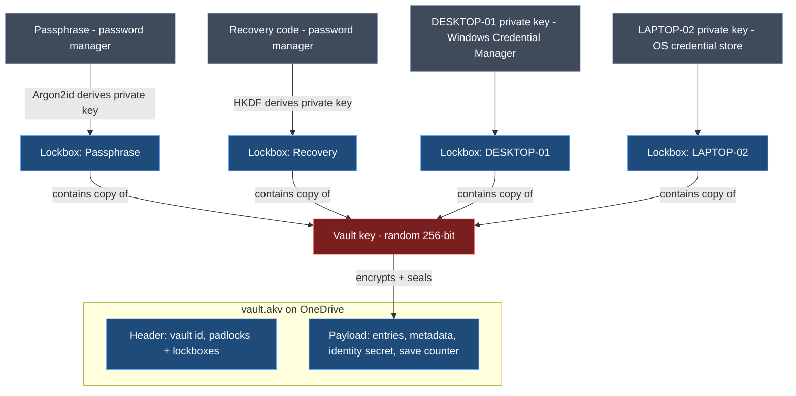
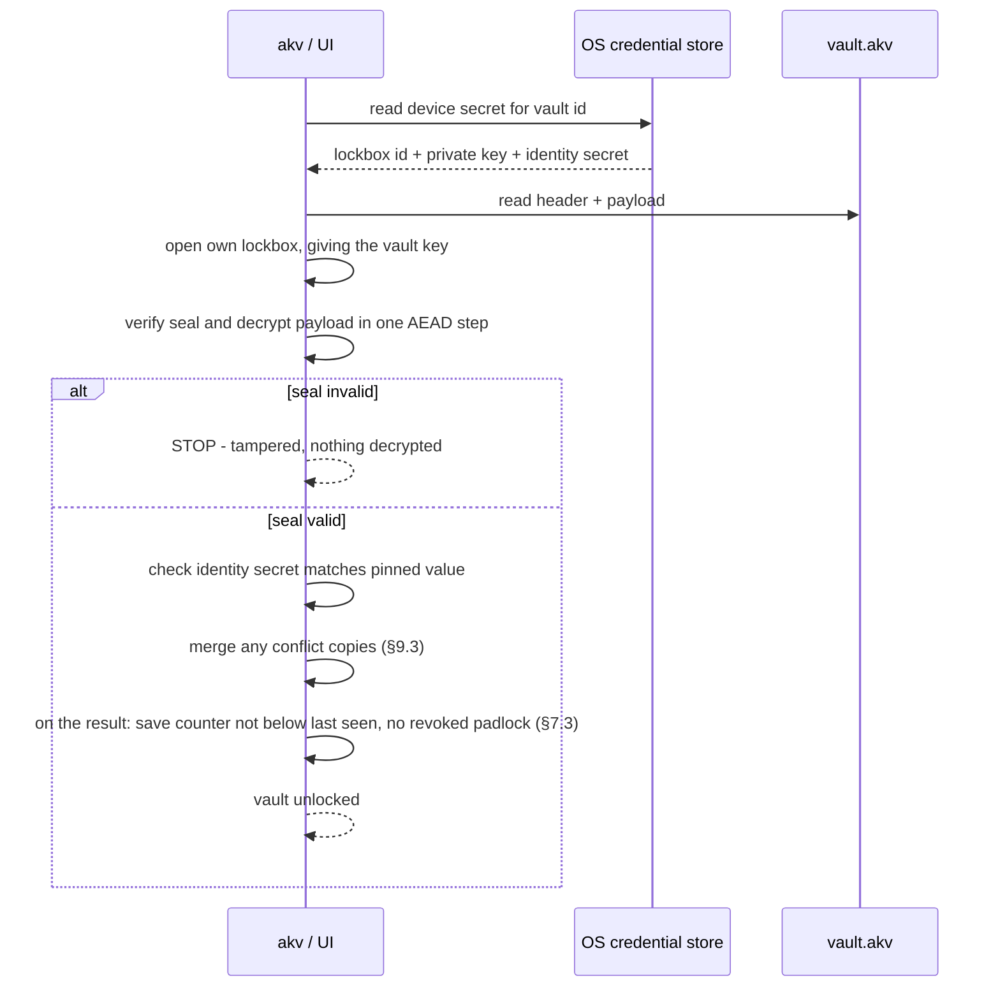
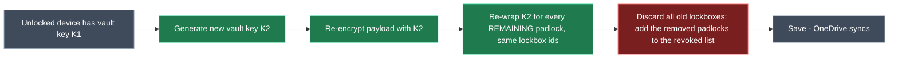
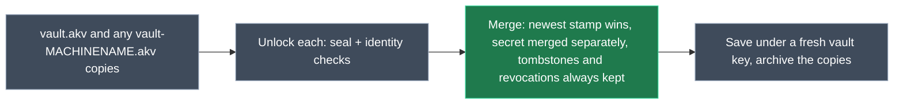
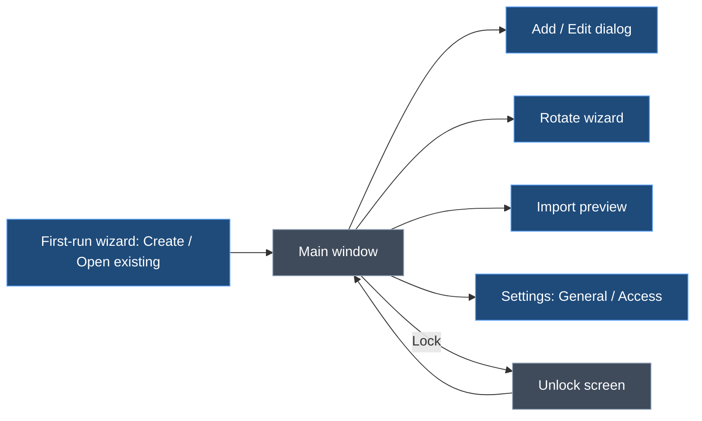

> **Plan file holds two design documents.** On approval they are saved to the repository (not committed unless asked):
> - Part 1 → `docs/design/crypto-and-persistence.md`
> - Part 2 → `docs/design/ui-and-cli.md`

# ApiKeyVault — Cryptography & Persistence Design

> **Status:** Agreed in design discussion, 2026-10-05; revised 2026-10-06 after review. Scope: how the vault is encrypted, unlocked, shared between devices via OneDrive, and stored on each device.

## 1. Context

API secret keys (OpenAI, Anthropic, OpenRouter, Azure OpenAI, Gemini, Google Stitch, Serper, Clockify, …) currently live in a plain-text file. ApiKeyVault replaces that with a single **encrypted vault file** that:

- lives in a OneDrive folder so every personal machine sees the same vault;
- opens **without a password prompt** on a trusted device, using the OS credential store;
- can always be recovered with a **master passphrase** or a **recovery code**, both kept in my password manager;
- lets a lost or retired device be **cut off** without touching any other device;
- refuses to open if anyone has **tampered** with the file.

Both the CLI (`akv`) and the desktop UI use the same core library, and therefore the same design.

**Scope and principle.**
- This is a vault for **one person and their own devices**. It is not a team or enterprise vault.
- Real holes are plugged with simple mechanisms.
- Threats that need an attacker who **already had access** (a former device, or an old passphrase) **and** can write to my OneDrive are accepted, not engineered around (§3, §12). The remedy for those is to rotate the API keys with each provider.

## 2. Glossary

| Term | Plain meaning | Technical meaning |
|---|---|---|
| **Vault key** | The one key that locks the safe | Random 256-bit symmetric key (DEK) encrypting the payload |
| **Lockbox** | A small locked box holding a copy of the vault key | The vault key encrypted to one recipient (key slot) |
| **Padlock** | Anyone can snap it shut; only its key opens it | A recipient's X25519 **public** key, stored in the vault file |
| **Private key** | The key that opens one padlock | A recipient's X25519 **private** key, never stored in the vault file |
| **Seal** | Tamper-evident seal over the whole file | AEAD authentication tag over header + payload |
| **Vault identity secret** | Proof that this is *my* vault, not a look-alike | Random 256-bit value inside the payload, pinned on each device |
| **Identity tag** | The same proof, for unlocks with the passphrase or recovery code | HMAC over the identity secret, keyed from the passphrase or recovery code (§7.2) |

## 3. Threat model

| Threat | Defended? | How |
|---|---|---|
| Someone gets the vault file (OneDrive compromise, leaked backup) | ✅ | Everything is encrypted. The only offline attack is guessing the passphrase, which is slowed by Argon2id. |
| Stolen laptop, powered off | ✅ (with BitLocker/FileVault) | The device private key is protected by the OS store (DPAPI) and full-disk encryption. |
| A device is lost or retired | ✅ | Remove its lockbox and rotate the vault key (§6.6). |
| Someone edits or corrupts the vault file | ✅ detected | The seal (§7.1). Restore from OneDrive version history. |
| Someone adds their own padlock to the file | ✅ detected | The seal covers the header (§7.1). |
| Someone builds a look-alike vault from my public padlocks | ✅ detected | Enrolled devices check the pinned identity secret. Passphrase and recovery unlocks check the identity tag (§7.2). |
| Someone serves an older genuine copy of the file (rollback) | ⚠️ warned | Save counter and the list of removed devices (§7.3). |
| An old passphrase or recovery code leaks after it was changed | ⚠️ partly | Every change of owner rotates the vault key (§6.5), so the old secret doesn't open the current vault. Copies saved **before** the change (version history, backups) still open with it and show the data as it was then. |
| Someone learns my passphrase or recovery code and adds their own device | ⚠️ visible | The device shows up in the device list. Remove it (§6.6) and change the passphrase or recovery code (§6.5). |
| Another OS user on the same machine | ✅ | The OS store is per user. |
| Malware running as **me** | ❌ (accepted) | With Tier 1 storage, it can read the device key, just as it can read Git or Azure CLI credentials. Tier 2 (§8.2) narrows this. |
| **Anyone who once held an owner secret** (a removed device, or an old passphrase plus an old copy) **and** can write to my OneDrive | ❌ (accepted) | They know the identity secret, so they can plant a vault my devices would open, and read keys added to it afterwards. Rotate the actual API keys with each provider, and treat an unexpectedly changed vault as a compromise. Defending this needs a key history (§13), which is overkill for a single-user vault. |
| Forgot the passphrase **and** lost every device **and** the recovery code | ❌ by design | Nobody can open the vault. That is the point. |

## 4. Key hierarchy



*Key: red = never written in the clear; blue = stored in the vault file; grey = held outside the file by its owner.*

Rules:

1. The **vault key is random** and never derived from the passphrase, so owners can be added without touching the others. It is **rotated whenever an owner is removed or replaced** (§6.5, §6.6), because an old copy of the file plus an old owner secret would otherwise still open the current vault.
2. Every lockbox holds the **same** vault key, locked to a different owner's padlock.
3. Padlocks are **public**: any unlocked device can create a new lockbox for any owner without that owner's secret. This is what makes rotation possible (§6.6).
4. Private keys **never enter the vault file**, and device private keys never leave their device.

## 5. Cryptographic constructions

### 5.1 Primitives

| Purpose | Primitive | Notes |
|---|---|---|
| Payload encryption + seal | **XChaCha20-Poly1305** (AEAD) | 192-bit random nonce, generated fresh on **every** save |
| Owner key pairs (padlocks) | **X25519** | Device, passphrase and recovery owners all use X25519 |
| Lockbox key derivation | **HKDF-SHA256** | Derives the wrap key from the X25519 shared secret |
| Passphrase → private key | **Argon2id** | Parameters stored in the passphrase lockbox |
| Identity tag | **HMAC-SHA256** | §7.2 |
| Randomness | OS CSPRNG | `RandomNumberGenerator` / libsodium `randombytes` |

### 5.2 Creating a lockbox (locking a copy of the vault key to a padlock)

This follows the same pattern as `age`'s X25519 recipients:

```
eph_priv, eph_pub  = X25519 keygen()                     # throwaway, per lockbox
shared             = X25519(eph_priv, recipient_pub)
wrap_key           = HKDF-SHA256(ikm  = shared,
                                 salt = eph_pub || recipient_pub,
                                 info = "akv/lockbox/v1")
nonce              = random 24 bytes
wrapped_vault_key  = XChaCha20-Poly1305.Encrypt(wrap_key, nonce,
                                 plaintext = vault_key,
                                 aad = vault_id || lockbox_id)
lockbox            = { lockbox_id, kind, recipient_pub, eph_pub, nonce, wrapped_vault_key,
                       kdf     (passphrase lockbox only, §5.4),
                       id_tag  (passphrase and recovery lockboxes only, §7.2) }
```

Opening a lockbox is the mirror image, using the owner's `recipient_priv` with `eph_pub`. The lockbox has its own authentication tag, so a tampered lockbox fails outright.

A `lockbox_id` belongs to one owner for life. Rotation (§6.6) re-wraps the new vault key under the **same** id. A replaced owner (new passphrase, new recovery code, re-enrolled device) gets a **new** id, and the old one is revoked.

### 5.3 The three kinds of owner

| Lockbox kind | Where the private key comes from |
|---|---|
| **Passphrase** | `Argon2id(passphrase, salt, m, t, p = 1)` produces 64 bytes: the first 32 are the X25519 private key, the last 32 are the identity-tag key (§7.2). Salt and parameters are stored in the passphrase lockbox. |
| **Recovery** | A 128-bit random code generated at vault creation, shown **once** as 26 Crockford Base32 characters plus a 2-character checksum, in groups of 4, and never stored by ApiKeyVault (it goes in the password manager). `HKDF-SHA256(code, info = "akv/recovery/v1")` expands it to 64 bytes, split the same way as the passphrase's. |
| **Device** | 32 random bytes generated when the device enrols, stored only in that device's OS credential store (§8). Devices have no identity tag; they pin the identity secret instead (§7.2). |

**Who can be removed:**

| Owner | Change it | Remove it |
|---|---|---|
| Passphrase | ✅ Replace (§6.5) | ❌ Never |
| Recovery code | ✅ Replace (§6.5) | ❌ Never |
| Other devices | ✅ Rename, replace on re-enrolment (§6.4) | ✅ Yes (§6.6) |
| **This device** | ✅ Rename | ❌ Never from itself. Remove it from another device |

- There is exactly **one** passphrase lockbox and **one** recovery lockbox at any time. They are your way back in when devices are lost, so they can only ever be replaced, never removed.
- **This device** is the one whose lockbox id is in this machine's OS credential store for this vault (§8.1). That's the key it "logged in" with. It is recognised the same way even if this session was opened with the passphrase. A machine that isn't enrolled has no "this device".
- The core enforces these rules on **every** save, whatever asked for it: the UI, the CLI, *Accept as current* or a merge (§9.3).
  - It refuses any operation that would leave the vault without a passphrase lockbox or without a recovery lockbox.
  - It refuses any request **made on this device** to remove this device's lockbox. A removal made on another device still applies when this device next opens or merges the vault (§6.6). That's how a lost laptop gets cut off.
- There are no per-device permissions: every owner has full access.

### 5.4 Argon2id parameters

- **Parallelism is 1**, because libsodium (and therefore NSec, §11) only supports `p = 1`.
- The starting point is `m = 64 MiB, t = 3, p = 1`.
- At vault creation, only the **iterations** are tuned upward, until a derivation takes about **0.5–1 s** on the creating machine. Memory stays at 64 MiB, so a vault created on a powerful desktop still opens on a small headless machine.
- The parameters can be raised later with the same passphrase. This gives the passphrase lockbox a new id (the old one is revoked). It is the one replacement that needs **no** key rotation, because nobody new can open anything.
- **Bounds are enforced on read:** `m` outside 19–256 MiB, `t` outside 2–64, or `p ≠ 1` are rejected before Argon2 runs. This stops a tampered header from causing a memory-exhaustion hang, since the seal can't be checked until after a lockbox is opened.

## 6. Operations

### 6.1 Create a vault

1. Generate the vault key, vault id, vault identity secret, recovery code and this device's private key.
2. Ask for the passphrase (entered twice) and derive the passphrase private key (§5.3).
3. Create three lockboxes: passphrase and recovery (each with its identity tag, §7.2), and this device.
4. Encrypt and seal the payload (§7.1), then write the file atomically (§9.2).
5. Store the device secrets in the OS store (§8). Show the recovery code once, and confirm it has been saved.

### 6.2 Unlock on a trusted device



### 6.3 Unlock with the passphrase or recovery code

This is the same flow as §6.2, except the private key comes from Argon2id(passphrase) or from the typed-in recovery code. It is used on a device that hasn't been enrolled, or as a fallback where no OS store is available.

There is no pinned identity secret to compare with, so after the seal check the lockbox's **identity tag** is checked instead (§7.2). A mismatch is treated as tampering (UC-24).
### 6.4 Enrol a new device

1. Unlock once with the passphrase (§6.3).
2. Generate a device private key and add a new lockbox for it, with the device's name and the date in the device list (§9.1).
3. Device names are unique. If a device lockbox with the **same machine name** already exists (for example after an OS reinstall), offer to replace it, showing when it was last used. Replacing removes the old lockbox, so it rotates the vault key (§6.6).
4. If this device already has a **different** identity secret pinned for this vault id, stop and report tampering. A pin is never silently replaced.
5. Save the file, then store the device secrets in the OS store.

### 6.5 Change the passphrase or recover

- **Proof required:** any **one** of the current passphrase, the recovery code, or an OS re-authentication (Windows Hello, or the Windows sign-in prompt where Hello isn't set up). Being unlocked by the device key alone isn't enough.
- **Change passphrase:** derive a new passphrase key with a new salt. Replace the passphrase lockbox: it gets a new id and a new identity tag, and the old id is revoked. Then **rotate the vault key** (§6.6).
- **Forgot the passphrase:**
  - on a trusted device, prove yourself with an OS re-authentication, then change the passphrase;
  - with no trusted device, unlock with the recovery code, then change the passphrase.
- **Regenerate the recovery code:** replace the recovery lockbox in the same way, rotate the vault key, then show the new code once.
- **Limitation:** copies of the file saved *before* the change (OneDrive version history, backups) still open with the old passphrase or code, and show the data as it was at that time.

### 6.6 Remove devices (always rotates the vault key)



- **Several devices can be removed in one go**, with one rotation.
- Only **other** devices' lockboxes can be removed (§5.3). To retire the machine you're on, remove it from another device, or with the passphrase on another machine.
- Removing a device doesn't need anything from it: it can be offline, lost or broken.
- Old lockboxes are **discarded unopened**. New ones are created using the public padlocks, so no other device's secret, passphrase or recovery code is needed. Identity tags are carried over unchanged, because the identity secret doesn't change.
- Other devices notice nothing: they open their (new) lockbox with their unchanged private key and find K2 inside.
- The removed padlock goes on the payload's append-only **revoked** list, which each device mirrors locally (§7.3).
- **Every** operation that removes or replaces an owner uses this flow, with one exception (re-tuning the passphrase's Argon2id parameters, §5.4). The operations are:
  - removing devices;
  - replacing a device on re-enrolment;
  - changing the passphrase;
  - regenerating the recovery code;
  - *Accept as current* (§7.3);
  - merging conflict copies (§9.3).
- **Open sessions:**
  - A session unlocked with a device key re-reads that key from the OS store and opens its re-wrapped lockbox.
  - A session unlocked with the passphrase or recovery code (`akv shell`, or a UI opened with the passphrase) asks for it again.
  - A session that can't open the current file **never saves**.
- **Limitation:** rotation protects the vault from this point on. It can't take back what the removed device could already read, including its OneDrive copy and older versions in version history. The removed device also still knows the identity secret (§3, accepted). There is no remote wipe. If that device was compromised, rotate the affected API keys with each provider.
- **What the removed device sees:** its lockbox id is no longer in the header. It reports "This device no longer has access to this vault", and offers to delete its OS store item and local state, or to re-enrol with the passphrase.
- **Edge case:** if two devices remove each other at the same moment, the merge keeps both removals (§9.3) and both are locked out. The passphrase still works, so either can re-enrol.

### 6.7 Stale-device pruning

- Each device's lockbox metadata lives in the **encrypted payload** (§9.1). The header holds only the lockbox id, kind and padlock.
- "Last used" is updated **at most once a day**, so OneDrive isn't constantly syncing tiny changes. Merges take the latest value, and it never counts as an edit.
- Devices unused for more than **90 days** are flagged in the UI and in `akv status`. Removing them is a manual action (several at once if you like), and always rotates the vault key (§6.6).
- There is no automatic pruning, because it would silently cut off a rarely used machine.
- The passphrase and recovery lockboxes are never pruned (§5.3).

## 7. Integrity

### 7.1 The seal

- The payload is encrypted with XChaCha20-Poly1305 under the vault key, with **AAD = every byte of the file before the payload nonce, exactly as stored**: magic, format version, header length and header, with no re-serialisation.
- Opening is a two-stage process: first get the vault key from your own lockbox, then **verify and decrypt in one AEAD step**. No plaintext is released unless the seal matches, so editing the header (adding a padlock, removing a lockbox, changing parameters, changing the format version) or the payload is always detected.
- The seal only proves that the header and payload belong together under *some* vault key. Anyone can build a well-sealed file from the public padlocks, which is why §7.2 exists.

### 7.2 Vault identity secret (stops look-alike vaults)

- **Enrolled devices pin it.**
  - When a device enrols, it copies the identity secret from the payload into its OS store, next to its private key.
  - On every device unlock, the payload's identity secret must match the pinned value. Someone who builds a fake vault from my public padlocks can't know it.
  - Enrolment never replaces a different pinned value (§6.4).
- **Passphrase and recovery unlocks check a tag.** These unlocks have nothing pinned, so the passphrase and recovery lockboxes each carry

  ```
  id_tag = HMAC-SHA256(tag_key, "akv/id/v1" || vault_id || identity_secret)
  ```

  where `tag_key` is the second half of that owner's derived secret (§5.3). After the seal check, the tag is recomputed and must match.
  - Without my passphrase or recovery code, nobody can produce a valid tag for a look-alike vault.
  - Copying the genuine tag doesn't help, because it only matches the genuine identity secret, which is encrypted.
- Tags are recomputed only when their lockbox is replaced, which is when the passphrase or new recovery code is at hand anyway. Rotation (§6.6) keeps them valid, because the identity secret never changes.
- **Limitation:** someone who once held an owner secret already knows the identity secret (§3, accepted).

### 7.3 Rollback detection

- The payload carries a **save counter** that goes up on every save, and the append-only **revoked** list of removed padlocks (§6.6).
- Each device mirrors, in its local state file (§8.1), the highest counter it has seen and every revoked padlock it has seen.
- It's a rollback, with a "this vault is older than one you've already seen" warning, if:
  - the counter is lower than the highest seen; or
  - the file holds a lockbox for a padlock this device knows was revoked. This catches a restored copy from before a device removal, which would otherwise quietly let that device back in.
- Conflict copies are merged **before** these checks, which then run on the merged result (§9.3).
- The choices are *Continue read-only* (writes nothing) or *Accept as current* (UC-25). Accepting:
  1. asks for the same proof as a passphrase change (§6.5);
  2. rotates the vault key, dropping every revoked padlock this device knows about;
  3. if the copy's passphrase or recovery lockbox is older than the one this device last saw (the copy predates a passphrase change or a new recovery code), requires a new passphrase or a new recovery code **in the same step**, so an old secret isn't quietly let back in. `--accept-rollback` refuses in that case (exit 7);
  4. sets the save counter to one more than the larger of the file's counter and the highest this device has seen, and saves.
- **Limitation:** a device that never opened a copy saved after a removal doesn't know the padlock was revoked, so it can't detect that rollback.

## 8. Device-side persistence

### 8.1 What each device stores

| Item | Where | Secret? |
|---|---|---|
| Device private key (32 B) + lockbox id + vault identity secret (32 B) | OS credential store, one item per vault, target `ApiKeyVault/<vaultId>` | **Yes** |
| Known vaults (path, vault id), highest save counter seen, revoked padlocks seen, current passphrase and recovery lockbox ids, last-used throttle | Local state file, e.g. `%LOCALAPPDATA%\ApiKeyVault\state.json` | No |

All OS store access goes through a single interface (`IDeviceKeyStore`: get / set / remove), so Tier 2 and other OSes can be added without touching the vault code.

### 8.2 Per-OS storage

| OS | Tier 1: silent (v1) | Tier 2: Windows Hello / Touch ID prompt (later) |
|---|---|---|
| **Windows** | Credential Manager, `CRED_TYPE_GENERIC`, **`CRED_PERSIST_LOCAL_MACHINE`** (never `ENTERPRISE`, which roams). Library: **Meziantou.Framework.Win32.CredentialManager**. | Non-exportable TPM key via `ncrypt.dll` (Platform Crypto Provider or the Passport/NGC key storage provider) used to wrap the device secret. **Needs a proof-of-concept** to confirm it actually shows a Windows Hello prompt rather than a key PIN. |
| **macOS** | **Login keychain**, generic password, non-synchronising. The Data Protection Keychain is ruled out because it needs a paid Apple Developer entitlement. Sign the CLI and UI with a stable self-signed certificate to avoid "Allow access?" prompts after rebuilds. Native calls (P/Invoke) into Security.framework. | Secure Enclave P-256 key wrapping the device secret. Deferred. |
| **Linux** | Secret Service (GNOME Keyring / KWallet / KeePassXC) via **Tmds.DBus.Protocol**, or the `secret-tool` command. | `systemd-creds --user` with TPM2 (needs systemd v256+ and `/dev/tpmrm0` access). Deferred. |
| **No store available** (SSH, WSL, headless) | Not enrolled as a device. The passphrase is asked for each session, and nothing secret is written to disk. | — |

### 8.3 Losing the device store is harmless

An admin password reset (which breaks DPAPI), an OS reinstall or a new machine all just mean the device is no longer enrolled. Unlock with the passphrase, re-enrol (which replaces the old lockbox, §6.4), and carry on.

## 9. Vault file persistence and sync

### 9.1 File layout

```
vault.akv
├── magic "AKV1" + format version          ┐
├── header (length-prefixed, UTF-8 JSON)     ┘ stored bytes = seal AAD (§7.1)
│   ├── vault_id
│   └── lockboxes: [ { lockbox_id, kind, recipient_pub, eph_pub, nonce, wrapped_vault_key,
│                      kdf?: { alg: argon2id, salt, m, t, p }, id_tag? } ]
└── payload: nonce (24 B) + XChaCha20-Poly1305 ciphertext of
    {
      identity_secret, save_counter,
      lockbox_registry: [ { lockbox_id, kind, name, created, last_used } ],
      revoked: [ { lockbox_id, recipient_pub, removed_at } ],   # append-only (§6.6, §7.3)
      entries: [ { id, provider, name, comment, source, expires, review_by, extra_fields,
                   stamp,                                        # details
                   secret, secret_stamp, previous_secret?, previous_until?,
                   created, last_used, last_test } ],            # last_* are usage fields
      profiles: [ { id, name, mappings: [ { var, entry_id, field? } ], stamp } ],
      settings: { <name>: { value, stamp }, … },                 # vault-wide settings (UI §5.7)
      tombstones: [ { id, stamp } ]                              # deleted entries and profiles
    }
    # stamp = { time, writer lockbox_id }  (§9.3)
```

All metadata (provider, name, comment, expiry) is encrypted, because it reveals too much to leave readable.

A reader checks the magic and format version **before** anything else. A version newer than it understands is reported as "saved by a newer ApiKeyVault", never as tampering.

### 9.2 Writing safely

1. **One writer per machine:** take an exclusive per-vault lock on this machine around steps 2–4. Use a named mutex keyed by vault id, **never** a lock file in the OneDrive folder. OneDrive only makes conflict copies between machines, so without this the UI and the CLI could silently overwrite each other.
2. **Re-read before write:** if the file on disk has changed since it was loaded (a different save counter or hash), reload and merge (§9.3) before saving.
3. **Atomic replace:**
   - Write a temp file in the same folder and flush it.
   - Re-check the file's hash just before replacing, because OneDrive can write a downloaded version at any moment. If it changed, go back to step 2.
   - Then replace `vault.akv`, retrying briefly on sharing violations, since OneDrive holds file handles.
   - OneDrive never sees a half-written file.
4. A fresh payload nonce on every save.
5. **Reads don't write**, except the throttled usage fields (§6.7). Those are skipped entirely in read-only mode (UC-25).

### 9.3 OneDrive conflict copies



- **When:** conflict copies are merged as soon as the vault is opened, **before** the rollback checks (§7.3), which then run on the merged result.
- **All files are treated alike.** OneDrive may keep either the older or the newer file as `vault.akv`, so a file's name carries no weight.
- **Checks on every file:**
  - The seal, the same `vault_id`, and the same identity secret (pinned value or identity tag).
  - A file that has a lockbox for this owner but fails a check is **not merged**. It is reported as tampering (UC-24) and left where it is.
  - A file this owner has no lockbox in (for example, one saved before this device enrolled) isn't tampering. It is left for another device, or for the passphrase, to merge.
- **Stamps:** every changed record is stamped with the writer's lockbox id and a time. The time is the later of the device clock and the newest stamp already in the vault plus 1 ms, so an edit always beats everything its device had already seen, even if its clock is slow. The newest stamp wins, and ties go to the higher lockbox id.
- **Entries:**
  - *Details* (name, comment, expiry, extra fields and so on): the newest `stamp` wins.
  - *The secret* is decided by `secret_stamp` alone, so a rotation on one device is never lost to a comment edit on another.
    - If the losing secret is neither the winner's secret nor its *previous*, both devices rotated the key. The losing secret is kept as *previous*, and an Attention item is raised (UI UC-16).
  - *Usage fields* (`last_used`, `last_test`) take the latest value and never count as edits.
  - *Tombstones* win over older stamps, so a deleted entry isn't brought back by a merge with an older copy.
- **Profiles and vault settings:** the newest stamp wins.
- **Lockboxes:**
  - The result is the union of all files' lockboxes, minus every revoked one. The revoked lists are merged too.
  - If both copies changed the passphrase, or both regenerated the recovery code, the newest lockbox of that kind wins and the other is revoked. The merge result says which passphrase or code now works.
  - The result always has exactly one passphrase lockbox and one recovery lockbox (§5.3). A passphrase or recovery lockbox is only ever revoked when a newer one replaces it. A file with no passphrase lockbox or no recovery lockbox is treated as tampering, and isn't merged.
- **The vault key:**
  - A merge always saves under a **fresh** vault key (§6.6). Conflicts are rare, and this guarantees that no key known to a dropped owner survives.
  - If two devices merge at the same moment, the result is just one more conflict copy, which the next open merges in the same way.
- **Save counter:** one more than the largest. The merged copies are archived to `conflicts/`.

## 10. Runtime hygiene

- **No plaintext on disk:** no temp files and no swap-friendly caches. Secret buffers are zeroed (`CryptographicOperations.ZeroMemory`) as soon as they've been used.
- **Secrets stay sealed in memory:**
  - the decrypted payload is parsed with `Utf8JsonReader` straight into `byte[]` buffers, never `string`;
  - each secret is immediately re-encrypted under a random per-session key, and the decrypted payload buffer is wiped;
  - a secret is decrypted only when it's used (copy, reveal, test, inject), then wiped;
  - the per-session key and the vault key are held with `CryptProtectMemory` on Windows (equivalents elsewhere where they exist).

  This gives the UI design's "decrypt only when used" rule (UI §8) without changing the file format.
- **Auto-lock:** the vault locks after a configurable idle time, and the vault key and per-session key are wiped from memory.
- **Clipboard:**
  - copied secrets are cleared after about 20 s;
  - on Windows they're marked `ExcludeClipboardContentFromMonitorProcessing` and `CanIncludeInClipboardHistory = 0`, so they skip clipboard history and cloud clipboard;
  - equivalent hints are used on macOS and Linux where they exist.
- **CLI:** secrets are never accepted as command-line arguments. `akv add` reads them with hidden input, or takes them from the clipboard and then clears it.

## 11. Libraries (.NET 10)

| Need | Library | Status |
|---|---|---|
| X25519, XChaCha20-Poly1305, HKDF, Argon2id | **NSec** (libsodium) | Preferred. Argon2id supports only `p = 1` (§5.4). A small proof-of-concept must confirm that Native AOT works and that a raw X25519 private key can be imported and exported (`RawPrivateKey`, `AllowPlaintextExport`). |
| Windows credential store | **Meziantou.Framework.Win32.CredentialManager** | v1 |
| Windows re-authentication (§6.5) | `UserConsentVerifier` (Windows Hello), falling back to `CredUIPromptForWindowsCredentials` | v1. A proof-of-concept must confirm it works from the CLI, which has to supply a console window handle |
| Linux Secret Service | **Tmds.DBus.Protocol** | Later |
| macOS Keychain | P/Invoke to Security.framework (`[LibraryImport]`) | Later |
| Rejected | Devlooped.CredentialManager (maintenance-fee checks, heavy dependencies), Microsoft.Identity.Client.Extensions.Msal (tied to MSAL's token cache) | — |

## 12. Accepted trade-offs

- **A single-user vault, not an enterprise one.** The passphrase and recovery code live in my password manager, and the OS credential store provides the convenience. Nothing beyond that is built.
- **Tier 1 is readable by any process running as me.** This matches Git, Azure CLI and most developer tooling. Tier 2 is the upgrade path, and it slots in behind `IDeviceKeyStore`.
- **A custom file format** rather than KDBX or age. The constructions above are standard (they follow the `age` pattern). Only the container is ours, which keeps it small and lets the header be sealed.
- **No 1Password-style Secret Key.** A strong passphrase plus Argon2id is the only defence against offline guessing. This was chosen for simpler recovery, and the OneDrive account has its own MFA.
- **Whole-file encryption.** Simple and atomic. The vault is small, so re-encrypting it on every save costs nothing. The same goes for rotating the vault key on every owner change and every merge.
- **The vault identity secret never rotates.** A former owner who can write to my OneDrive could therefore plant a vault my devices would open (§3). This is accepted. The remedy is to rotate the provider keys.
- **Conflict merging is automatic.** Copies that pass the seal and identity checks are merged without asking.

## 13. Deferred

- Tier 2 storage (Windows Hello / TPM, Secure Enclave, `systemd-creds`).
- **Key history.** An append-only list of key commitments, pinned per device, would let up-to-date devices reject a vault planted by a former owner (§3). It also needs merge rules for copies that are behind or have diverged. This was considered and deferred as overkill for a single-user vault.
- Per-secret encryption inside the file itself. In v1 this is done in memory only (§10).
- FIDO2 / YubiKey `hmac-secret` as an extra lockbox kind.
- Raising Argon2id parameters automatically as hardware gets faster.

## 14. Verification (when implemented)

- Round-trip tests: create, unlock (device / passphrase / recovery), enrol, remove and rotate, change passphrase.
- Known-answer test vectors for the lockbox, the identity tag and the payload format.
- Tamper tests: flip a byte in the magic/version, the header, a lockbox and the payload; add a padlock. Each must be detected, and no plaintext must be returned.
- Look-alike tests: a vault built from the genuine public padlocks, with its own vault key and identity secret, is rejected on:
  - device unlock;
  - passphrase and recovery unlock on a device with nothing pinned, including when the genuine `id_tag` is copied into it;
  - re-enrolment of a device whose lockbox is missing.
- Owner-change tests:
  - after a passphrase change or recovery regeneration, the old passphrase or code plus an **older copy** of the file can't open the current file;
  - replacing a device on re-enrolment rotates the key;
  - a passphrase change is refused when the only proof is the device key;
  - re-tuning Argon2id gives a new lockbox id without a rotation.
- Access tests:
  - removing the passphrase or recovery lockbox is refused by the core, whether it's asked for by the UI, the CLI, *Accept as current* or a merge;
  - removing this device's own lockbox is refused, whether the session was opened with the device key or with the passphrase;
  - removing three other devices at once does one rotation, and none of the three can open the result;
  - a removed device reports "no longer has access", not tampering.
- Rollback tests:
  - restoring a copy from before a device removal is flagged by a device that saw the removal;
  - *Accept as current* drops the revoked padlock and moves the save counter past every value seen;
  - *Accept as current* on a copy from before a passphrase change requires a new passphrase, and `--accept-rollback` refuses.
- Conflict tests, each verified on both merge orders **and** with OneDrive keeping either file as `vault.akv`:
  - concurrent edits to different entries are both kept;
  - deletes and device removals aren't brought back;
  - a rotation on one device and a comment edit on another keep the new secret and the new comment;
  - an edit from a device whose clock is a day slow still beats what that device had seen;
  - the merged vault is saved under a fresh key that no dropped owner's key opens;
  - a file with a different identity secret is refused, not merged;
  - two devices that remove each other at the same moment both end up removed, and the passphrase and recovery lockboxes survive;
  - a file with no passphrase or no recovery lockbox is refused as tampering;
  - a file this device has no lockbox in is left alone, not reported as tampering.
- Concurrency tests: two processes on one machine saving at once lose nothing; a crash between writing the temp file and the replace leaves the old vault intact.
- Version test: a file with a newer format version is reported as such, not as tampering.
- Argon2id bounds: out-of-range parameters (including `p ≠ 1`) are rejected before derivation.
- Manual check on Windows: the Credential Manager item exists as a local-machine generic credential, and copied secrets don't appear in clipboard history (Win+V).

---

# ApiKeyVault — UI & CLI Design

> **Status:** Draft from design discussion, 2026-10-05; revised 2026-10-06 after review. Scope: what the user can do with ApiKeyVault (use cases), and how each use case works in the CLI (`akv`, Spectre.Console) and the desktop UI (Avalonia). Cryptography and storage are covered in `crypto-and-persistence.md`, referred to below as *Crypto §n*.

## 1. Context

- ApiKeyVault replaces a plain-text file of API keys, for a **single user** across their own devices.
- There are two ways in:
  - a **CLI** for the terminal, scripts and AI agents;
  - a **desktop UI** for browsing and day-to-day copying.
- Both are thin layers over one **Core** library, so every use case behaves the same way in both.
- Daily use should be fast:
  - on an enrolled device there's no password prompt;
  - getting a key into a tool should take seconds;
  - keys should never be shown on screen, put in shell history or written to plain files.

## 2. Principles

1. **Same behaviour in the CLI and UI.** Every use case below has a CLI command and a UI location. Where they differ, the difference is noted.
2. **Use secrets without seeing them.** The main ways to use a key are copy (clipboard auto-clear) and inject (`akv run`). Showing a key on screen is an explicit, short-lived action.
3. **Secrets never travel as command-line arguments.** They're entered as hidden input or taken from the clipboard (in the UI or the CLI), or passed through stdin (scripts only).
4. **Keyboard first.** Everything common can be done without the mouse.
5. **Scriptable and testable.** The CLI has a non-interactive mode with JSON output. Every UI control has an automation ID (§9).
6. **No surprises.** Destructive or security-relevant actions say exactly what will happen before they do it: delete, remove a device (which rotates the vault key), change the passphrase.

## 3. Entry model

| Field | Required | Notes |
|---|---|---|
| Provider | ✅ | A preset (§4) or `Other` |
| Name | ✅ | Unique per provider. Lowercase, `a-z 0-9 - _`. Together these give the address `provider/name`, for example `anthropic/claude-code` |
| Secret | ✅ | Kept sealed in memory and decrypted only when used (§8) |
| Comment | — | What the key is for, and where it's used |
| Source | — | Where the key came from. Pre-filled by the preset with the provider's key-management URL, and can be edited (for example a different Azure resource) |
| Expires | — | Optional date. Most AI provider keys don't expire, so this can be left blank |
| Review by | — | Optional reminder date, for keys that don't expire but should be rotated regularly |
| Extra fields | Per preset | For example Azure OpenAI: endpoint, deployment, API version |
| Last test | Automatic | Time and result of the last live check (✓ / ✗ with the reason) |
| Created / Updated | Automatic | Timestamps |

**Status of an entry** (shown as an icon and colour everywhere):

| Status | Rule | CLI | UI |
|---|---|---|---|
| OK | Not expiring within 30 days, and the last test passed or the key hasn't been tested | `●` green | green dot |
| Due | Expires or review-by date within 30 days | `▲` yellow | yellow triangle |
| Expired | Expiry date has passed | `▲` red | red triangle |
| Failing | Last live test failed (401, 403 and so on) | `✕` red | red cross |

## 4. Provider presets

A preset provides:
- a display name and icon;
- the source URL;
- a key format hint (used only to warn, never to block);
- any extra fields;
- a live test.

Live tests are read-only calls that cost nothing where possible. **Every endpoint and format below must be confirmed during implementation.**

| Provider | Key looks like | Source (key page) | Extra fields | Live test |
|---|---|---|---|---|
| OpenAI | `sk-proj-…` / `sk-…` | platform.openai.com/api-keys | Organisation (optional) | `GET api.openai.com/v1/models` (Bearer) |
| Anthropic | `sk-ant-api03-…` | platform.claude.com/settings/keys (console.anthropic.com redirects there) | — | `GET api.anthropic.com/v1/models` (`x-api-key`, `anthropic-version`) |
| OpenRouter | `sk-or-v1-…` | openrouter.ai/settings/keys | — | `GET openrouter.ai/api/v1/key` (also shows usage and limit) |
| Azure OpenAI | 32 or 84 characters | Azure portal → resource → *Keys and Endpoint* | Endpoint, deployment, API version | `GET {endpoint}/openai/models?api-version=…` (`api-key` header) |
| Gemini | `AIza…` (39 characters) | aistudio.google.com/apikey | — | `GET generativelanguage.googleapis.com/v1beta/models` (`x-goog-api-key`) |
| Google Stitch | To confirm. It may share Gemini's `AIza` prefix, in which case import must ask, not guess | stitch.withgoogle.com/settings | — | To confirm. Otherwise stored without a live test |
| Serper | 40 hex characters | serper.dev/api-key | — | To confirm. If there's no free endpoint, use a minimal search (1 credit) that only runs when you ask for a test |
| Clockify | Alphanumeric | Clockify → Profile settings → API | Workspace (optional) | `GET api.clockify.me/api/v1/user` (`X-Api-Key`) |
| Other | Anything | Free text | Any custom name/value pairs | Optional: an `https` URL + header name (+ prefix such as `Bearer `), test passes on any 2xx response |

- Presets are data (an embedded JSON file), so a new provider is a small change and not new screens.
- **Import** (UC-04) uses each preset's key format to guess the provider, matching the **longest prefix first** (`sk-ant-` and `sk-or-` before `sk-`). Where two presets share a format, it asks rather than guesses.
- **Live tests only send a key where it's meant to go:**
  - `https` only;
  - redirects are not followed (a 3xx counts as "couldn't test"), because .NET's `HttpClient` forwards custom key headers such as `x-api-key` to the redirected host;
  - an Azure endpoint outside `*.openai.azure.com`, `*.cognitiveservices.azure.com` and `*.services.ai.azure.com` gets a warning;
  - for *Other*, the first test, and the first test after the URL's host changes, asks "Send this key to `<host>`?".

## 5. Use cases

### 5.1 Overview

| ID | Use case | CLI | UI |
|---|---|---|---|
| **Setting up** | | | |
| UC-01 | Create a new vault | `akv init` | First-run wizard → *Create a new vault* |
| UC-02 | Use the vault on another device | `akv join` | First-run wizard → *Open an existing vault* |
| UC-03 | Unlock when the device isn't enrolled | Asked for the passphrase automatically; `akv shell` for a session | Unlock screen |
| UC-04 | Import keys from the old plain-text file | `akv import <file>` | *File → Import…* |
| **Daily use** | | | |
| UC-05 | Find a key | `akv list`, `akv find <text>` | Search (Ctrl+K), sidebar filters |
| UC-06 | Copy a key | `akv get <key>` | Enter / 📋 / double-click |
| UC-07 | Use a key in a command without copying it | `akv run -e VAR=<key> -- <cmd>` | *Copy as command…* (copies the `akv run` line, not the key) |
| UC-08 | Pipe a key into a tool | `akv get <key> --stdout \| tool` | — (CLI only) |
| UC-09 | Show a key on screen | `akv get <key> --reveal` | 👁 (re-masks after 10 s) |
| UC-10 | Lock | Not needed (each command is short-lived); `exit` in `akv shell` | Ctrl+L, auto-lock |
| **Managing keys** | | | |
| UC-11 | Add a key | `akv add` | Ctrl+N |
| UC-12 | Edit a key's details | `akv edit <key>` | *Edit* |
| UC-13 | Replace a key's secret (rotate) | `akv rotate <key>` | *Rotate* wizard |
| UC-14 | Delete a key | `akv rm <key>` | 🗑 / Delete key |
| UC-15 | Test a key, or all keys | `akv test <key>` / `akv test --all` | *Test* / *Test all* |
| UC-16 | See what needs attention | `akv status` | *Attention* view and badge |
| **Access (devices, passphrase, recovery code)** | | | |
| UC-17 | See who has access | `akv access list` | *Settings → Access* |
| UC-18 | Remove one or more other devices (rotates the vault key) | `akv access remove <name>...` | *Settings → Access → Remove* (multi-select) |
| UC-19 | Rename this device | `akv access rename <new>` | *Settings → Access → Rename* |
| UC-20 | Change the passphrase | `akv passphrase change` | *Settings → Access → Passphrase → Replace* |
| UC-21 | Create a new recovery code | `akv recovery new` | *Settings → Access → Recovery code → Replace* |
| UC-22 | Recover (forgotten passphrase, no enrolled device) | `akv recover` | Unlock screen → *Use recovery code* || **When things go wrong** | | | |
| UC-23 | OneDrive conflict copy found | Merged automatically on next open; reported in the output | Banner: "Merged N changes from a conflicting copy" |
| UC-24 | Tampering detected | Stops; exit code 6 | Blocking error screen |
| UC-25 | Older copy detected (rollback) | Warning; asks before continuing | Warning dialog |
| **Settings** | | | |
| UC-26 | Change settings | `akv config get/set` | *Settings → General* |

### 5.2 Setting up

**UC-01 Create a new vault**

1. Choose the folder; the default suggestion is the OneDrive folder, if one is found. The vault file is set to OneDrive's *Always keep on this device*, so it can still be opened offline after Storage Sense frees up space.
2. Enter the passphrase twice. A strength meter shows; weak passphrases trigger a warning, and very weak ones are refused.
3. Argon2id is tuned automatically, with a "Securing…" spinner of about 1 s.
4. The **recovery code** is shown once in a panel, with a reminder to save it in your password manager. To continue, type a **randomly chosen group** of the code to confirm you've saved it. The code can also be copied to the clipboard once (with auto-clear).
5. This device is enrolled automatically, using the machine name as the device name (editable).
6. Offer to import (UC-04).

```
$ akv init
? Vault location › C:\Users\me\OneDrive\ApiKeyVault\vault.akv
? Passphrase     › ************************   strength: strong
? Confirm        › ************************
⠋ Securing (tuning key derivation)…
╭─ Recovery code ─ shown once ──────────────────────────────╮
│  7KQ2-M9XD-4RTA-PB3W-ZE8N-H1FC-60VJ                       │
│  Save it in your password manager.                        │
│  It opens the vault if you forget the passphrase.         │
╰───────────────────────────────────────────────────────────╯
? Type group 3 to confirm you saved it › 4RTA
✓ Vault created. This device (DESKTOP-01) is enrolled.
? Import keys from an existing file now? (y/N)
```

**UC-02 Use the vault on another device**

1. Point to the existing `vault.akv`. The default finds it in OneDrive and sets it to *Always keep on this device*.
2. Enter the passphrase once. The passphrase lockbox's identity tag is checked (Crypto §7.2), so a look-alike vault planted in OneDrive is refused here.
3. Confirm the device name. Names are unique. If a device with the same name already exists (for example after an OS reinstall), its last-used time is shown and you're offered to **replace** it. Replacing removes the old device, so the vault key is rotated (Crypto §6.4).
4. The device is enrolled. From now on, it opens without a prompt.

**UC-03 Unlock when the device isn't enrolled**

- Used where there's no OS credential store (SSH, WSL, headless) or the user chose not to enrol.
- CLI: each command asks for the passphrase. `akv shell` opens an interactive session (`akv> list`, `akv> get …`) that keeps the vault unlocked until `exit` or the idle timeout. If another device rotates the vault key meanwhile, the session asks for the passphrase again before its next save (Crypto §6.6).
- Prompts always read from the console itself (`CONIN$` / `/dev/tty`), never from stdin, so piping data into a command doesn't collide with the passphrase prompt. Scripts on a device that isn't enrolled pass `--passphrase-stdin`: the first line of stdin is the passphrase, and the rest is left for `--secret-stdin`.
- UI: the unlock screen has a passphrase box, a *Use recovery code* link and an *Enrol this device* checkbox (on by default where an OS store exists).

**UC-04 Import keys from the old plain-text file**

1. Read a `.env`-style file (`NAME=value`), JSON, or loose lines.
2. Each value's provider is guessed from its key format (§4). A name is suggested from the variable name, for example `OPENAI_API_KEY_WORK` → `openai/work`.
3. **Preview table:** provider, name, masked secret, duplicate warnings. Every row can be edited or skipped.
4. *Test after import* is an optional checkbox.
5. Once the import is saved, offer to delete the original file, with a warning:
   - deleting doesn't remove copies in the Recycle Bin, OneDrive version history or backups;
   - if the plain-text file was ever synced, **rotate those keys** (UC-13).
   - The *Attention* view can list them as "was stored in plain text".

```
$ akv import C:\Users\me\keys.txt
 #  Provider      Name           Secret        Note
 1  OpenAI        personal-dev   sk-proj-…Xa9  
 2  Anthropic     claude-code    sk-ant-…3fQ   
 3  Unknown       clockify-key   N3k…q1        ? pick provider
 4  OpenAI        personal-dev   sk-proj-…Xa9  duplicate of #1 – skipped
? Provider for #3 › Clockify
? Import 3 keys? (Y/n)
✓ Imported 3 keys.
⚠ keys.txt still exists and may be in OneDrive version history.
? Delete keys.txt now? (y/N)
```

### 5.3 Daily use

**UC-05 Find a key**

- CLI:
  - `akv list` shows a table: status, provider, name, expires/review, last test, comment.
  - Filters: `--provider`, `--due [30d]`, `--failing`, `--search <text>`.
  - `akv find <text>` does a fuzzy search across provider, name and comment.
- UI:
  - Ctrl+K focuses search, with fuzzy matching on every keystroke.
  - The sidebar filters by provider or *Attention*.
  - ↑/↓ moves through the results.

**Addressing keys in the CLI:**
- **Exact:** the full `provider/name`, or an entry id. This always works.
- **Short:** just the `name`, if it's unique, or a fuzzy fragment.
  - Allowed only when running interactively at a console, for `get` (clipboard and `--reveal`), `find`, `list` and `test`.
  - If more than one key matches, a picker is shown.
  - The chosen `provider/name` is always echoed back before anything happens.
- Everything else accepts **exact addresses only**: `run`, `get --stdout`, `rm`, `rotate`, `edit`, every `--no-input` run, and every run without a console. Anything else is an error (exit 4), so a script never silently gets a different key after a rename or delete.

**UC-06 Copy a key**

1. The secret is decrypted on its own (§8) and put on the clipboard, flagged so Windows keeps it out of clipboard history and cloud clipboard.
2. A countdown clears the clipboard after 20 s (configurable).
   - It's only cleared if the clipboard still holds our value, so anything you copied since isn't wiped.
   - Our value is recognised by the clipboard's change counter (Windows `GetClipboardSequenceNumber`) or by a SHA-256 of the value.
   - The secret itself is wiped from our memory as soon as it's on the clipboard.
3. CLI: the command stays open and shows a progress bar until the clipboard is cleared.
   - Ctrl+C clears it straight away.
   - `--no-wait` hands the clear-down to a small background helper and returns at once. The helper is given only the change counter and the hash, over a pipe: never the secret, and nothing in its command line or environment.
4. UI: the status bar shows "📋 Copied claude-code · clears in 14s" with a ring countdown, and a *Clear now* button.
5. The entry's "last used" time is recorded, at most once a day per entry.

**UC-07 Use a key in a command without copying it**

```
$ akv run -e OPENAI_API_KEY=openai/personal-dev -e SERPER_API_KEY=serper/research -- python agent.py
```

- The secrets are put only into the child process's environment. No clipboard, screen, history or file is involved.
- **Exit code:** the child's exit code. If akv fails before the child starts, it follows the `env` / `docker run` convention, so a script can tell the two apart:
  - 125 for akv's own failure, with akv's reason on stderr (as JSON under `--json`);
  - 126 if the command can't be run;
  - 127 if it isn't found.
- An extra field is injected with `#`, for example `-e AZURE_OPENAI_ENDPOINT=azure-openai/intent-eastus#endpoint`.
- On Windows the command is resolved with `PATH` and `PATHEXT`, so `npx`, `npm` and other `.cmd` tools work. `.cmd` and `.bat` files run through `cmd.exe` with escaping that is safe against the "BatBadBut" class of argument-injection bugs.
- **Profiles** (optional): `akv run --profile agent -- python agent.py`, where `agent` is a saved set of `VAR=key` mappings stored in the vault. Profiles refer to entries **by id**, so renaming an entry doesn't break them, and deleting one makes the profile fail loudly.
- UI: *Copy as command…* puts the `akv run …` line on the clipboard. That's safe, because the line doesn't contain the key.
- **This is the way for AI agents to use keys.** The agent sees the command and its output, never the key, unless the child prints it.

**UC-08 Pipe a key into a tool**

- `akv get <key> --stdout` writes the secret to stdout with no trailing newline (`--newline` adds one).
- It's **refused when stdout is the terminal**, so the key never appears on screen or in the scrollback. Use `--reveal` (UC-09) to see it on purpose.
- It's also **off until enabled on this device**, with the *Allow secret output to pipes* setting (§5.7).
  - AI agent tools run commands with stdout piped and keep that output in their transcript, so the terminal check alone doesn't stop an agent printing a key by accident.
  - The setting can be changed in the UI, or in the CLI only with a confirmation typed at the console. It's refused under `--no-input`.
  - The refusal message points to `akv run` (UC-07), not to the setting.

**UC-09 Show a key on screen**

- An explicit action:
  - UI: 👁, which re-masks after 10 s or when focus moves;
  - CLI: `--reveal`, which prints the secret in a panel and warns that it stays in the scrollback. It's refused when stdout isn't a terminal.
- The secret can be shown partly: first 6 and last 4 characters (*Show ends*), for checking which key it is without showing it all.

**UC-10 Lock**

- UI:
  - Ctrl+L, or the 🔒 button;
  - automatically after the idle timeout (5 minutes by default);
  - automatically when Windows is locked, the PC sleeps or the user session changes.
- Locking wipes the vault key and returns to a lock screen, or straight back to unlocked on an enrolled device with one click (*Open*).
- Locking or closing the app also clears the clipboard at once, if it still holds a value we put there.

### 5.4 Managing keys

**UC-11 Add a key**

- The fields from §3. Choosing a provider pre-fills the source and shows the format hint and any extra fields.
- Secret input:
  - UI: a masked box with paste support. Pasting from the clipboard clears the clipboard afterwards.
  - CLI: hidden prompt, `--from-clipboard`, or `--secret-stdin` for scripts.
- A live test runs on save by default (`--no-test` skips it).
  - If it fails, you can *Save anyway* or *Go back*.
  - Under `--no-input`, a failed test means **not saved**, with exit 5, unless `--save-anyway` is given.
  - "Couldn't test" saves with a warning.
- Duplicate check: the same provider/name is refused. The same secret already stored under another name gives a warning.

```
$ akv add --provider anthropic --name claude-code --comment "Claude Code on DESKTOP-01" --from-clipboard
⠋ Testing against api.anthropic.com…
✓ Valid. Saved anthropic/claude-code. Clipboard cleared.
```

**UC-12 Edit a key's details**

- Change the name, comment, source, expiry, review-by date or extra fields.
- Changing the **secret** goes through UC-13, so the change is recorded on purpose.
- Renaming doesn't break `akv run` profiles, which refer to entries by id. Scripts that use `-e VAR=provider/name` with the old name fail with exit 4 rather than picking up another key.

**UC-13 Replace a key's secret (rotate)** — a guided flow:

1. **Open source:** opens the provider's key page in the browser.
2. **New key:** paste the new secret; it's tested at once.
3. **Save:** the new secret replaces the old one.
   - The old secret is kept for 7 days as *previous*, so an accidental rotation can be undone (`akv rotate <key> --undo`, or *Undo rotation* in the UI). It's then removed during the next save.
   - The *rotated on* date is recorded, and the review-by date can be pushed forward.
4. **Revoke old:** a reminder to delete the old key on the provider's page, with a checkbox to confirm.

**UC-14 Delete a key**

- Asks for confirmation:
  - CLI: type the name, or use `--yes` in scripts;
  - UI: a dialog naming the key.
- Leaves a tombstone so a sync merge doesn't bring the key back (Crypto §9.3).
- Reminds you to revoke the key on the provider's page.

**UC-15 Test a key, or all keys**

- One key: a spinner, then ✓ or ✕ with the reason (401 invalid / revoked, 403 no permission, 429 rate limited, network error).
- All keys: tested in parallel (up to 4 at a time), with a live table in the CLI and progress in the UI.
- Results are saved as *last test*.
- Network errors and redirects don't mark a key as failing; they're shown as "couldn't test".
- Keys are only ever sent to the host their preset or entry names, over `https` (§4).
- `akv test` exits 5 if any key failed. Keys that merely couldn't be tested don't change the exit code.
- Tests never run automatically in the background, because they make network calls.

```
$ akv test --all
 Provider      Name           Result
 OpenAI        personal-dev   ✓ 210 ms
 Anthropic     claude-code    ✓ 180 ms
 Serper        research       ✕ 401 invalid or revoked
 Google Stitch prototype      – no live test for this provider
```

**UC-16 See what needs attention**

- Collects:
  - keys that are due, expired or failing;
  - keys flagged "was stored in plain text";
  - keys where two devices both rotated the secret (Crypto §9.3);
  - devices not used for over 90 days.
- CLI: `akv status` shows a summary panel with the vault path, number of devices, save counter and the items above.
- UI: the *Attention* entry in the sidebar shows a count badge. The app opens to this view when there's something new.

### 5.5 Access

**The rule** (Crypto §5.3):

| Owner | Allowed | Not allowed |
|---|---|---|
| Passphrase | Replace (UC-20) | Remove |
| Recovery code | Replace (UC-21) | Remove |
| Other devices | Remove (UC-18) | — |
| This device | Rename (UC-19) | Remove |

- There's no *Remove* button or command for the passphrase, the recovery code or the device you're on.
- The core refuses these removals too, so no script, merge or rollback can do them either.
- "This device" is the one whose key is in this machine's Credential Manager. It's recognised even if you opened the vault with the passphrase.

**UC-17 See who has access**

```
Access                                                     [Remove selected]
┌───┬───────────────┬──────────────┬──────────────┬──────────────┐
│   │ Owner         │ Added        │ Last used    │              │
├───┼───────────────┼──────────────┼──────────────┼──────────────┤
│   │ Passphrase    │ 2026-10-05   │ today        │ [Replace]    │
│   │ Recovery code │ 2026-10-05   │ never        │ [Replace]    │
│   │ DESKTOP-01 ★  │ 2026-10-05   │ now          │              │
│ ☐ │ LAPTOP-02     │ 2026-10-06   │ 2 days ago   │ [Remove]     │
│ ☑ │ OLD-SURFACE   │ 2025-11-02   │ 142 days ⚠   │ [Remove]     │
└───┴───────────────┴──────────────┴──────────────┴──────────────┘
★ this device   ⚠ unused for over 90 days
```

- The passphrase and recovery code are listed first, then the devices.
- Only other devices have a checkbox and a *Remove* button.
- CLI: `akv access list` (`--json` for scripts), with this device marked.

**UC-18 Remove one or more other devices**

1. Tick one or more devices (CLI: `akv access remove OLD-SURFACE LAPTOP-02`).
   - The passphrase, the recovery code and this device can't be selected.
   - The CLI refuses them with exit 2: for this device, "You can't remove the device you're using. Remove it from another device."
2. A confirmation explains what will happen: "OLD-SURFACE and LAPTOP-02 will lose access. The vault key will be changed; your other devices aren't affected. Anything they have already read can't be taken back. If one of them may be compromised, rotate your API keys."
3. The vault key is rotated **once** for all of them (Crypto §6.6), with a spinner. The result is shown.

**UC-19 Rename this device** — changes only the display name in the encrypted payload. Names stay unique.

**UC-20 Change the passphrase**

- First asks you to prove it's you, with any **one** of: the current passphrase, the recovery code, or Windows Hello (or the Windows sign-in prompt) (Crypto §6.5).
  - Being unlocked by the device key isn't enough, so a passerby can't change it.
  - If you've forgotten the passphrase but are on an enrolled device, Windows Hello is the way through.
- Then enter the new one twice. A strength meter shows.
- The vault key is rotated, with a spinner. Other devices aren't affected.
- The confirmation says: "Remember to update your password manager. Copies of the vault saved before now, such as in OneDrive version history, still open with the old passphrase."

**UC-21 Create a new recovery code**

- Proof as in UC-20.
- A new code is shown once, then confirmed by typing a randomly chosen group.
- The vault key is rotated, so the old code no longer opens the vault from now on. Copies saved before now still open with it, which the confirmation says, along with a reminder to update your password manager.

**UC-22 Recover**

1. Enter the recovery code. It's checked with its checksum, so typos are caught before trying it.
2. Set a new passphrase.
3. This device is enrolled.
4. Offer to create a new recovery code.

### 5.6 When things go wrong

| Case | What the user sees | What they can do |
|---|---|---|
| **UC-23 Conflict copy** | "OneDrive created a conflicting copy (vault-LAPTOP-02.akv). Merged 2 changes." | *View changes* (list of merged entries). The copy is archived to `conflicts/` |
| **UC-24 Tampering** | "This vault file has been changed by something other than ApiKeyVault, is damaged, or isn't the vault this device knows. Nothing was decrypted." Also used for a conflict copy that fails its checks, which is then not merged | *Open OneDrive version history*; *Choose another file*. The vault can't be opened until it's fixed. A restored older version then shows as UC-25 |
| **UC-25 Rollback** | "This vault is older than one this device has already seen (save 41 vs 57). Changes may be missing." If the copy still lets in a removed device, it says so | *Continue read-only* (writes nothing); *Open OneDrive version history*; *Accept as current*. Accepting needs the same proof as UC-20, rotates the vault key (which shuts out removed devices again), and asks for a new passphrase or recovery code if the copy predates a change to either (Crypto §7.3). CLI: `--accept-rollback`, which refuses in that last case |
| Newer format | "This vault was saved by a newer version of ApiKeyVault." Exit code 8 | Update ApiKeyVault |
| Vault file missing | "Vault not found at …" | *Locate…* / `akv config set vault <path>` |
| Device removed from another device | "This device no longer has access to this vault." | *Clean up* (deletes the local credential and state); *Re-enrol with passphrase* |
| Device no longer enrolled (OS store cleared) | Unlock screen with "This device needs to be enrolled again" | Enter the passphrase → re-enrol (replaces the old entry) |
| Wrong passphrase | "Passphrase didn't open this vault." A short delay is added after each wrong attempt | Retry / *Use recovery code* |

### 5.7 Settings (UC-26)

| Setting | Default |
|---|---|
| Vault path | Chosen at init or join |
| Auto-lock after idle | 5 min |
| Lock when the OS locks or sleeps | On |
| Clipboard clear after | 20 s |
| Reveal re-mask after | 10 s |
| "Due" warning window | 30 days |
| Stale device after | 90 days |
| Theme | Follow OS (light / dark) |
| Hide window from screen capture (Windows `WDA_EXCLUDEFROMCAPTURE`) | On. Keeps the window out of screen sharing and screenshots; can be turned off |
| Test keys when saving | On |
| Allow secret output to pipes (`get --stdout`) | Off. Turn on for scripts on this device (UC-08) |

Settings that belong to the vault (warning window, stale-device age) are stored in the encrypted payload. Settings that belong to this device (path, timers, theme, secret output) are stored in the local state file.

## 6. CLI reference (`akv`)

### 6.1 Command tree

```
akv
├── init                         UC-01
├── join [path]                  UC-02
├── shell                        UC-03
├── import <file>                UC-04
├── list | ls  [filters]         UC-05
├── find <text>                  UC-05
├── get <key> [--stdout|--reveal|--no-wait]     UC-06/08/09
├── run [-e VAR=<key>[#field]]... [--profile p] -- <cmd>  UC-07
├── add [--no-test|--save-anyway] UC-11
├── edit <key>                   UC-12
├── rotate <key> [--undo]        UC-13
├── rm <key>                     UC-14
├── test [<key>|--all]           UC-15
├── status                       UC-16
├── profile list|set|rm          UC-07 (run profiles)
├── access list                  UC-17
├── access remove <name>...      UC-18  (other devices only)
├── access rename <new>          UC-19
├── passphrase change            UC-20
├── recovery new                 UC-21
├── recover                      UC-22
└── config get|set|list          UC-26
```

### 6.2 Global options

| Option | Meaning |
|---|---|
| `--vault <path>` | Use a different vault for this command |
| `--json` | Machine-readable output. **Never includes secrets.** The only ways akv itself shows a secret are `get --stdout` and `get --reveal`; `run` passes them only to the child |
| `--no-input` | Never prompt; fail instead (exit 2, 3 or 4). For scripts and CI. Implied when there's no console. AI agents should use `akv run` (UC-07) |
| `--yes` | Confirm destructive actions without asking |
| `--passphrase-stdin` | On a device that isn't enrolled, read the passphrase from the first line of stdin (UC-03) |
| `--accept-rollback` | Accept an older vault as current, without asking (UC-25) |
| `--no-color`, `--quiet` | Plain or minimal output. Colour is also turned off automatically when output is redirected |

### 6.3 Exit codes

| Code | Meaning |
|---|---|
| 0 | Success |
| 1 | General error |
| 2 | Bad usage or invalid arguments |
| 3 | Couldn't unlock (wrong passphrase, not enrolled under `--no-input`) |
| 4 | Key not found, or more than one match |
| 5 | Live test failed |
| 6 | Tampering detected |
| 7 | Rollback detected and not accepted |
| 8 | Vault saved by a newer version of ApiKeyVault |
| *n* | `akv run`: the child process's exit code. akv's own failures before the child starts are 125 (reason on stderr), 126 (can't run the command) and 127 (command not found) instead of 1–8 |

### 6.4 Spectre.Console pieces used

| Need | Spectre feature |
|---|---|
| Choosing from lists (provider, ambiguous key) | `SelectionPrompt` with search |
| Hidden secret / passphrase entry | `TextPrompt<string>.Secret()` |
| Lists and results | `Table`, with colours from the status in §3 |
| Recovery code, warnings, `status` | `Panel` |
| Live tests, Argon2 tuning, key rotation | `Status` spinner / `Live` table |
| Clipboard countdown | `Progress` bar |
| Command parsing and help | `Spectre.Console.Cli` (`CommandApp`) |

## 7. Desktop UI (Avalonia)

### 7.1 Window map



### 7.2 Main window

```
┌──────────────────────────────────────────────────────────────────────────────┐
│ 🔒 ApiKeyVault          [ Search keys…              Ctrl+K ]     ⚙  🔒 Lock  │
├───────────────┬──────────────────────────────────┬───────────────────────────┤
│ All keys   12 │ ● Anthropic · claude-code        │ Anthropic · claude-code   │
│ ⚠ Attention 2 │ ● OpenAI · personal-dev          │                           │
│───────────────│ ▲ Azure OpenAI · intent-eastus   │ Secret  ••••••••••  👁 📋  │
│ Anthropic   2 │   expires in 27 days             │ Comment Claude Code on…   │
│ OpenAI      3 │ ✕ Serper · research   401        │ Source  platform.clau… ↗  │
│ OpenRouter  1 │ ● Gemini · stitch-proto          │ Expires —                 │
│ Azure OpenAI 2│                                  │ Tested  ✓ today 09:14     │
│ Gemini      2 │                                  │ Created 2026-03-02        │
│ Serper      1 │                                  │                           │
│ Clockify    1 │                                  │ [Test] [Rotate] [Edit] 🗑  │
├───────────────┴──────────────────────────────────┴───────────────────────────┤
│ 📋 Copied claude-code · clears in 14s ◔  [Clear now]        Synced · 3 devices │
└──────────────────────────────────────────────────────────────────────────────┘
```

- **Sidebar:** All keys, Attention (with a badge), then one item per provider with a count.
- **List:** status icon, provider, name, and a second line with the expiry or failure reason.
- **Details:** the masked secret with 👁 / 📋, the entry fields, the test result and actions.
- **Status bar:**
  - clipboard countdown;
  - sync state ("Synced", "Merged 2 changes", "Vault file changed on disk — reloaded");
  - device count.
- The window follows the OS light/dark theme using Avalonia's Fluent theme.

### 7.3 Keyboard shortcuts

| Keys | Action |
|---|---|
| Ctrl+K | Search |
| ↑ / ↓ | Move through the list |
| Enter | Copy the selected key |
| Ctrl+Shift+C | *Copy as command…* (`akv run` line) |
| Ctrl+N | Add a key |
| Ctrl+E | Edit |
| Ctrl+R | Show / hide the selected secret |
| Ctrl+T | Test the selected key |
| Delete | Delete (with confirmation), when the list has focus |
| Ctrl+L | Lock |
| Ctrl+, | Settings |

## 8. Secret handling in the interfaces

**Requirement on the core:** whole-file encryption would put every secret in memory as plain text while the vault is open. Instead, the core keeps secrets **sealed in memory** (Crypto §10), and the file format doesn't change:
- unlocking makes only the entry details readable;
- each secret is decrypted only when it's used, then wiped.

| Situation | Vault key in memory | Plain-text secret in memory |
|---|---|---|
| CLI `get` / `test` / `add` | Only while the command runs | Only while copying, testing or saving it, then wiped |
| CLI `run` | Only at startup | In the child process's environment, for as long as the child runs |
| CLI clipboard countdown | Wiped before the countdown starts | Only on the clipboard, not in our memory |
| UI, unlocked | Kept, protected in memory, because it's needed to save | Only while you copy, reveal, test or edit it, then wiped |
| UI, locked | Wiped | None |

**Rules:**

- Secrets are kept as pinned `byte[]` buffers and wiped with `CryptographicOperations.ZeroMemory`.
- **.NET strings can't be wiped.** A secret becomes a `string` only where a framework API demands it:
  - Avalonia text input, and the CLI's hidden prompt;
  - the reveal label;
  - the clipboard API;
  - HTTP headers for live tests;
  - the child's environment for `akv run` (`ProcessStartInfo.Environment`).

  These strings are short-lived, never stored in view models, and input boxes are cleared straight after saving. A copy may remain in memory until the memory manager reuses it; this is an accepted limitation. `SecureString` isn't used, because Microsoft no longer recommends it.
- Secrets are **never** logged, written to exception messages, included in `--json`, or shown in window titles or notifications.
- Masked inputs don't reveal their value through the accessibility interface. This must be confirmed for Avalonia's `TextBox` with `PasswordChar` (§9).
- Paging and crash dumps can capture memory, so full-disk encryption is assumed.

## 9. Testing and AI automation

| Layer | Tool | What it covers |
|---|---|---|
| Core | xUnit | Crypto, storage, merge and presets (Crypto §14) |
| View models | xUnit + CommunityToolkit.Mvvm | Every UI use case's logic, without the UI: add, copy and countdown, lock on idle, rotate wizard steps, attention rules |
| UI (headless) | **Avalonia.Headless.XUnit** | Real windows rendered in memory: clicks, typing, focus, keyboard shortcuts. Screenshot output for visual checks, including by an AI agent reading the images |
| CLI | **Spectre.Console.Testing** (`CommandAppTester`, `TestConsole`) | Commands, prompts, tables, exit codes, `--json` output |
| End-to-end smoke (Windows) | FlaUI (UI Automation) | Start the real app, unlock, find a key, copy it, check the clipboard is cleared |

**Rules that make this possible:**

- Every interactive control has an `AutomationProperties.AutomationId` (for example `Search.Box`, `Entry.Copy`, `Settings.Access.Remove`).
- The CLI's `--no-input` + `--json` + `--secret-stdin` (+ `--passphrase-stdin` on a device that isn't enrolled) let scripts run every use case without prompts. The exceptions are `init`, `join`, `recover`, `passphrase change` and `recovery new`, which are interactive on purpose and are covered by `TestConsole` tests instead.
- The device key store, clock, clipboard and HTTP layer are interfaces (`IDeviceKeyStore`, `TimeProvider`, `IClipboard`, `IProviderTester`). Tests use fakes, so automated tests never touch the real Credential Manager, the real clipboard or real provider APIs.
- **Automation only ever uses a throwaway test vault with fake keys.** It never points at the real `vault.akv`. The test fixtures create the vault in a temporary folder.

## 10. Out of scope (v1)

- Tray icon with a global quick-copy hotkey (a likely next step).
- Exporting to plain text or `.env` files (`akv run` covers this need without writing secrets to disk).
- Creating or revoking keys automatically through provider admin APIs.
- Sharing a vault with other people.
- Browser extension, mobile apps.
- macOS and Linux packaging (the design is cross-platform; Windows ships first).

## 11. Verification (when implemented)

- Each use case UC-01 to UC-26 has at least one view-model or CLI test. The key flows (UC-01, 02, 04, 06, 07, 11, 13, 18, 22, 24) also have a headless UI test.
- Access (UC-17 to UC-21):
  - the Access screen has no *Remove* for the passphrase, the recovery code or this device, and `akv access remove` refuses them (exit 2);
  - this device is recognised whether the vault was opened with the device key or the passphrase;
  - removing several devices does one rotation.
- Clipboard:
  - the value is cleared after the timeout;
  - it isn't cleared if the user copied something else since;
  - it doesn't appear in Win+V history;
  - lock and exit clear it at once;
  - the `--no-wait` helper's command line and environment contain no secret.
- `akv get --stdout` is refused on a terminal, refused while *Allow secret output* is off, and works when piped with it on. `--reveal` is refused when piped. Turning the setting on is refused under `--no-input`.
- Conflict copy (UC-23): merged automatically and archived; a copy that fails its checks isn't merged.
- No secret in output: a test scans stdout, stderr, `--json` output and exception text for every secret in the test vault.
- Key addressing: a fuzzy or bare-name address is refused (exit 4) by `run`, `--stdout`, `rm`, `rotate`, `edit` and every `--no-input` or console-less run, even when exactly one key matches. Where short addresses are allowed, the chosen key is echoed before acting.
- `akv run`:
  - passes only the requested variables;
  - returns the child's exit code;
  - returns 125 / 126 / 127 for its own failures;
  - runs a `.cmd` tool on Windows.
- Prompts read from the console while stdin is piped; `--passphrase-stdin` + `--secret-stdin` work together.
- Live tests: never follow a redirect, refuse `http`, and ask before sending an *Other* key to a new host.
- *Continue read-only* (UC-25) and read commands leave the vault file unchanged, apart from the daily usage fields when not read-only.
- Masked inputs expose nothing through UI Automation (§8).
- Locking wipes the vault key. Copy, reveal and test don't leave the decrypted secret in any view-model field afterwards.
- Manual: screen sharing in Teams shows a blank window while *Hide from screen capture* is on.
